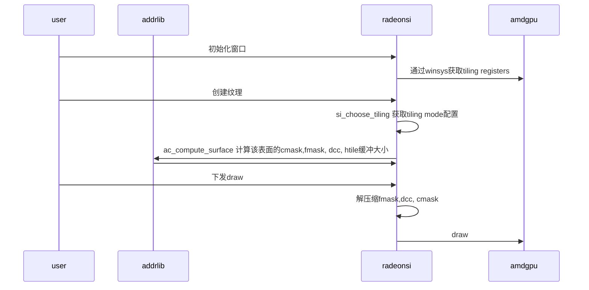

# addrlib类型


## addrlib 


### 类图


### 计算流程图

```mermaid


graph LR

    winsys -->  amdgpu | 获取gpu tiling 寄存器信息 


```



```mermaid
sequenceDiagram

participant u as user
participant a as addrlib 
participant r as radeonsi 
participant amd  as amdgpu


r ->> a  : ac_compute_surface 
r ->> a : AddrComputeSurfaceInfo 
a ->> V1::Lib : GetLib 获取handle实例
V1::Lib ->> CiLib  : CiLib::HwlComputeSurfaceInfo 

CiLIb ->> SiLib : SiLIb::HwlComputeSurfaceInfo
SiLib ->> EgbasedLib : EgbasedLib::HwlComputeSurfaceInfo

```


### linear 表面大小计算
#### ADDR_TM_LINEAR_GENERAL

$$
surfSize = Pitch * Height * bpp *numSamples * expNumSlices
$$

#### ADDR_TM_LINEAR_ALIGNED      = 1,    ///< Requests pitch or slice to be multiple of 64 pixels

$$
surfSize = AlignPitch * AlignHeight * bpp *numSamples * expNumSlices
$$

### 1D tile 表面大小计算

$$
surfSize = pitch*height *bpp * numSamples * thickness * expNumSlices;
$$

### 2d/3d表面大小计算
计算表面大小

$$

surfSize = paddedPitch * paddedHeight * 2^{\lceil \log_2(bpp) \rceil} * numSamples

$$


### 计算cmask  

$$

cmask\_size = \frac{width*height}{(8*8)*2} * num\_layers

$$


```
static void ac_compute_cmask(const struct radeon_info *info, const struct ac_surf_config *config,
                             struct radeon_surf *surf)
{

   unsigned base_align = num_pipes * pipe_interleave_bytes;

   unsigned width = align(surf->u.legacy.level[0].nblk_x, cl_width * 8);
   unsigned height = align(surf->u.legacy.level[0].nblk_y, cl_height * 8);
   unsigned slice_elements = (width * height) / (8 * 8);

   /* Each element of CMASK is a nibble. */
   unsigned slice_bytes = slice_elements / 2;

   surf->u.legacy.color.cmask_slice_tile_max = (width * height) / (128 * 128);
   if (surf->u.legacy.color.cmask_slice_tile_max)
      surf->u.legacy.color.cmask_slice_tile_max -= 1;

   unsigned num_layers;
   if (config->is_3d)
      num_layers = config->info.depth;
   else if (config->is_cube)
      num_layers = 6;
   else
      num_layers = config->info.array_size;

   surf->cmask_alignment_log2 = util_logbase2(MAX2(256, base_align));
   surf->cmask_slice_size = align(slice_bytes, base_align);
   surf->cmask_size = surf->cmask_slice_size * num_layers;
}

```

### 计算fmask

###  dcc 计算

### 计算htile


### 计算swizzle


计算纹理


### addrlib中类图

这里只列举相关类之间关系， 类的具体作用参考mesa 的doxygen文档


### addrlib使用


#### addrlib 句柄的创建

在上层创建winsys时也就是创建screen时，对于radeonsi的winsys 首先获取gpu信息， 然后根据gpu info 创建addrlib
设置R600_DEBUG=info 打印gpu info 信息


```c
// max_alignment 输出
ADDR_HANDLE amdgpu_addr_create(const struct radeon_info *info,
			       const struct amdgpu_gpu_info *amdinfo,
			       uint64_t *max_alignment)
{
	ADDR_CREATE_INPUT addrCreateInput = {0};
	ADDR_CREATE_OUTPUT addrCreateOutput = {0};
	ADDR_REGISTER_VALUE regValue = {0};
	ADDR_CREATE_FLAGS createFlags = {{0}};
	ADDR_GET_MAX_ALINGMENTS_OUTPUT addrGetMaxAlignmentsOutput = {0};
	ADDR_E_RETURNCODE addrRet;

	addrCreateInput.size = sizeof(ADDR_CREATE_INPUT);
	addrCreateOutput.size = sizeof(ADDR_CREATE_OUTPUT);

	regValue.gbAddrConfig = amdinfo->gb_addr_cfg;
	createFlags.value = 0;

   addrlib_family_rev_id(info->family, &addrCreateInput.chipFamily, &addrCreateInput.chipRevision);
       switch (family) {
       case CHIP_TAHITI:
       	*addrlib_family = FAMILY_SI;
       	*addrlib_revid = get_first(AMDGPU_TAHITI_RANGE);
       	break;
       case CHIP_PITCAIRN:
       	*addrlib_family = FAMILY_SI;
       	*addrlib_revid = get_first(AMDGPU_PITCAIRN_RANGE);
       	break;
       ...


	if (addrCreateInput.chipFamily >= FAMILY_AI) {
		addrCreateInput.chipEngine = CIASICIDGFXENGINE_ARCTICISLAND;
		regValue.blockVarSizeLog2 = 0;
	} else {
		regValue.noOfBanks = amdinfo->mc_arb_ramcfg & 0x3;
		regValue.noOfRanks = (amdinfo->mc_arb_ramcfg & 0x4) >> 2;

		regValue.backendDisables = amdinfo->enabled_rb_pipes_mask;
		regValue.pTileConfig = amdinfo->gb_tile_mode;
		regValue.noOfEntries = ARRAY_SIZE(amdinfo->gb_tile_mode);
		if (addrCreateInput.chipFamily == FAMILY_SI) {
			regValue.pMacroTileConfig = NULL;
			regValue.noOfMacroEntries = 0;
		} else {
			regValue.pMacroTileConfig = amdinfo->gb_macro_tile_mode;
			regValue.noOfMacroEntries = ARRAY_SIZE(amdinfo->gb_macro_tile_mode);
		}

		createFlags.useTileIndex = 1;
		createFlags.useHtileSliceAlign = 1;

		addrCreateInput.chipEngine = CIASICIDGFXENGINE_SOUTHERNISLAND;
	}

    // 设置回调函数
	addrCreateInput.callbacks.allocSysMem = allocSysMem;
        return malloc(pInput->sizeInBytes);

	addrCreateInput.callbacks.freeSysMem = freeSysMem;
	addrCreateInput.callbacks.debugPrint = 0;
	addrCreateInput.createFlags = createFlags;

    // 将信息加入regValue 
	addrCreateInput.regValue = regValue;


    // 创建对应芯片系列的lib实例
	addrRet = AddrCreate(&addrCreateInput, &addrCreateOutput);
       ADDR_E_RETURNCODE returnCode = ADDR_OK;
       returnCode = Lib::Create(pAddrCreateIn, pAddrCreateOut);
       return returnCode;


    //
	if (max_alignment) {
		addrRet = AddrGetMaxAlignments(addrCreateOutput.hLib, &addrGetMaxAlignmentsOutput);
		if (addrRet == ADDR_OK){
			*max_alignment = addrGetMaxAlignmentsOutput.baseAlign;
		}
	}
	return addrCreateOutput.hLib;
}

```

### 创建具体Lib实例

```cpp

ADDR_E_RETURNCODE Lib::Create(
    const ADDR_CREATE_INPUT* pCreateIn,     ///< [in] pointer to ADDR_CREATE_INPUT
    ADDR_CREATE_OUTPUT*      pCreateOut)    ///< [out] pointer to ADDR_CREATE_OUTPUT
{
    Lib* pLib = NULL;
    ADDR_E_RETURNCODE returnCode = ADDR_OK;

    if ((returnCode == ADDR_OK)                    &&
        (pCreateIn->callbacks.allocSysMem != NULL) &&
        (pCreateIn->callbacks.freeSysMem != NULL))
    {
        Client client = {
            pCreateIn->hClient,
            pCreateIn->callbacks
        };

        switch (pCreateIn->chipEngine)
        {
            case CIASICIDGFXENGINE_SOUTHERNISLAND:
                switch (pCreateIn->chipFamily)
                {
                    case FAMILY_SI:
                        pLib = SiHwlInit(&client);
                        break;
                    case FAMILY_VI:
                    case FAMILY_CZ: // VI based fusion(carrizo)
                    case FAMILY_CI:
                    case FAMILY_KV: // CI based fusion
                        pLib = CiHwlInit(&client);
                        break;
                    default:
                        ADDR_ASSERT_ALWAYS();
                        break;
                }
                break;
            case CIASICIDGFXENGINE_ARCTICISLAND:
                switch (pCreateIn->chipFamily)
                {
                    case FAMILY_AI:
                    case FAMILY_RV:
                        pLib = Gfx9HwlInit(&client);
                        break;
                    default:
                        ADDR_ASSERT_ALWAYS();
                        break;
                }
                break;
            default:
                ADDR_ASSERT_ALWAYS();
                break;
        }
    }

    if (pLib != NULL)
    {
        BOOL_32 initValid;

        // Pass createFlags to configFlags first since these flags may be overwritten
        pLib->m_configFlags.noCubeMipSlicesPad  = pCreateIn->createFlags.noCubeMipSlicesPad;
        pLib->m_configFlags.fillSizeFields      = pCreateIn->createFlags.fillSizeFields;
        pLib->m_configFlags.useTileIndex        = pCreateIn->createFlags.useTileIndex;
        pLib->m_configFlags.useCombinedSwizzle  = pCreateIn->createFlags.useCombinedSwizzle;
        pLib->m_configFlags.checkLast2DLevel    = pCreateIn->createFlags.checkLast2DLevel;
        pLib->m_configFlags.useHtileSliceAlign  = pCreateIn->createFlags.useHtileSliceAlign;
        pLib->m_configFlags.allowLargeThickTile = pCreateIn->createFlags.allowLargeThickTile;
        pLib->m_configFlags.disableLinearOpt    = FALSE;

        pLib->SetChipFamily(pCreateIn->chipFamily, pCreateIn->chipRevision);

        pLib->SetMinPitchAlignPixels(pCreateIn->minPitchAlignPixels);

        // Global parameters initialized and remaining configFlags bits are set as well
        initValid = pLib->HwlInitGlobalParams(pCreateIn);

        if (initValid)
            pLib->m_pElemLib = ElemLib::Create(pLib);

        pLib->m_pElemLib->SetConfigFlags(pLib->m_configFlags);
                m_configFlags = flags;
    }

    pCreateOut->hLib = pLib;

    pCreateOut->numEquations =
            pLib->HwlGetEquationTableInfo(&pCreateOut->pEquationTable);
    pLib->SetMaxAlignments();
        m_maxBaseAlign     = HwlComputeMaxBaseAlignments();
                    [-> CiLib::HwlComputeMaxBaseAlignments]
        m_maxMetaBaseAlign = HwlComputeMaxMetaBaseAlignments();
                    [-> CiLib::HwlComputeMaxMetaBaseAlignments]

    return returnCode;
}
```

* 采用工厂模式创建对应系列的lib对象
* 测试显卡为CI以此进行分析


###  HwlInitGlobalParams

```c
BOOL_32 SiLib::HwlInitGlobalParams(
    const ADDR_CREATE_INPUT* pCreateIn) ///< [in] create input
{
    BOOL_32 valid = TRUE;
    const ADDR_REGISTER_VALUE* pRegValue = &pCreateIn->regValue;

    valid = DecodeGbRegs(pRegValue);

    if (valid)
    {
        if (m_settings.isTahiti || m_settings.isPitCairn)
        {
            m_pipes = 8;
        }
        else if (m_settings.isCapeVerde || m_settings.isOland)
        {
            m_pipes = 4;
        }
        else
        {
            // Hainan is 2-pipe (m_settings.isHainan == 1)
            m_pipes = 2;
        }

        valid = InitTileSettingTable(pRegValue->pTileConfig, pRegValue->noOfEntries);

        if (valid)
        {
            InitEquationTable();
        }

        m_maxSamples = 16;
    }

    return valid;
}

```


#### stub


# ac_surface


纹理创建时通过调用 ac_compute_surface 计算表面tile mask cmask等信息

```c
int ac_compute_surface(ADDR_HANDLE addrlib, const struct radeon_info *info,
		       const struct ac_surf_config *config,
		       enum radeon_surf_mode mode,
		       struct radeon_surf *surf)
{
	int r;

	r = surf_config_sanity(config, surf->flags);
	if (r)
		return r;

	if (info->chip_class >= GFX9)
		return gfx9_compute_surface(addrlib, info, config, mode, surf);
	else
		return gfx6_compute_surface(addrlib, info, config, mode, surf);
}
```


### static int gfx6_compute_surface(ADDR_HANDLE addrlib,


```cpp
/**
 * Fill in the tiling information in \p surf based on the given surface config.
 *
 * The following fields of \p surf must be initialized by the caller:
 * blk_w, blk_h, bpe, flags.
 */
static int gfx6_compute_surface(ADDR_HANDLE addrlib,
				const struct radeon_info *info,
				const struct ac_surf_config *config,
				enum radeon_surf_mode mode,
				struct radeon_surf *surf)
{
	unsigned level;
	bool compressed;
	ADDR_COMPUTE_SURFACE_INFO_INPUT AddrSurfInfoIn = {0};
	ADDR_COMPUTE_SURFACE_INFO_OUTPUT AddrSurfInfoOut = {0};
	ADDR_COMPUTE_DCCINFO_INPUT AddrDccIn = {0};
	ADDR_COMPUTE_DCCINFO_OUTPUT AddrDccOut = {0};
	ADDR_COMPUTE_HTILE_INFO_INPUT AddrHtileIn = {0};
	ADDR_COMPUTE_HTILE_INFO_OUTPUT AddrHtileOut = {0};
	ADDR_TILEINFO AddrTileInfoIn = {0};
	ADDR_TILEINFO AddrTileInfoOut = {0};
	int r;

    // 块宽和块高都是4即为压缩
	compressed = surf->blk_w == 4 && surf->blk_h == 4;

	/* MSAA requires 2D tiling. */
	if (config->info.samples > 1)
		mode = RADEON_SURF_MODE_2D;

	/* DB doesn't support linear layouts. */
	if (surf->flags & (RADEON_SURF_Z_OR_SBUFFER) &&
	    mode < RADEON_SURF_MODE_1D)
		mode = RADEON_SURF_MODE_1D;

	/* Set the requested tiling mode. */
    AddrSurfInfoIn.tileMode = ADDR_TM_xxx => mode

	/* The format must be set correctly for the allocation of compressed
	 * textures to work. In other cases, setting the bpp is sufficient.
	 */
	if (compressed) {
        ...
	}
	else {
		AddrDccIn.bpp = AddrSurfInfoIn.bpp = surf->bpe * 8;
	}

	AddrDccIn.numSamples = AddrSurfInfoIn.numSamples =
		MAX2(1, config->info.samples);
	AddrSurfInfoIn.tileIndex = -1;

	if (!(surf->flags & RADEON_SURF_Z_OR_SBUFFER)) {
		AddrDccIn.numSamples = AddrSurfInfoIn.numFrags =
			MAX2(1, config->info.storage_samples);
	}

	/* Set the micro tile type. */
	if (surf->flags & RADEON_SURF_SCANOUT)
		AddrSurfInfoIn.tileType = ADDR_DISPLAYABLE;
	else if (surf->flags & RADEON_SURF_Z_OR_SBUFFER)
		AddrSurfInfoIn.tileType = ADDR_DEPTH_SAMPLE_ORDER;
	else
		AddrSurfInfoIn.tileType = ADDR_NON_DISPLAYABLE;

	AddrSurfInfoIn.flags.color = !(surf->flags & RADEON_SURF_Z_OR_SBUFFER);
	AddrSurfInfoIn.flags.depth = (surf->flags & RADEON_SURF_ZBUFFER) != 0;
	AddrSurfInfoIn.flags.cube = config->is_cube;
	AddrSurfInfoIn.flags.display = get_display_flag(config, surf);
	AddrSurfInfoIn.flags.pow2Pad = config->info.levels > 1;
	AddrSurfInfoIn.flags.tcCompatible = (surf->flags & RADEON_SURF_TC_COMPATIBLE_HTILE) != 0;

	/* Only degrade the tile mode for space if TC-compatible HTILE hasn't been
	 * requested, because TC-compatible HTILE requires 2D tiling.
	 */
	AddrSurfInfoIn.flags.opt4Space = !AddrSurfInfoIn.flags.tcCompatible &&
					 !AddrSurfInfoIn.flags.fmask &&
					 config->info.samples <= 1 &&
					 (surf->flags & RADEON_SURF_OPTIMIZE_FOR_SPACE);

	/* DCC notes:
	 * - If we add MSAA support, keep in mind that CB can't decompress 8bpp
	 *   with samples >= 4.
	 * - Mipmapped array textures have low performance (discovered by a closed
	 *   driver team).
	 */
	AddrSurfInfoIn.flags.dccCompatible =
		info->chip_class >= VI &&
		!(surf->flags & RADEON_SURF_Z_OR_SBUFFER) &&
		!(surf->flags & RADEON_SURF_DISABLE_DCC) &&
		!compressed &&
		((config->info.array_size == 1 && config->info.depth == 1) ||
		 config->info.levels == 1);

	AddrSurfInfoIn.flags.noStencil = (surf->flags & RADEON_SURF_SBUFFER) == 0;
	AddrSurfInfoIn.flags.compressZ = !!(surf->flags & RADEON_SURF_Z_OR_SBUFFER);

	/* On CI/VI, the DB uses the same pitch and tile mode (except tilesplit)
	 * for Z and stencil. This can cause a number of problems which we work
	 * around here:
	 *
	 * - a depth part that is incompatible with mipmapped texturing
	 * - at least on Stoney, entirely incompatible Z/S aspects (e.g.
	 *   incorrect tiling applied to the stencil part, stencil buffer
	 *   memory accesses that go out of bounds) even without mipmapping
	 *
	 * Some piglit tests that are prone to different types of related
	 * failures:
	 *  ./bin/ext_framebuffer_multisample-upsample 2 stencil
	 *  ./bin/framebuffer-blit-levels {draw,read} stencil
	 *  ./bin/ext_framebuffer_multisample-unaligned-blit N {depth,stencil} {msaa,upsample,downsample}
	 *  ./bin/fbo-depth-array fs-writes-{depth,stencil} / {depth,stencil}-{clear,layered-clear,draw}
	 *  ./bin/depthstencil-render-miplevels 1024 d=s=z24_s8
	 */
	int stencil_tile_idx = -1;

	if (AddrSurfInfoIn.flags.depth && !AddrSurfInfoIn.flags.noStencil &&
	    (config->info.levels > 1 || info->family == CHIP_STONEY)) {
		/* Compute stencilTileIdx that is compatible with the (depth)
		 * tileIdx. This degrades the depth surface if necessary to
		 * ensure that a matching stencilTileIdx exists. */
		AddrSurfInfoIn.flags.matchStencilTileCfg = 1;

		/* Keep the depth mip-tail compatible with texturing. */
		AddrSurfInfoIn.flags.noStencil = 1;
	}

	/* Set preferred macrotile parameters. This is usually required
	 * for shared resources. This is for 2D tiling only. */
	if (AddrSurfInfoIn.tileMode >= ADDR_TM_2D_TILED_THIN1 &&
	    surf->u.legacy.bankw && surf->u.legacy.bankh &&
	    surf->u.legacy.mtilea && surf->u.legacy.tile_split) {
		/* If any of these parameters are incorrect, the calculation
		 * will fail. */
		AddrTileInfoIn.banks = surf->u.legacy.num_banks;
		AddrTileInfoIn.bankWidth = surf->u.legacy.bankw;
		AddrTileInfoIn.bankHeight = surf->u.legacy.bankh;
		AddrTileInfoIn.macroAspectRatio = surf->u.legacy.mtilea;
		AddrTileInfoIn.tileSplitBytes = surf->u.legacy.tile_split;
		AddrTileInfoIn.pipeConfig = surf->u.legacy.pipe_config + 1; /* +1 compared to GB_TILE_MODE */
		AddrSurfInfoIn.flags.opt4Space = 0;
		AddrSurfInfoIn.pTileInfo = &AddrTileInfoIn;

		/* If AddrSurfInfoIn.pTileInfo is set, Addrlib doesn't set
		 * the tile index, because we are expected to know it if
		 * we know the other parameters.
		 *
		 * This is something that can easily be fixed in Addrlib.
		 * For now, just figure it out here.
		 * Note that only 2D_TILE_THIN1 is handled here.
		 */
		assert(!(surf->flags & RADEON_SURF_Z_OR_SBUFFER));
		assert(AddrSurfInfoIn.tileMode == ADDR_TM_2D_TILED_THIN1);

		if (info->chip_class == SI) {
			if (AddrSurfInfoIn.tileType == ADDR_DISPLAYABLE) {
				if (surf->bpe == 2)
					AddrSurfInfoIn.tileIndex = 11; /* 16bpp */
				else
					AddrSurfInfoIn.tileIndex = 12; /* 32bpp */
			} else {
				if (surf->bpe == 1)
					AddrSurfInfoIn.tileIndex = 14; /* 8bpp */
				else if (surf->bpe == 2)
					AddrSurfInfoIn.tileIndex = 15; /* 16bpp */
				else if (surf->bpe == 4)
					AddrSurfInfoIn.tileIndex = 16; /* 32bpp */
				else
					AddrSurfInfoIn.tileIndex = 17; /* 64bpp (and 128bpp) */
			}
		} else {
			/* CIK - VI */
			if (AddrSurfInfoIn.tileType == ADDR_DISPLAYABLE)
				AddrSurfInfoIn.tileIndex = 10; /* 2D displayable */
			else
				AddrSurfInfoIn.tileIndex = 14; /* 2D non-displayable */

			/* Addrlib doesn't set this if tileIndex is forced like above. */
			AddrSurfInfoOut.macroModeIndex = cik_get_macro_tile_index(surf);
		}
	}

	surf->has_stencil = !!(surf->flags & RADEON_SURF_SBUFFER);
	surf->num_dcc_levels = 0;
	surf->surf_size = 0;
	surf->dcc_size = 0;
	surf->dcc_alignment = 1;
	surf->htile_size = 0;
	surf->htile_slice_size = 0;
	surf->htile_alignment = 1;

	const bool only_stencil = (surf->flags & RADEON_SURF_SBUFFER) &&
				  !(surf->flags & RADEON_SURF_ZBUFFER);

	/* Calculate texture layout information. */
	if (!only_stencil) {
		for (level = 0; level < config->info.levels; level++) {
			r = gfx6_compute_level(addrlib, config, surf, false, level, compressed,
					       &AddrSurfInfoIn, &AddrSurfInfoOut,
					       &AddrDccIn, &AddrDccOut, &AddrHtileIn, &AddrHtileOut);
			if (r)
				return r;

			if (level > 0)
				continue;

			/* Check that we actually got a TC-compatible HTILE if
			 * we requested it (only for level 0, since we're not
			 * supporting HTILE on higher mip levels anyway). */
			assert(AddrSurfInfoOut.tcCompatible ||
			       !AddrSurfInfoIn.flags.tcCompatible ||
			       AddrSurfInfoIn.flags.matchStencilTileCfg);

			if (AddrSurfInfoIn.flags.matchStencilTileCfg) {
				if (!AddrSurfInfoOut.tcCompatible) {
					AddrSurfInfoIn.flags.tcCompatible = 0;
					surf->flags &= ~RADEON_SURF_TC_COMPATIBLE_HTILE;
				}

				AddrSurfInfoIn.flags.matchStencilTileCfg = 0;
				AddrSurfInfoIn.tileIndex = AddrSurfInfoOut.tileIndex;
				stencil_tile_idx = AddrSurfInfoOut.stencilTileIdx;

				assert(stencil_tile_idx >= 0);
			}

			r = gfx6_surface_settings(addrlib, info, config,
						  &AddrSurfInfoOut, surf);
			if (r)
				return r;
		}
	}

	/* Calculate texture layout information for stencil. */
	if (surf->flags & RADEON_SURF_SBUFFER) {
		AddrSurfInfoIn.tileIndex = stencil_tile_idx;
		AddrSurfInfoIn.bpp = 8;
		AddrSurfInfoIn.flags.depth = 0;
		AddrSurfInfoIn.flags.stencil = 1;
		AddrSurfInfoIn.flags.tcCompatible = 0;
		/* This will be ignored if AddrSurfInfoIn.pTileInfo is NULL. */
		AddrTileInfoIn.tileSplitBytes = surf->u.legacy.stencil_tile_split;

		for (level = 0; level < config->info.levels; level++) {
			r = gfx6_compute_level(addrlib, config, surf, true, level, compressed,
					       &AddrSurfInfoIn, &AddrSurfInfoOut,
					       &AddrDccIn, &AddrDccOut,
					       NULL, NULL);
			if (r)
				return r;

			/* DB uses the depth pitch for both stencil and depth. */
			if (!only_stencil) {
				if (surf->u.legacy.stencil_level[level].nblk_x !=
				    surf->u.legacy.level[level].nblk_x)
					surf->u.legacy.stencil_adjusted = true;
			} else {
				surf->u.legacy.level[level].nblk_x =
					surf->u.legacy.stencil_level[level].nblk_x;
			}

			if (level == 0) {
				if (only_stencil) {
					r = gfx6_surface_settings(addrlib, info, config,
								  &AddrSurfInfoOut, surf);
					if (r)
						return r;
				}

				/* For 2D modes only. */
				if (AddrSurfInfoOut.tileMode >= ADDR_TM_2D_TILED_THIN1) {
					surf->u.legacy.stencil_tile_split =
						AddrSurfInfoOut.pTileInfo->tileSplitBytes;
				}
			}
		}
	}

	/* Compute FMASK. */
	if (config->info.samples >= 2 && AddrSurfInfoIn.flags.color) {
		ADDR_COMPUTE_FMASK_INFO_INPUT fin = {0};
		ADDR_COMPUTE_FMASK_INFO_OUTPUT fout = {0};
		ADDR_TILEINFO fmask_tile_info = {};

		fin.size = sizeof(fin);
		fout.size = sizeof(fout);

		fin.tileMode = AddrSurfInfoOut.tileMode;
		fin.pitch = AddrSurfInfoOut.pitch;
		fin.height = config->info.height;
		fin.numSlices = AddrSurfInfoIn.numSlices;
		fin.numSamples = AddrSurfInfoIn.numSamples;
		fin.numFrags = AddrSurfInfoIn.numFrags;
		fin.tileIndex = -1;
		fout.pTileInfo = &fmask_tile_info;

		r = AddrComputeFmaskInfo(addrlib, &fin, &fout);
		if (r)
			return r;

		surf->fmask_size = fout.fmaskBytes;
		surf->fmask_alignment = fout.baseAlign;
		surf->fmask_tile_swizzle = 0;

		surf->u.legacy.fmask.slice_tile_max =
			(fout.pitch * fout.height) / 64;
		if (surf->u.legacy.fmask.slice_tile_max)
		    surf->u.legacy.fmask.slice_tile_max -= 1;

		surf->u.legacy.fmask.tiling_index = fout.tileIndex;
		surf->u.legacy.fmask.bankh = fout.pTileInfo->bankHeight;
		surf->u.legacy.fmask.pitch_in_pixels = fout.pitch;

		/* Compute tile swizzle for FMASK. */
		if (config->info.fmask_surf_index &&
		    !(surf->flags & RADEON_SURF_SHAREABLE)) {
			ADDR_COMPUTE_BASE_SWIZZLE_INPUT xin = {0};
			ADDR_COMPUTE_BASE_SWIZZLE_OUTPUT xout = {0};

			xin.size = sizeof(ADDR_COMPUTE_BASE_SWIZZLE_INPUT);
			xout.size = sizeof(ADDR_COMPUTE_BASE_SWIZZLE_OUTPUT);

			/* This counter starts from 1 instead of 0. */
			xin.surfIndex = p_atomic_inc_return(config->info.fmask_surf_index);
			xin.tileIndex = fout.tileIndex;
			xin.macroModeIndex = fout.macroModeIndex;
			xin.pTileInfo = fout.pTileInfo;
			xin.tileMode = fin.tileMode;

			int r = AddrComputeBaseSwizzle(addrlib, &xin, &xout);
			if (r != ADDR_OK)
				return r;

			assert(xout.tileSwizzle <=
			       u_bit_consecutive(0, sizeof(surf->tile_swizzle) * 8));
			surf->fmask_tile_swizzle = xout.tileSwizzle;
		}
	}

	/* Recalculate the whole DCC miptree size including disabled levels.
	 * This is what addrlib does, but calling addrlib would be a lot more
	 * complicated.
	 */
	if (surf->dcc_size && config->info.levels > 1) {
		/* The smallest miplevels that are never compressed by DCC
		 * still read the DCC buffer via TC if the base level uses DCC,
		 * and for some reason the DCC buffer needs to be larger if
		 * the miptree uses non-zero tile_swizzle. Otherwise there are
		 * VM faults.
		 *
		 * "dcc_alignment * 4" was determined by trial and error.
		 */
		surf->dcc_size = align64(surf->surf_size >> 8,
					 surf->dcc_alignment * 4);
	}

	/* Make sure HTILE covers the whole miptree, because the shader reads
	 * TC-compatible HTILE even for levels where it's disabled by DB.
	 */
	if (surf->htile_size && config->info.levels > 1 &&
	    surf->flags & RADEON_SURF_TC_COMPATIBLE_HTILE) {
		/* MSAA can't occur with levels > 1, so ignore the sample count. */
		const unsigned total_pixels = surf->surf_size / surf->bpe;
		const unsigned htile_block_size = 8 * 8;
		const unsigned htile_element_size = 4;

		surf->htile_size = (total_pixels / htile_block_size) *
				   htile_element_size;
		surf->htile_size = align(surf->htile_size, surf->htile_alignment);
	}

	surf->is_linear = surf->u.legacy.level[0].mode == RADEON_SURF_MODE_LINEAR_ALIGNED;
	surf->is_displayable = surf->is_linear ||
			       surf->micro_tile_mode == RADEON_MICRO_MODE_DISPLAY ||
			       surf->micro_tile_mode == RADEON_MICRO_MODE_ROTATED;

	/* The rotated micro tile mode doesn't work if both CMASK and RB+ are
	 * used at the same time. This case is not currently expected to occur
	 * because we don't use rotated. Enforce this restriction on all chips
	 * to facilitate testing.
	 */
	if (surf->micro_tile_mode == RADEON_MICRO_MODE_ROTATED) {
		assert(!"rotate micro tile mode is unsupported");
		return ADDR_ERROR;
	}

	ac_compute_cmask(info, config, surf);
	return 0;
}

/

```

### gfx6_compute_level


```c


```

### static int surf_config_sanity(const struct ac_surf_config *config,


//校验参数
```cpp
static int surf_config_sanity(const struct ac_surf_config *config,
			      unsigned flags)
{
	/* FMASK is allocated together with the color surface and can't be
	 * allocated separately.
	 */
	assert(!(flags & RADEON_SURF_FMASK));

	/* all dimension must be at least 1 ! */
    ...


	if (config->is_3d && config->info.array_size > 1)
		return -EINVAL;
	if (config->is_cube && config->info.depth > 1)
		return -EINVAL;

	return 0;
}

```
### Arctic Islands
"Arctic Islands" 是 AMD（Advanced Micro Devices）公司用于命名其GPU架构系列之一的术语。这个术语通常用来指代一系列AMD GPU架构，但具体的架构名称可能会有所不同。通常，Arctic Islands 是 Southern Islands 架构之后，Vega 架构之前的一代 GPU 架构。

具体而言，Arctic Islands 架构包括了一系列的图形处理器（GPU），这些 GPU 用于 AMD 的 Radeon 系列显卡。它们在图形渲染、计算任务和其他图形相关的工作负载中发挥作用。每个架构都引入了新的技术、特性和性能改进，以提供更好的图形处理性能。

需要注意的是，GPU架构通常是由硬件制造商用于区分其不同产品系列的术语。与之类似，NVIDIA 也有其GPU架构，例如"Pascal"、"Volta"和"Ampere"。这些架构的发布通常伴随着新一代显卡产品的推出。


 SiLib::HwlInitGlobalParams {
    BOOL_32 valide = True;
    const Addr GbRegs = (pRegValue);
 }


## Lib::Create

Creates and initializes AddrLib object.

```c
ADDR_E_RETURNCODE Lib::Create(
    const ADDR_CREATE_INPUT* pCreateIn,     ///< [in] pointer to ADDR_CREATE_INPUT ADDR_CREATE_OUTPUT*      pCreateOut)    ///< [out] pointer to ADDR_CREATE_OUTPUT
```

```c
Lib::Create

switch (pCreateIn->chipFamily)
        pLib = SiHwlInit(&client);
        pLib = CiHwlInit(&client);
        pLib = Gfx9HwlInit(&client);
                 

pLib->m_configFlags.noCubeMipSlicesPad  = pCreateIn->createFlags.noCubeMipSlicesPad;
...
pLib->SetChipFamily(pCreateIn->chipFamily, pCreateIn->chipRevision);
pLib->SetMinPitchAlignPixels(pCreateIn->minPitchAlignPixels);

```

## Object

```cpp
//*       Calls instanced allocSysMem inside Client
VOID* Object::ClientAlloc(
    size_t         objSize,    ///< [in] Size to allocate
    const Client*  pClient)    ///< [in] Client pointer
{
    VOID* pObjMem = NULL;

    if (pClient->callbacks.allocSysMem != NULL)
    {
        ADDR_ALLOCSYSMEM_INPUT allocInput = {0};

        allocInput.size        = sizeof(ADDR_ALLOCSYSMEM_INPUT);
        allocInput.flags.value = 0;
        allocInput.sizeInBytes = static_cast<UINT_32>(objSize);
        allocInput.hClient     = pClient->handle;

        pObjMem = pClient->callbacks.allocSysMem(&allocInput);
    }

    return pObjMem;
}
```


# AddrLib


## AddrInterface 结构体

### AddrTileMode

```c
typedef enum _AddrTileMode
{
    ADDR_TM_LINEAR_GENERAL      = 0,    ///< 最少限制，如果不是缓冲区，要求 pitch 为 8 的倍数
    ADDR_TM_LINEAR_ALIGNED      = 1,    ///< 请求 pitch 或 slice 为 64 像素的倍数
    ADDR_TM_1D_TILED_THIN1      = 2,    ///< 8x8 瓦片的线性数组
    ADDR_TM_1D_TILED_THICK      = 3,    ///< 8x8x4 瓦片的线性数组
    ADDR_TM_2D_TILED_THIN1      = 4,    ///< 一组宏瓦片包含 8x8 瓦片
    ADDR_TM_2D_TILED_THIN2      = 5,    ///< 仅适用于 600 HWL，宏瓦片比例为 1:4
    ADDR_TM_2D_TILED_THIN4      = 6,    ///< 仅适用于 600 HWL，宏瓦片比例为 1:16
    ADDR_TM_2D_TILED_THICK      = 7,    ///< 一组宏瓦片包含 8x8x4 瓦片
    ADDR_TM_2B_TILED_THIN1      = 8,    ///< 仅适用于 600 HWL，带有 bank swap
    ADDR_TM_2B_TILED_THIN2      = 9,    ///< 仅适用于 600 HWL，带有 bank swap 并且比例为 1:4
    ADDR_TM_2B_TILED_THIN4      = 10,   ///< 仅适用于 600 HWL，带有 bank swap 并且比例为 1:16
    ADDR_TM_2B_TILED_THICK      = 11,   ///< 仅适用于 600 HWL，带有 bank swap，包含 8x8x4 瓦片
    ADDR_TM_3D_TILED_THIN1      = 12,   ///< 宏瓦片之间带有管道旋转的宏瓦片
    ADDR_TM_3D_TILED_THICK      = 13,   ///< 宏瓦片之间带有管道旋转的宏瓦片，厚瓦片
    ADDR_TM_3B_TILED_THIN1      = 14,   ///< 仅适用于 600 HWL，带有 bank swap
    ADDR_TM_3B_TILED_THICK      = 15,   ///< 仅适用于 600 HWL，带有 bank swap，厚瓦片
    ADDR_TM_2D_TILED_XTHICK     = 16,   ///< 瓦片为 8x8x8，从 NI 开始有效
    ADDR_TM_3D_TILED_XTHICK     = 17,   ///< 瓦片为 8x8x8，从 NI 开始有效
    ADDR_TM_POWER_SAVE          = 18,   ///< 节能模式，仅由 NI 上的 KMD 使用
    ADDR_TM_PRT_TILED_THIN1     = 19,   ///< 在宏瓦片大小之外没有 bank/pipe 旋转或哈希
    ADDR_TM_PRT_2D_TILED_THIN1  = 20,   ///< 与 2D_TILED_THIN1 相同，仅 PRT
    ADDR_TM_PRT_3D_TILED_THIN1  = 21,   ///< 与 3D_TILED_THIN1 相同，仅 PRT
    ADDR_TM_PRT_TILED_THICK     = 22,   ///< 在宏瓦片大小之外没有 bank/pipe 旋转或哈希
    ADDR_TM_PRT_2D_TILED_THICK  = 23,   ///< 与 2D_TILED_THICK 相同，仅 PRT
    ADDR_TM_PRT_3D_TILED_THICK  = 24,   ///< 与 3D_TILED_THICK 相同，仅 PRT
    ADDR_TM_UNKNOWN             = 25,   ///< 未知的瓦片模式，应由地址库决定
    ADDR_TM_COUNT               = 26,   ///< 必须是最后一个瓦片模式的值
} AddrTileMode;

```

### ADDR_COMPUTE_DCCINFO_INPUT

```c
/**
****************************************************************************************************
*   _ADDR_COMPUTE_DCCINFO_INPUT
*
*   @brief
*       AddrComputeDccInfo的输入结构
****************************************************************************************************
*/
typedef struct _ADDR_COMPUTE_DCCINFO_INPUT
{
    UINT_32             size;            ///< 以字节为单位的结构体大小
    UINT_32             bpp;             ///< 颜色表面的比特每像素
    UINT_32             numSamples;      ///< 颜色表面的采样数
    UINT_64             colorSurfSize;   ///< 绑定了dcc键的颜色表面的大小
    AddrTileMode        tileMode;        ///< 颜色表面的瓦片模式
    ADDR_TILEINFO       tileInfo;        ///< 颜色表面的瓦片信息
    UINT_32             tileSwizzle;     ///< 瓦片交错
    INT_32              tileIndex;       ///< 颜色表面的瓦片索引，
                                         ///< 如果不想使用它，必须设置为-1
                                         ///< 当全局useTileIndex设置为1时，此时必须为-1
    INT_32              macroModeIndex;  ///< 如果存在宏块模式表，则在其中的索引（CI）
                                         ///< 说明：当tileIndex不为-1时，此值必须有效
} ADDR_COMPUTE_DCCINFO_INPUT;

```


### ADDR_COMPUTE_DCCINFO_OUTPUT

```c
/**
****************************************************************************************************
*   ADDR_COMPUTE_DCCINFO_OUTPUT
*
*   @brief
*       AddrComputeDccInfo的输出结构
****************************************************************************************************
*/
typedef struct _ADDR_COMPUTE_DCCINFO_OUTPUT
{
    UINT_32 size;                 ///< 以字节为单位的结构体大小
    UINT_32 dccRamBaseAlign;      ///< dcc键的基本对齐方式
    UINT_64 dccRamSize;           ///< dcc键的大小
    UINT_64 dccFastClearSize;     ///< 可以快速清除的dcc键部分的大小
    BOOL_32 subLvlCompressible;   ///< 子资源是否可压缩
    BOOL_32 dccRamSizeAligned;    ///< dcc键大小是否对齐
} ADDR_COMPUTE_DCCINFO_OUTPUT;

```
### ADDR_COMPUTE_HTILE_INFO_INPUT

### ADDR_COMPUTE_HTILE_INFO_OUTPUT


### ADDR_COMPUTE_SURFACE_INFO_INPUT

```cpp
/**
****************************************************************************************************
*   ADDR_COMPUTE_SURFACE_INFO_INPUT
*
*   @brief
*       用于 AddrComputeSurfaceInfo 的输入结构体
****************************************************************************************************
*/
typedef struct _ADDR_COMPUTE_SURFACE_INFO_INPUT
{
    UINT_32             size;               ///< 以字节为单位的结构体大小

    AddrTileMode        tileMode;           ///< 瓦片模式
    AddrFormat          format;             ///< 如果格式设置为有效格式，可能会覆盖 bpp/width/height
                                            ///  可能会被覆写
    UINT_32             bpp;                ///< 每像素位数
    UINT_32             numSamples;         ///< 采样数
    UINT_32             width;              ///< 宽度，以像素为单位
    UINT_32             height;             ///< 高度，以像素为单位
    UINT_32             numSlices;          ///< 表面切片或深度的数量
    UINT_32             slice;              ///< 切片索引
    UINT_32             mipLevel;           ///< 当前 mip 映射级别
    UINT_32             numMipLevels;       ///< mip 链中的 mip 映射级别数
    ADDR_SURFACE_FLAGS  flags;              ///< 表面类型标志
    UINT_32             numFrags;           ///< 片段数量，将其保留为零或与普通AA的采样数相同;
                                            ///  对于EQAA，请将其设置为片段数量
    /// r800 and later HWL parameters
    // Needed by 2D tiling, for linear and 1D tiling, just keep them 0's
    ADDR_TILEINFO*      pTileInfo;          ///< 2D 瓦片参数。设置为0以使用默认/计算
    AddrTileType        tileType;           ///< 微瓦片类型，在tileIndex != -1时不需要
    INT_32              tileIndex;          ///< 瓦片索引，如果不想使用它，则必须为-1
                                            ///  同时全局useTileIndex设置为1
    UINT_32             basePitch;          ///< 基本级别的像素间距，0表示忽略，对于SI+的mip级别是必需的
                                            ///  不要在压缩格式中使用块的pitch！
    UINT_32             maxBaseAlign;       ///< 客户端请求的最大基本对齐
    UINT_32             pitchAlign;         ///< 客户端请求的pitch对齐
    UINT_32             heightAlign;        ///< 客户端请求的高度对齐
} ADDR_COMPUTE_SURFACE_INFO_INPUT;

```

## AddrInterface


### AddrComputeSurfaceInfo 

```c
*************************************************************************
*/
ADDR_E_RETURNCODE ADDR_API AddrComputeSurfaceInfo(
    ADDR_HANDLE                             hLib, ///< address lib handle
    const ADDR_COMPUTE_SURFACE_INFO_INPUT*  pIn,  ///< [in] surface information
    ADDR_COMPUTE_SURFACE_INFO_OUTPUT*       pOut) ///< [out] surface parameters and alignments
{
    V1::Lib* pLib = V1::Lib::GetLib(hLib);

    ADDR_E_RETURNCODE returnCode = ADDR_OK;

    if (pLib != NULL)
    {
        returnCode = pLib->ComputeSurfaceInfo(pIn, pOut);
    }
    else
    {
        returnCode = ADDR_ERROR;
    }

    return returnCode;
}


```

### AddrGetMaxAlignments / AddrGetMaxAlignments

```cpp
//       Convert maximum alignments
ADDR_E_RETURNCODE ADDR_API AddrGetMaxAlignments(
    ADDR_HANDLE                     hLib, ///< address lib handle
    ADDR_GET_MAX_ALINGMENTS_OUTPUT* pOut) ///< [out] output structure
{
    Addr::Lib* pLib = Lib::GetLib(hLib);

    returnCode = pLib->GetMaxAlignments(pOut);
        //see HwlComputeMaxBaseAlignments

    return returnCode;
}

```


## SI

###  BOOL_32 SiLib::DecodeGbRegs(

Decodes GB_ADDR_CONFIG and noOfBanks/noOfRanks

```c
BOOL_32 SiLib::DecodeGbRegs(
    const ADDR_REGISTER_VALUE* pRegValue) ///< [in] create input
{
    GB_ADDR_CONFIG  reg;
    BOOL_32         valid = TRUE;

    reg.val = pRegValue->gbAddrConfig;

    m_pipeInterleaveBytes = xxx; => reg.f.pipe_interleave_size

    m_rowSize = ADDR_ROWSIZE_1KB; => reg.f.row.size

    m_banks = 4; => pRegValue->noOfBanks

    m_ranks = 1; => pRegValue->noOfRanks

    m_logicalBanks = m_banks * m_ranks;

    ADDR_ASSERT(m_logicalBanks <= 16);

    return valid;
}

```

## Lib

### ComputeSurfaceInfo

```c

ADDR_E_RETURNCODE Lib::ComputeSurfaceInfo(
     const ADDR_COMPUTE_SURFACE_INFO_INPUT* pIn,    ///< [in] input structure
     ADDR_COMPUTE_SURFACE_INFO_OUTPUT*      pOut    ///< [out] output structure
     ) const
{
    ADDR_E_RETURNCODE returnCode = ADDR_OK;

    if (GetFillSizeFieldsFlags() == TRUE)
    {
        if ((pIn->size != sizeof(ADDR_COMPUTE_SURFACE_INFO_INPUT)) ||
            (pOut->size != sizeof(ADDR_COMPUTE_SURFACE_INFO_OUTPUT)))
        {
            returnCode = ADDR_PARAMSIZEMISMATCH;
        }
    }

    // We suggest client do sanity check but a check here is also good
    if (pIn->bpp > 128)
    {
        returnCode = ADDR_INVALIDPARAMS;
    }

    if ((pIn->tileMode == ADDR_TM_UNKNOWN) && (pIn->mipLevel > 0))
    {
        returnCode = ADDR_INVALIDPARAMS;
    }

    // Thick modes don't support multisample
    if ((Thickness(pIn->tileMode) > 1) && (pIn->numSamples > 1))
    {
        returnCode = ADDR_INVALIDPARAMS;
    }

    if (returnCode == ADDR_OK)
    {
        // Get a local copy of input structure and only reference pIn for unadjusted values
        ADDR_COMPUTE_SURFACE_INFO_INPUT localIn = *pIn;
        ADDR_TILEINFO tileInfoNull = {0};

        if (UseTileInfo())
        {
            // If the original input has a valid ADDR_TILEINFO pointer then copy its contents.
            // Otherwise the default 0's in tileInfoNull are used.
            if (pIn->pTileInfo)
            {
                tileInfoNull = *pIn->pTileInfo;
            }
            localIn.pTileInfo  = &tileInfoNull;
        }

        localIn.numSamples = (pIn->numSamples == 0) ? 1 : pIn->numSamples;

        // Do mipmap check first
        // If format is BCn, pre-pad dimension to power-of-two according to HWL
        ComputeMipLevel(&localIn);

        if (m_configFlags.checkLast2DLevel)
        {
            // Save this level's original height in pixels
            pOut->height = pIn->height;
        }

        UINT_32 expandX = 1;
        UINT_32 expandY = 1;
        ElemMode elemMode;

        // Save outputs that may not go through HWL
        pOut->pixelBits = localIn.bpp;
        pOut->numSamples = localIn.numSamples;
        pOut->last2DLevel = FALSE;
        pOut->tcCompatible = FALSE;

#if !ALT_TEST
        if (localIn.numSamples > 1)
        {
            ADDR_ASSERT(localIn.mipLevel == 0);
        }
#endif

        if (localIn.format != ADDR_FMT_INVALID) // Set format to INVALID will skip this conversion
        {
            // Get compression/expansion factors and element mode
            // (which indicates compression/expansion
            localIn.bpp = GetElemLib()->GetBitsPerPixel(localIn.format,
                                                        &elemMode,
                                                        &expandX,
                                                        &expandY);

            // Special flag for 96 bit surface. 96 (or 48 if we support) bit surface's width is
            // pre-multiplied by 3 and bpp is divided by 3. So pitch alignment for linear-
            // aligned does not meet 64-pixel in real. We keep special handling in hwl since hw
            // restrictions are different.
            // Also Mip 1+ needs an element pitch of 32 bits so we do not need this workaround
            // but we use this flag to skip RestoreSurfaceInfo below

            if ((elemMode == ADDR_EXPANDED) && (expandX > 1))
            {
                ADDR_ASSERT(IsLinear(localIn.tileMode));
            }

            GetElemLib()->AdjustSurfaceInfo(elemMode,
                                            expandX,
                                            expandY,
                                            &localIn.bpp,
                                            &localIn.basePitch,
                                            &localIn.width,
                                            &localIn.height);

            // Overwrite these parameters if we have a valid format
        }
        else if (localIn.bpp != 0)
        {
            localIn.width  = (localIn.width != 0) ? localIn.width : 1;
            localIn.height = (localIn.height != 0) ? localIn.height : 1;
        }
        else // Rule out some invalid parameters
        {
            ADDR_ASSERT_ALWAYS();

            returnCode = ADDR_INVALIDPARAMS;
        }

        // Check mipmap after surface expansion
        if (returnCode == ADDR_OK)
        {
            returnCode = PostComputeMipLevel(&localIn, pOut);
        }

        if (returnCode == ADDR_OK)
        {
            if (UseTileIndex(localIn.tileIndex))
            {
                // Make sure pTileInfo is not NULL
                ADDR_ASSERT(localIn.pTileInfo);

                UINT_32 numSamples = GetNumFragments(localIn.numSamples, localIn.numFrags);

                INT_32 macroModeIndex = TileIndexNoMacroIndex;

                if (localIn.tileIndex != TileIndexLinearGeneral)
                {
                    // Try finding a macroModeIndex
                    macroModeIndex = HwlComputeMacroModeIndex(localIn.tileIndex,
                                                              localIn.flags,
                                                              localIn.bpp,
                                                              numSamples,
                                                              localIn.pTileInfo,
                                                              &localIn.tileMode,
                                                              &localIn.tileType);
                }

                // If macroModeIndex is not needed, then call HwlSetupTileCfg to get tile info
                if (macroModeIndex == TileIndexNoMacroIndex)
                {
                    returnCode = HwlSetupTileCfg(localIn.bpp,
                                                 localIn.tileIndex, macroModeIndex,
                                                 localIn.pTileInfo,
                                                 &localIn.tileMode, &localIn.tileType);
                }
                // If macroModeIndex is invalid, then assert this is not macro tiled
                else if (macroModeIndex == TileIndexInvalid)
                {
                    ADDR_ASSERT(!IsMacroTiled(localIn.tileMode));
                }

                pOut->macroModeIndex = macroModeIndex;
            }
        }

        if (returnCode == ADDR_OK)
        {
            localIn.flags.dccPipeWorkaround = localIn.flags.dccCompatible;

            if (localIn.tileMode == ADDR_TM_UNKNOWN)
            {
                // HWL layer may override tile mode if necessary
                HwlSelectTileMode(&localIn);
            }
            else
            {
                // HWL layer may override tile mode if necessary
                HwlOverrideTileMode(&localIn);

                // Optimize tile mode if possible
                OptimizeTileMode(&localIn);
            }
        }

        // Call main function to compute surface info
        if (returnCode == ADDR_OK)
        {
            returnCode = HwlComputeSurfaceInfo(&localIn, pOut);
        }

        if (returnCode == ADDR_OK)
        {
            // Since bpp might be changed we just pass it through
            pOut->bpp  = localIn.bpp;

            // Also original width/height/bpp
            pOut->pixelPitch    = pOut->pitch;
            pOut->pixelHeight   = pOut->height;

#if DEBUG
            if (localIn.flags.display)
            {
                ADDR_ASSERT((pOut->pitchAlign % 32) == 0);
            }
#endif //DEBUG

            if (localIn.format != ADDR_FMT_INVALID)
            {
                //
                // Note: For 96 bit surface, the pixelPitch returned might be an odd number, but it
                // is okay to program texture pitch as HW's mip calculator would multiply 3 first,
                // then do the appropriate paddings (linear alignment requirement and possible the
                // nearest power-of-two for mipmaps), which results in the original pitch.
                //
                GetElemLib()->RestoreSurfaceInfo(elemMode,
                                                 expandX,
                                                 expandY,
                                                 &localIn.bpp,
                                                 &pOut->pixelPitch,
                                                 &pOut->pixelHeight);
            }

            if (localIn.flags.qbStereo)
            {
                if (pOut->pStereoInfo)
                {
                    ComputeQbStereoInfo(pOut);
                }
            }

            if (localIn.flags.volume) // For volume sliceSize equals to all z-slices
            {
                pOut->sliceSize = pOut->surfSize;
            }
            else // For array: sliceSize is likely to have slice-padding (the last one)
            {
                pOut->sliceSize = pOut->surfSize / pOut->depth;

                // array or cubemap
                if (pIn->numSlices > 1)
                {
                    // If this is the last slice then add the padding size to this slice
                    if (pIn->slice == (pIn->numSlices - 1))
                    {
                        pOut->sliceSize += pOut->sliceSize * (pOut->depth - pIn->numSlices);
                    }
                    else if (m_configFlags.checkLast2DLevel)
                    {
                        // Reset last2DLevel flag if this is not the last array slice
                        pOut->last2DLevel = FALSE;
                    }
                }
            }

            pOut->pitchTileMax = pOut->pitch / 8 - 1;
            pOut->heightTileMax = pOut->height / 8 - 1;
            pOut->sliceTileMax = pOut->pitch * pOut->height / 64 - 1;
        }
    }

    ValidBaseAlignments(pOut->baseAlign);

    return returnCode;
}

```


## CI


### BOOL_32 CiLib::HwlInitGlobalParams(

Initializes global parameters

```c
BOOL_32 CiLib::HwlInitGlobalParams(
    const ADDR_CREATE_INPUT* pCreateIn) ///< [in] create input
{
    const ADDR_REGISTER_VALUE* pRegValue = &pCreateIn->regValue;

    valid = DecodeGbRegs(pRegValue);
        [-> SiLib::DecodeGbRegs]

    m_pipes = xxx ?? ==> m_settings.Isxx?

    if (valid)
    {
        valid = InitTileSettingTable(pRegValue->pTileConfig, pRegValue->noOfEntries);
            [-> CiLib::InitTileSettingTable]
    }
    if (valid)
    {
        valid = InitMacroTileCfgTable(pRegValue->pMacroTileConfig, pRegValue->noOfMacroEntries);
            [-> CiLib::InitMacroTileCfgTable]
    }

    if (valid)
    {
        InitEquationTable();
        [-> SiLib::InitEquationTable]
    }

    return valid;
}
```
### CiLib::InitTileSettingTable]


### CiLib::InitMacroTileCfgTable]


## ElemLib 


### ElemLib::Create


```cpp

//*       Creates and initializes AddrLib object.
ElemLib* ElemLib::Create(
    const Lib* pAddrLib)   ///< [in] Pointer of parent AddrLib instance
{
    ElemLib* pElemLib = NULL;


    if (pAddrLib)
    {
        VOID* pObj = Object::ClientAlloc(sizeof(ElemLib), pAddrLib->GetClient());
        if (pObj)
        {
            pElemLib = new(pObj) ElemLib(const_cast<Lib* const>(pAddrLib));
        }
    }

    return pElemLib;
}


```

### ElemLib::ElemLib

```cpp
ElemLib::ElemLib(
    Lib* pAddrLib)  ///< [in] Parent addrlib instance pointer
    :
    Object(pAddrLib->GetClient()),
    m_pAddrLib(pAddrLib)
{
    switch (m_pAddrLib->GetChipFamily())
    {
            m_depthPlanarType = ADDR_DEPTH_PLANAR_R600;
            m_fp16ExportNorm = 0;
    }

    m_configFlags.value = 0;
}

```


```
@startuml

    - Loop mrt
    repeat
        - 检验fast_clear满足条件
        note
            2D/3d Tiling
            非共享纹理
            ...
        end note
        if ( clear DCC) then (yes)
            - 获取 dcc reset_value
            if (MSAA && cmask_buffer) then (yes)
    			- clear_value = 0xCCCCCCCC;
                - si_clear_buffer(cmask_buffer, clear_value, 4)
                note left
                    si_clear_buffer根据samples, size, 决定采用cp_dma,或者是cs进行clear操作
                end note
                - fmask_decompress_needed = true;
            endif
            - si_clear_buffer(dcc_buffer, reset_value , 4)
        else
            - 检验clear条件
            note left
                size not small
                bpe <= 8
                ...
            end note
            - si_alloc_separate_cmask
            note right
                设定CB_COLOR0_CMASK, CB_COLOR0_INFO
            end note
            - clear_value = 0
            - si_clear_buffer(cmask_buffer, clear_value, 4)
    		- eliminate_needed = true;
        endif
        - set tex->dirty_level_mask
        - inc compressed_colortex_counter
        - si_set_clear_color(color)
        note right
            写入寄存器CB_COLOR0_CLEAR_WORD0,1
        end note

    repeat while( mrt)
    - 其余通过blitter clear

@enduml

```


```
@staruml
- si_draw_vbo
- si_update_all_texture_descriptors
note left
    通过si_set_shader_image, si_set_sampler_view samples 设定needs_*_decompress_mask
end note
- si_decompress_textures
  if (compressed_colortex_counter is updated)  then
    - si_samplers_update_needs_color_decompress_mask
      note left
        call color_needs_decompression 设定 samples->needs_color_decompress_mask
      end note
    - si_update_shader_needs_decompress_mask
      note left
        设定 sctx->shader_needs_decompress_mask
      end note

    repeat
		if (sctx->samplers[i].needs_depth_decompress_mask)  then
			- si_decompress_sampler_depth_textures(sctx, &sctx->samplers[i]);
            if (!tex->cmask_buffer && !tex->surface.fmask_size && !tex->dcc_offset) then
		        - custom_blend = sctx->custom_blend_*_decompress;

                 note right
                 设定CB_COLOR_CONTROL MODE
                custom_blend_resolve :   V_028808_CB_RESOLVE);
                custom_blend_fmask_decompress : V_028808_CB_FMASK_DECOMPRESS);
            custom_blend_eliminate_fastclear :  V_028808_CB_ELIMINATE_FAST_CLEAR);
            custom_blend_dcc_decompress : V_028808_CB_DCC_DECOMPRESS);

                 end note
                repeat
                       -  si_blitter_begin(sctx, SI_DECOMPRESS);
                       -  util_blitter_custom_color(sctx->blitter, cbsurf, custom_blend);
                       -  si_blitter_end(sctx);

                repeat while( num_layers)

            endif

        endif

	    if (sctx->samplers[i].needs_color_decompress_mask)  then
	    	- si_decompress_sampler_color_textures(sctx, &sctx->samplers[i]);
        endif

	    if (sctx->images[i].needs_color_decompress_mask)  then
	    	- si_decompress_image_color_textures(sctx, &sctx->images[i]);
	    endif
    repeat while(shader_needs_decompress_mask)


endif

@enduml

```
