# amdgpu winsys分析

1. Initialization 
The following 

## 
As in all X propgra

	

glXChooseFBConfig -> glXGetFBConfigs -> __glxInitialize

__glxInitialize --> 

dri3_display继承

```graphiz 
digraph structs {
    node [shape=record];

    struct_GLXDRIdisplay [label="{__GLXDRIdisplay|destroyDisplay() : void|createScreen() : struct glx_screen*}"];
    struct_dri3_display [label="{dri3_display|base: __GLXDRIdisplayRec*\nloader_extensions: const __DRIextension**\ndri3Major: int\ndri3Minor: int\nhasPresent: int\npresentMajor: int\npresentMinor: int}"];

    struct_GLXDRIdisplay -> struct_dri3_display [label="base"];
}
```

LIBGL_ALWAYS_INDIRECT
LIBGL_ALWAYS_SOFTWARE
LIBGL_DRI3_DISABLE

Display *dpy

```graphviz
digraph {


glXChooseFBConfig [style=filled, fillcolor=lightblue]
state1 [label="",shape=circle]
state2 [label="",shape=circle]
state11 [label="",shape=circle]
state12 [label="",shape=circle]
state13 [label="",shape=circle]


state1 -> __glxInitialize

__glxInitialize -> state11 [arrowhead=normal, penwidth=3, color=red]
state11 ->  dri3_create_display
state11 -> state12 [arrowhead=normal, penwidth=3, color=red]
state12 -> dri2_create_display 
state12-> state13 [arrowhead=normal, penwidth=3, color=red]
state13 -> dri_create_display  
state13 -> state14[arrowhead=normal, penwidth=3, color=red] 
state14 -> driswCreatDisplay 

glXChooseFBConfig -> state1 [arrowhead=normal, penwidth=3, color=red]
state1 -> state2   [arrowhead=normal, penwidth=3, color=red]
state2 -> AllocAndFetchScreenConfigs  

state21 [label="",shape=circle]
state22 [label="",shape=circle]
state23 [label="",shape=circle]
state24 [label="",shape=circle]
state25 [label="",shape=circle]
state26 [label="",shape=circle]
state27 [label="",shape=circle]
state28 [label="",shape=circle]
state30 [label="",shape=circle]
state31 [label="",shape=circle]
state32 [label="",shape=circle]
state33 [label="",shape=circle]
state34 [label="",shape=circle]
state35 [label="",shape=circle]
state36 [label="",shape=circle]
state37 [label="",shape=circle]
state41 [label="",shape=circle]
state42 [label="",shape=circle]
state43 [label="",shape=circle]
state44 [label="",shape=circle]
state45 [label="",shape=circle]
state46 [label="",shape=circle]
state47 [label="",shape=circle]

AllocAndFetchScreenConfigs -> state21 [label="dri3CreateScreen",arrowhead=normal, penwidth=3, color=red]
state21 ->  dri3_create_screen
state21 -> state22  [label="dri3Screen create failed", arrowhead=normal, penwidth=3, color=red]
state22 -> dri2CreateScreen 
state22 -> state23[label="dri2Screen create failed", arrowhead=normal, penwidth=3, color=red]
state23 ->  driCreateScreen 
state23 -> state24[label="driScreen create failed", arrowhead=normal, penwidth=3, color=red]
state24 ->  driswCreateScreen 
state24 ->state25[label="driswScreen create failed", arrowhead=normal, penwidth=3, color=red]
state25 -> indirect_create_screen 


dri3_create_screen -> state31[label="", arrowhead=normal, penwidth=3, color=red]
state31-> glx_screen_init[label="", arrowhead=normal, penwidth=3, color=red]
state31 -> state32[label="", arrowhead=normal, penwidth=3, color=red]
state32 -> loader_dri3_open
state32 -> state33[label="", arrowhead=normal, penwidth=3, color=red]
state33 -> loader_get_user_preferred_fd 
state33 -> state34 [label="", arrowhead=normal, penwidth=3, color=red]
state34 -> loader_get_driver_for_fd
state34 -> state35 [label="", arrowhead=normal, penwidth=3, color=red]
state35 -> driOpenDriver [label="", arrowhead=normal, penwidth=3, color=red]
state35 -> state36 [label="", arrowhead=normal, penwidth=3, color=red]
state36 ->  driGetDriverExtensions
state36 -> state37 [label="", arrowhead=normal, penwidth=3, color=red]
state37 -> loader_dri3_open [label="", arrowhead=normal, penwidth=3, color=red]

loader_dri3_open-> state41 [label="", arrowhead=normal, penwidth=3, color=red]
state41 -> sfdas[label="", arrowhead=normal, penwidth=3, color=red]

loader_get_driver_for_fd -> state51 


driGetDriverExtensions -> state

`

## buffer_create
```mermaid
graph TD
amdgpu_bo_init_functions-.初始化ws->base.buffer_create.-> A

A[amdgpu_bo_create] --> 
B[amdgpu_create_bo]

C[amdgpu_get_new_ib]--> D[amdgpu_ib_new_buffer]
D -->E[buffer_create]

F[si_alloc_resoure]--> B
I[si_buffer_create] --> F
J[si_invalidata_buffer]--> F
K[si_texture_create_object]-->F
L[si_texture_invalidata_storage] --> F

M[si_resource_create] --> I
N[pipe_aligned_buffer_create]--> I

A1[si_buffer_transfer_map]--> J
B1[si_buffer_subdata] --> A1
C1[bufferobj_data] --> B1
D1[st_bufferojb_data] --> C1

E1[buffer_data] --> D1
F1[_mesa_buffer_data]-->E1
H1[_mesa_BufferData_no_error] -->  I1

I1[buffer_data_no_error] --> E1
L1[buffer_data_error] -->E1 
K1[glBufferData] --> M1[_mesa_BufferData]
M1-->F1


G[amdgpu_cs_create] --> C
H[amdgpu_cs_flush]--> C


amdgpu_cs_init_functions -.初始化ws->base._cs_flush, cs_create等.-> H

si_flush_dma_cs --> H
si_flush_gfx_cs --> H

si_create_context -.构造dma_cs, gfx_cs.-> G


```
si_init_screen_buffer_functions.初始化si_screen的b.resource_create,destro
buffer_subdata为si_buffer_subdata.

### 关于`_mesa_BufferData_no_error` 

在OpenGL中，可以通过调用`glGetError`函数来获取OpenGL的错误状态。默认情况下，OpenGL会在出现错误时自动将错误状态设置，并且在出现错误后会导致OpenGL函数调用的立即返回。这样可以帮助开发者快速发现和解决问题。

如果你想在某些情况下禁用OpenGL错误检查，可以使用以下方法：

1. **设置noerror标志**：你可以通过调用`glDebugMessageControl`函数来设置OpenGL的错误检查模式。这将允许你选择哪些类型的错误消息会产生，或者完全禁用错误消息。

   ```c
   // 禁用所有错误消息
   glDebugMessageControl(GL_DONT_CARE, GL_DONT_CARE, GL_DONT_CARE, 0, NULL, GL_FALSE);
   ```

   在此例中，`GL_DONT_CARE`参数表示不关心特定的消息类型或源类型。最后一个参数设置为`GL_FALSE`表示禁用错误消息。你可以根据需要选择特定的消息类型和源类型。

2. **OpenGL调试上下文**：另一种方法是使用OpenGL调试上下文。在使用OpenGL的调试扩展时，你可以启用或禁用调试输出，包括错误消息。

   ```c
   // 初始化调试上下文
   glEnable(GL_DEBUG_OUTPUT);
   glDebugMessageCallback(DebugMessageCallback, NULL);
   ```

   然后，你可以实现`DebugMessageCallback`回调函数来处理调试消息，并根据需要选择是否处理错误消息。

需要注意的是，禁用OpenGL错误检查可能会导致难以调试的问题，并且不推荐在正式代码中禁用错误检查。在开发阶段，错误检查对于快速发现和解决问题非常有用，因此应该在开发时启用错误检查，并在发布版本中禁用它。


st_init_bufferobj_functions 初始化pipe_screen的screen的BufferData为st_bufferojb_data


### 关于amdgpu_winsys的创建


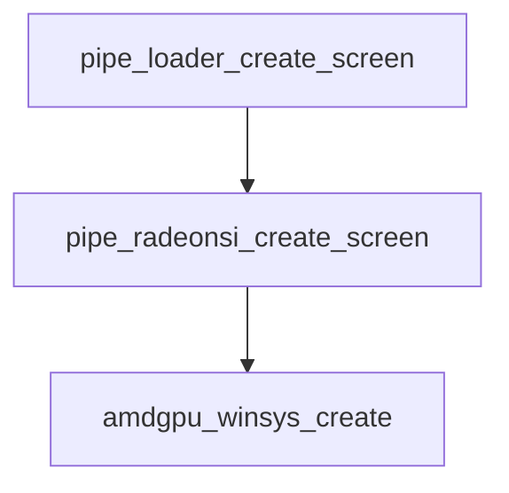
关于amdgpu_winsys_create 的函数内部流程图

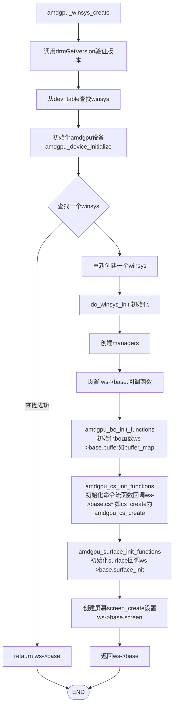


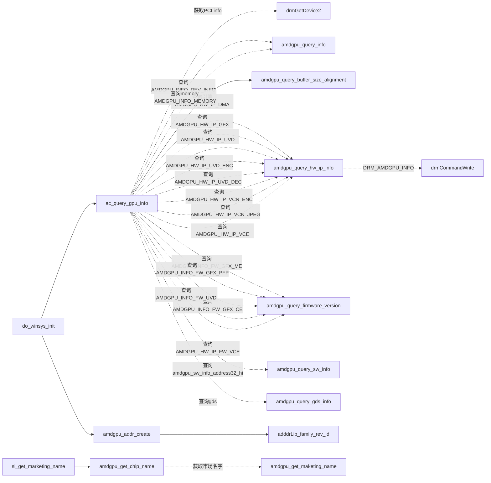

```mermaid 
 
graph LR

amdgpu_create_bo-->amdgpu_bo_alloc -.DRM_AMDGPU_GEM_CREATE.-> drmCommadWriteRead--> Ioctl
amdgpu_create_bo -.分配虚拟地址空间范围.-> amdgpu_va_range_alloc --> amdgpu_vamgr_find_va
amdgpu_create_bo --> amdgpu_bo_va_op_raw 
amdgpu_cretate_bo --> amdgpu_bo_export -->  AAA{switch type}
AAA -.case flink.-> amdgpu_bo_export_flink
AAA -.case type kms.->	amdgpu_add_to_table
AAA -. case dma buf . -> drmPrimeHandleToFD --> drmIoctl
amdgpu_create_bo --> amdgpu_add_buffer_to_global_list
 
si_context_create -.调用ws->base.ctx_create.-> acc[amdgpu_ctx_create ]-->
accr[amdgpu_cs_ctx_create]

acc--> amdgpu_bo_alloc
acc--> amdgpu_bo_cpu_map 


```

## amdgpu_cs_add_buffer

radeon_add_to_buffer_list --> cs_add_buffer

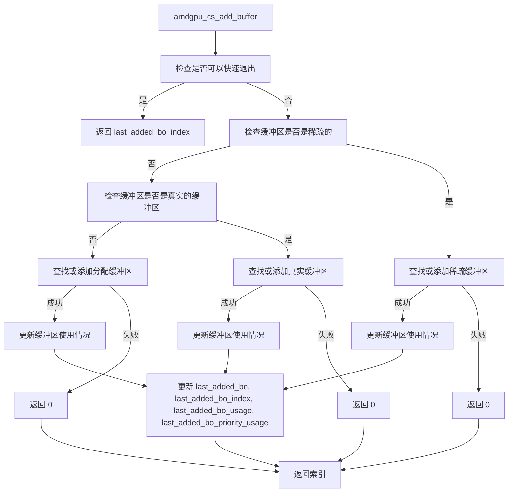


### amdgpu_bo_map

bind to ws->base.buffer_map


```mermaid 
 
graph TD

amdgpu_create_bo-->amdgpu_bo_alloc -.DRM_AMDGPU_GEM_CREATE.-> drmCommadWriteRead--> Ioctl
amdgpu_create_bo -.分配虚拟地址空间范围.-> amdgpu_va_range_alloc --> amdgpu_vamgr_find_va
amdgpu_create_bo --> amdgpu_bo_va_op_raw 
amdgpu_cretate_bo --> amdgpu_bo_export -->  AAA{switch type}
AAA -.case flink.-> amdgpu_bo_export_flink
AAA -.case type kms.->	amdgpu_add_to_table
AAA -. case dma buf . -> drmPrimeHandleToFD --> drmIoctl
amdgpu_create_bo --> amdgpu_add_buffer_to_global_list
 
si_context_create -.调用ws->base.ctx_create.-> acc[amdgpu_ctx_create ]-->
accr[amdgpu_cs_ctx_create]

acc--> amdgpu_bo_alloc
acc--> amdgpu_bo_cpu_map 

```

这个amdgpu_box_get_handle 绑定到在这个ws->base.buffer_get_handle

si_init_screen_texture_functions 绑定si_texture_get_handle 到resoruce_get_handle

```c
 void si_init_screen_texture_functions(struct si_screen *sscreen)
 {
     sscreen->b.resource_from_handle = si_texture_from_handle;
     sscreen->b.resource_get_handle = si_texture_get_handle;
     sscreen->b.resource_from_memobj = si_texture_from_memobj;
     sscreen->b.memobj_create_from_handle = si_memobj_from_handle;
     sscreen->b.memobj_destroy = si_memobj_destroy;
     sscreen->b.check_resource_capability = si_check_resource_capability;
 }

```


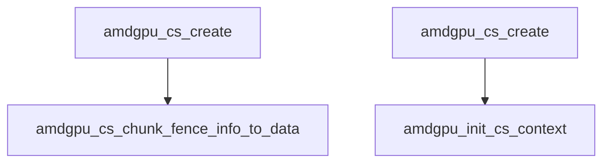

amdgpu_cs_init_functions   初始化ws->base.相关cs回调函数接口
G

dri2.c的文件中dri_kms_driver_api 绑定了这个特resourece_get-handle大赛哦这个allocateBuffer
在dri_util.c dri2接口
driDRI2Extension 把这个dri2AllcateBuffer 绑定到allocateBuffer， 不过据分析这个是在egl的allocateBffer用到


这个dri_kms_driver_api 是个续汉书表
设置ws->addrlib


### amdgpu_cs_get_buffer_list


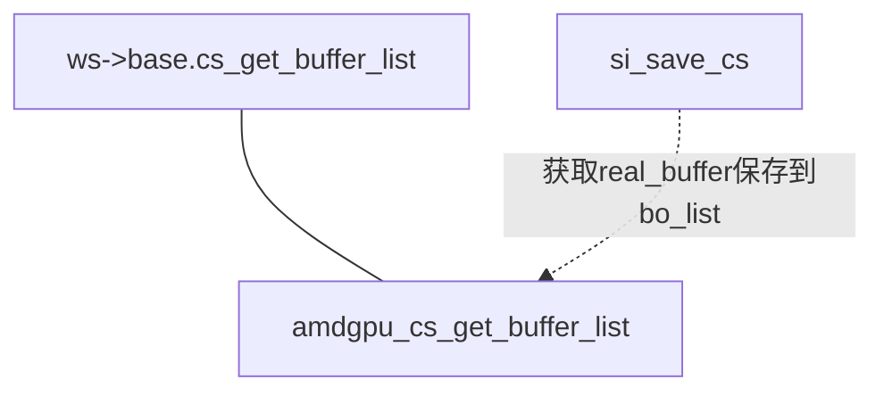

### amdgpu_cs_get_next_fence

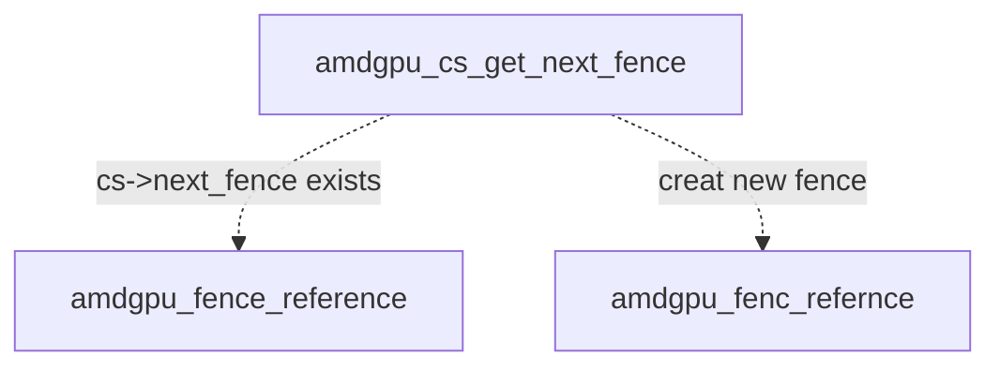
### amdgpu_cs_sync_flush 

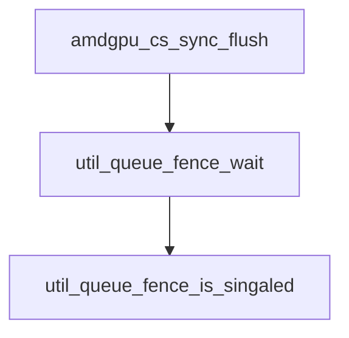

### amdgpU_cs_add_fence_dependency

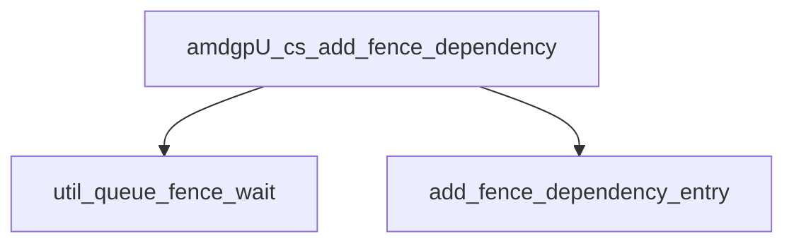

### amdgpu_cs_add_syncobj_signal

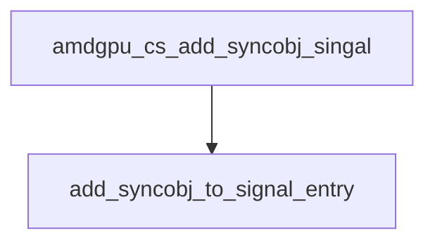
### amdgpu_fence_wait_rel_timeout

这个函数绑定到ws->base.fence_wait


### amdgpu_fence_reference 

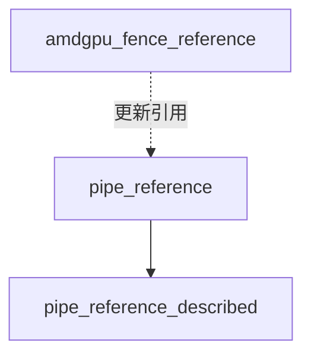
### amdgpu_fence_import_syncobj

绑定到ws->base.fence_import_syncobj

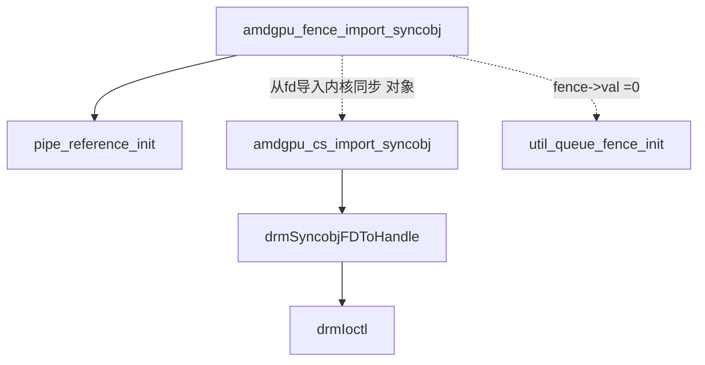
### amdgpu_fence_import_sync_file

bind to ws->base.fence_import_sync_file
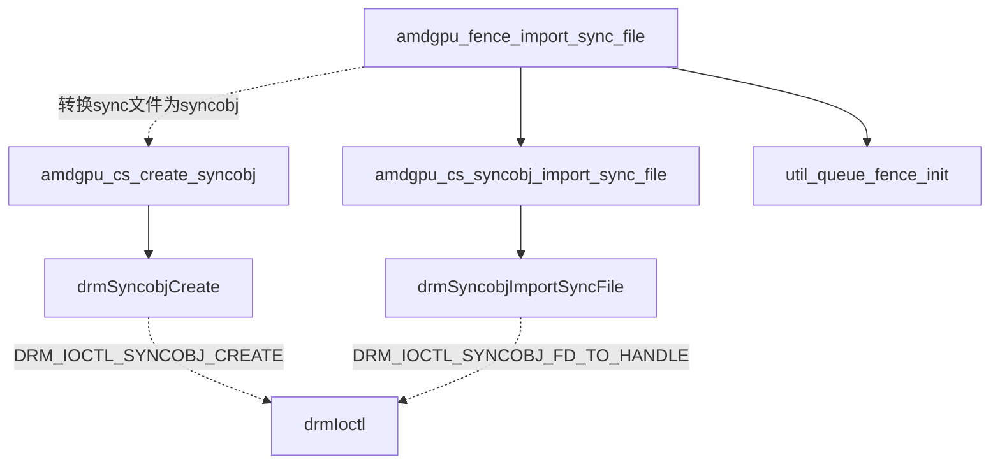

#### amdgpu_fence_export_sync_file


### amdgpuu_fence_export_sync_file

bind to ws->base.fence_export_sync_file

### amdgpu_export_signalled_sync_file

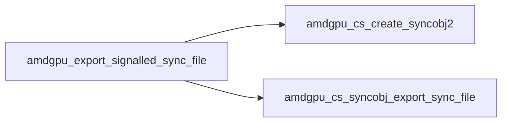
这个直接调用amdgpu_fence_wait


## amdgpu_buffer_set_metadata / amdgpu_buffer_get_metadata

bind to ws-base.buffer_get_metadata
bind to ws->base.buffer_set_metadata

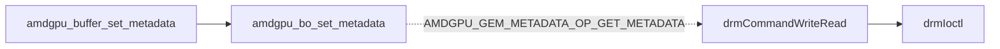

### amdgpu_bo_unmap
bind ws->base.buffer_unmap

### amdgpu_bo_from_handle

bind to ws->base.buffer_from_handle
该函数的流程图如下
```mermaid
graph LR
amdgpu_bo_from_handle --> amdgpu_bo_import -.转换一个dma handle到kms handle.-> amdgpu_bo_handle_tyu=pe_dma_buf_fd
amdgpu_bo_from_handle --> |根据类型找到带有这个handle的buffer| handle_talbe_lookup 
amdgpu_bo_from_handle --> |根据类型open the handle DRM_IOCTL_GEM_OPEN | drmIoctl 
amdgpu_bo_from_handle --> amdgpu_bo_create

```

### amdgpu_bo_import


```graphviz
digraph {

	glXCreateNewContext [style=filled, fillcolor=lightblue]
	End [label="End"style=filled, fillcolor=lightblue]

	 node [shape=circle];

  state1 [label="state1"];
  state2 [label="state2"];
  state11 [label="state11"];
  state21 [label="state21"];
  state31 [label="state31"];
  state32 [label="state32"];
  state34 [label="state34"];
  state35 [label="state35"];
  state36 [label="state36"];
  state37 [label="state37"];
  state38 [label="state38"];
  state39 [label="state39"];
  state40 [label="state40"];
  state41 [label="state41"];
  state42 [label="state42"];
  state43 [label="state43"];
  state44 [label="state44"];
  state45 [label="state45"];
  state46 [label="state46"];
  state47 [label="state47"];
  state48 [label="state48"];

	node[shape=ellipse]
	dri3cca [label="dri3_create_context_attribs"]
    gci [label="glx_context_init"]
	glXCreateNewContext -> state1 [arrowhead=normal, penwidth=3, color=red]
	state1 -> glXGetFBConfigs 
	state1 -> state11[arrowhead=normal, penwidth=3, color=red]
	state11 -> CreateContext [label="创建新的上下文"]
	
	CreateContext -> state2[arrowhead=normal, penwidth=3, color=red]
	state2 -> GetGLXScrenConfigs [label=""]
	state2 -> state21[arrowhead=normal, penwidth=3, color=red]
	state21 -> create_context [label="直接渲染"]
	create_context-> dri3_create_context
	dri3_create_context-> dri3cca 
	dri3cca -> state31 [arrowhead=normal, penwidth=3, color=red]
	state31 -> gci
	state31 -> state32 [label="image_driver->createContextAttribs",arrowhead=normal, penwidth=3, color=red]
	state32 -> driCreateContextAttribs
	
	driCreateContextAttribs ->  state34 [label="driver->CreateContext",arrowhead=normal, penwidth=3, color=red]
	state34-> dri_create_context

	dri_create_context -> state35 [label="stapi->create_context",arrowhead=normal, penwidth=3, color=red]
	state35->st_api_create_context

	st_api_create_context -> state36 [label="smap->screen->context_create",arrowhead=normal, penwidth=3, color=red]
	state36 ->  si_pipe_create_context
	si_pipe_create_context-> state37 [arrowhead=normal, penwidth=3, color=red]
	state37 -> si_create_context
	si_create_context -> state38  [label="set gfx_cs"][arrowhead=normal, penwidth=3, color=red]
	state38  -> amdgpu_ctx_create [label="create winsys context"]
	state38 -> state39[arrowhead=normal, penwidth=3, color=red]
	state39 -> amdgpu_cs_create [label="create winsys cs "] 
	state39 -> state40 [label="设置sctx->blitter"][arrowhead=normal, penwidth=3, color=red]
	state40 -> util_blitter_create
	state40 -> state41 [arrowhead=normal, penwidth=3, color=red]
	state41 -> si_begin_new_gfx_cs

	si_begin_new_gfx_cs -> state42 [arrowhead=normal, penwidth=3, color=red]
	state42 -> si_pm4_emit

	si_pm4_emit -> state43 [arrowhead=normal, penwidth=3, color=red]
	state43 -> radeon_add_to_buffer_list -> amdgpu_cs_add_buffer

	state36 -> state44[arrowhead=normal, penwidth=3, color=red]
	state44 -> st_create_context

	st_create_context -> state45[arrowhead=normal, penwidth=3, color=red]
	state45 -> st_init_driver_functions 
	state45 -> state46 [arrowhead=normal, penwidth=3, color=red]
	state46 -> _mesa_initialize_context
	
	state46 -> state47[arrowhead=normal, penwidth=3, color=red]
	state47 -> st_create_context_priv
	
	st_create_context_priv -> state48[arrowhead=normal, penwidth=3, color=red]
	state48 -> cso_create_context [label="further analysis"]



}



```
pipe_loader_drm_probe_fd_nodup -> ss[label="set  dev->base.ops=&pipe_loader_drm_ops"]
pipe_loader_create_screen -> state1
state1 -> pipe_loader_load_options
state1-> state2
state2-> pipe_loader_drm_create_screen
pipe_loader_drm_create_screen -> state3
state3-> pipe_loader_drm_device
state3->state4 [label="dd->create_screen look up driver_descriptors"]
state4-> pipe_radeonsi_create_screen
pipe_radeonsi_create_screen -> amdgpu_winsys_create
amdgpu_winsys_create ->state5
state5 ->drmGetVersion 
state5 -> state6
state6-> amdgpu_device_initialize
state6 -> state7 [label="look up a winsys  "]
state7 -> util_hash_table_get 
state7 -> state8 [label=" find ws succeed return &ws->base"]

state8 -> state9 [label"create new winsys"]

state9 -> do_winsys_init
do_winsys_init -> state10
state10 -> ac_query_gpu_info
ac_query_gpu_info -> state11
state11 -> drmGetDevice2
state11 -> state12
state12 -> amdgpu_query_gpu_info 
state12 -> state13 

state13 -> amdgpu_query_hw_ip_info
state13 -> state14 
state14 -> amdgpu_query_fireware_version
state14 -> state15
state15 -> amdgpu_query_sw_info
state15 -> state16
state15 -> amdgpu_query_gds_info


state10 -> admgpu_addr_create
amdgpu_addr_create 
state10 -> state11


state9 -> state16 
state16 -> radeonsi_screen_create [label="screen_create"] 
state16 -> state17  [label="set pipe_scren base functions"]

```
###  glXMakeContext

```
	node[shape=circle]
  state1 [label="state1"];
  state2 [label="state2"];
  state3 [label="state3"];
  state4 [label="state4"];
  state5 [label="state5"];
  state6 [label="state6"];
  state7 [label="state7"];
  state8 [label="state8"];
  state9 [label="state9"];
  state10 [label="state10"];
  state11 [label="state11"];
  state12 [label="state12"];
  state13 [label="state13"];
  state14 [label="state14"];
  state15 [label="state15"];
  state16 [label="state16"];

 node[shape=default]
MakeContextCurrent -> state1[arrowhead=normal, penwidth=3, color=red]
state1 -> __glXGetCurrentContext
state1 -> state2[arrowhead=normal, penwidth=3, color=red]
state2 ->  dri3_bind_context [label="bind"]
dri3_bind_context -> state3[arrowhead=normal, penwidth=3, color=red]
state3 -> driReleaseDrawalbes
state3 -> state4[arrowhead=normal, penwidth=3, color=red]
state4 -> driBindContext [label="bindContext"]
driBindContext -> state5 [arrowhead=normal, penwidth=3, color=red]
state5 ->  dri_make_current
 dri_make_current -> state6 [arrowhead=normal, penwidth=3, color=red]
 state6 -> st_api_make_current

 st_api_make_current -> state7 [arrowhead=normal, penwidth=3, color=red]
 state7 -> state8 [arrowhead=normal, penwidth=3, color=red]
 state8 -> st_framebuffer_resuse_or_create -> st_framebuffer_create
 state8 -> state10[arrowhead=normal, penwidth=3, color=red]
 state10 -> _mesa_make_current 
 _mesa_make_current -> state12 [arrowhead=normal, penwidth=3, color=red]
 state12 -> _glapi_set_context
state12 -> state13 [arrowhead=normal, penwidth=3, color=red]
state13 -> _glapi_set_dispatch
state13 -> state14[arrowhead=normal, penwidth=3, color=red]
state14 -> _mesa_reference_framebuffer
state14 -> state15 [arrowhead=normal, penwidth=3, color=red]
state15 -> check_init_viewport
 state10 -> state11 [arrowhead=normal, penwidth=3, color=red]
state11 -> st_context_validate
 state7 -> state9 [label="st is null",arrowhead=normal, penwidth=3, color=red]

 state6 -> state16[arrowhead=normal, penwidth=3, color=red]
 state16 -> pp_init_fbos [label="allocate the temp FBOs"]

```

```
node[shape=record]


```

node [shape=circle];

  state1 [label="state1"];
  state2 [label="state2"];
  state3 [label="state3"];
  state4 [label="state4"];
  state5 [label="state5"];
  state6 [label="state6"];
  state7 [label="state7"];
  state8 [label="state8"];
  state9 [label="state9"];
  state10 [label="state10"];
  state11 [label="state11"];
  state12 [label="state12"];
  state13 [label="state13"];
  state14 [label="state14"];
  state15 [label="state15"];
  state16 [label="state16"];
  state17 [label="state17"];
  state18 [label="state18"];
  state19 [label="state19"];
  state20 [label="state20"];
  state21 [label="state21"];
  state22 [label="state22"];
  state23 [label="state23"];
  state24 [label="state24"];
  state25 [label="state25"];
  state26 [label="state26"];
  state27 [label="state27"];
  state28 [label="state28"];
  state29 [label="state29"];
  state30 [label="state30"];
  state31 [label="state31"];
  state32 [label="state32"];
  state33 [label="state33"];
  state34 [label="state34"];
  state35 [label="state35"];
  state36 [label="state36"];
  state37 [label="state37"];
  state38 [label="state38"];
  state39 [label="state39"];
  state40 [label="state40"];

node[shape=default]

dri_screen_create
dri_screen_create_sw

// env:: GBM_ALWAYS_SOFTWARE 
dri_device_create->dri_screen_create->dri_screen_create_dir2 -> dri_load_driver -> dri_open_driver-> loader_open_driver->
loader_open_driver_lib

dri_device_create ->dri_screen_create_sw->dri_screen_create_dir2

gbm_create_device->_gbm_create_devicee->find_backend ->builtin_backends-> dri_device_create
dri2_initialize -> dri2_initilize_drm-> gbm_create_device
egl_Initialize-> _eglDriver-> dri2_initialize


R600_DEBUG=info


   74      typedef struct _GB_ADDR_CONFIG_T {
   75           unsigned int                                : 1;
   76           unsigned int num_lower_pipes                : 1;
   77           unsigned int row_size                       : 2;
   78           unsigned int                                : 2;
   79           unsigned int multi_gpu_tile_size            : 2;
   80           unsigned int                                : 1;
   81           unsigned int num_gpus                       : 3;
   82           unsigned int                                : 1;
   83           unsigned int shader_engine_tile_size        : 3;
   84           unsigned int                                : 2;
   85           unsigned int num_shader_engines             : 2;
   86           unsigned int                                : 1;
   87           unsigned int bank_interleave_size           : 3;
   88           unsigned int                                : 1;
   89           unsigned int pipe_interleave_size           : 3;
   90           unsigned int                                : 1;
   91           unsigned int num_pipes                      : 3;
   92      } GB_ADDR_CONFIG_T;


