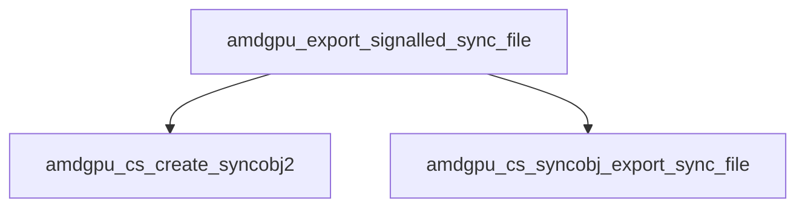

# amdgpu winsys分析

## 


```mermaid
graph TD
amdgpu_bo_init_functions-.初始化ws->base.buffer_create.-> A

A[amdgpu_bo_create] --> 
B[amdgpu_create_bo]

C[amdgpu_get_new_ib]--> D[amdgpu_ib_new_buffer]
D -->E[buffer_create]

F[si_alloc_resoure]--> B
I[si_buffer_create] --> F
J[si_invalidata_buffer]--> F
K[si_texture_create_object]-->F
L[si_texture_invalidata_storage] --> F

M[si_resource_create] --> I
N[pipe_aligned_buffer_create]--> I

A1[si_buffer_transfer_map]--> J
B1[si_buffer_subdata] --> A1
C1[bufferobj_data] --> B1
D1[st_bufferojb_data] --> C1

E1[buffer_data] --> D1
F1[_mesa_buffer_data]-->E1
H1[_mesa_BufferData_no_error] -->  I1

I1[buffer_data_no_error] --> E1
L1[buffer_data_error] -->E1 
K1[glBufferData] --> M1[_mesa_BufferData]
M1-->F1


G[amdgpu_cs_create] --> C
H[amdgpu_cs_flush]--> C


amdgpu_cs_init_functions -.初始化ws->base._cs_flush, cs_create等.-> H

si_flush_dma_cs --> H
si_flush_gfx_cs --> H

si_create_context -.构造dma_cs, gfx_cs.-> G


```
si_init_screen_buffer_functions.初始化si_screen的b.resource_create,destro
buffer_subdata为si_buffer_subdata.

### 关于`_mesa_BufferData_no_error` 

在OpenGL中，可以通过调用`glGetError`函数来获取OpenGL的错误状态。默认情况下，OpenGL会在出现错误时自动将错误状态设置，并且在出现错误后会导致OpenGL函数调用的立即返回。这样可以帮助开发者快速发现和解决问题。

如果你想在某些情况下禁用OpenGL错误检查，可以使用以下方法：

1. **设置noerror标志**：你可以通过调用`glDebugMessageControl`函数来设置OpenGL的错误检查模式。这将允许你选择哪些类型的错误消息会产生，或者完全禁用错误消息。

   ```c
   // 禁用所有错误消息
   glDebugMessageControl(GL_DONT_CARE, GL_DONT_CARE, GL_DONT_CARE, 0, NULL, GL_FALSE);
   ```

   在此例中，`GL_DONT_CARE`参数表示不关心特定的消息类型或源类型。最后一个参数设置为`GL_FALSE`表示禁用错误消息。你可以根据需要选择特定的消息类型和源类型。

2. **OpenGL调试上下文**：另一种方法是使用OpenGL调试上下文。在使用OpenGL的调试扩展时，你可以启用或禁用调试输出，包括错误消息。

   ```c
   // 初始化调试上下文
   glEnable(GL_DEBUG_OUTPUT);
   glDebugMessageCallback(DebugMessageCallback, NULL);
   ```

   然后，你可以实现`DebugMessageCallback`回调函数来处理调试消息，并根据需要选择是否处理错误消息。

需要注意的是，禁用OpenGL错误检查可能会导致难以调试的问题，并且不推荐在正式代码中禁用错误检查。在开发阶段，错误检查对于快速发现和解决问题非常有用，因此应该在开发时启用错误检查，并在发布版本中禁用它。


st_init_bufferobj_functions 初始化pipe_screen的screen的BufferData为st_bufferojb_data


### 关于amdgpu_winsys的创建


```mermaid


graph TD
	A0[pipe_loader_create_screen] -->A	
	A[pipe_radeonsi_create_screen]-> B[amdgpu_winsys_create]
```
关于amdgpu_winsys_create 的函数内部流程图


```mermaid 
 
graph LR

amdgpu_create_bo-->amdgpu_bo_alloc -.DRM_AMDGPU_GEM_CREATE.-> drmCommadWriteRead--> Ioctl
amdgpu_create_bo -.分配虚拟地址空间范围.-> amdgpu_va_range_alloc --> amdgpu_vamgr_find_va
amdgpu_create_bo --> amdgpu_bo_va_op_raw 
amdgpu_cretate_bo --> amdgpu_bo_export -->  AAA{switch type}
AAA -.case flink.-> amdgpu_bo_export_flink
AAA -.case type kms.->	amdgpu_add_to_table
AAA -. case dma buf . -> drmPrimeHandleToFD --> drmIoctl
amdgpu_creat_bo --> amdgpu_add_buffer_to_global_list
 
si_context_create -.调用ws->base.ctx_create.-> acc[amdgpu_ctx_create ]-->
accr[amdgpu_cs_ctx_create]

acc--> amdgpu_bo_alloc
acc--> amdgpu_bo_cpu_map 


```
amdgpu_cs_add_buffer函数流程图如下


radeon_add_to_buffer_list --> cs_add_buffer

```
graph LR
    A[amdgpu_cs_add_buffer] --> B["检查是否可以快速退出"]
    B --> |是| C[返回 last_added_bo_index]
    B --> |否| D["检查缓冲区是否是稀疏的"]
    D --> |否| E["检查缓冲区是否是真实的缓冲区"]
    E --> |否| F["查找或添加分配缓冲区"]
    F --> |成功| G["更新缓冲区使用情况"]
    F --> |失败| H[返回 0]
    E --> |是| I["查找或添加真实缓冲区"]
    I --> |成功| J["更新缓冲区使用情况"]
    I --> |失败| K[返回 0]
    D --> |是| L["查找或添加稀疏缓冲区"]
    L --> |成功| M["更新缓冲区使用情况"]
    L --> |失败| N[返回 0]
    J --> O["更新 last_added_bo, last_added_bo_index, last_added_bo_usage, last_added_bo_priority_usage"]
    G --> O
    M --> O
    O --> P[返回索引]
    H --> P
    K --> P
    N --> P

```


### amdgpu_bo_map

bind to ws->base.buffer_map


```mermaid 
 
graph LR

amdgpu_create_bo-->amdgpu_bo_alloc -.DRM_AMDGPU_GEM_CREATE.-> drmCommadWriteRead--> Ioctl
amdgpu_create_bo -.分配虚拟地址空间范围.-> amdgpu_va_range_alloc --> amdgpu_vamgr_find_va
amdgpu_create_bo --> amdgpu_bo_va_op_raw 
amdgpu_cretate_bo --> amdgpu_bo_export -->  AAA{switch type}
AAA -.case flink.-> amdgpu_bo_export_flink
AAA -.case type kms.->	amdgpu_add_to_table
AAA -. case dma buf . -> drmPrimeHandleToFD --> drmIoctl
amdgpu_creat_bo --> amdgpu_add_buffer_to_global_list
 
si_context_create -.调用ws->base.ctx_create.-> acc[amdgpu_ctx_create ]-->
accr[amdgpu_cs_ctx_create]

acc--> amdgpu_bo_alloc
acc--> amdgpu_bo_cpu_map 

```
	这个amdgpu_box_get_handle 绑定到在这个ws->base.buffer_get_handle

si_init_screen_texture_functions 绑定si_texture_get_handle 到resoruce_get_handle

```c
 void si_init_screen_texture_functions(struct si_screen *sscreen)
 {
     sscreen->b.resource_from_handle = si_texture_from_handle;
     sscreen->b.resource_get_handle = si_texture_get_handle;
     sscreen->b.resource_from_memobj = si_texture_from_memobj;
     sscreen->b.memobj_create_from_handle = si_memobj_from_handle;
     sscreen->b.memobj_destroy = si_memobj_destroy;
     sscreen->b.check_resource_capability = si_check_resource_capability;
 }

```


```mermiad
graph TD
amdgpu_cs_create --> amdgpu_cs_chunk_fence_info_to_data

AA[amdgpu_cs_create]--> A[amdgpu_init_cs_context]
AA

```

amdgpu_cs_init_functions   初始化ws->base.相关cs回调函数接口
G

dri2.c的文件中dri_kms_driver_api 绑定了这个特resourece_get-handle大赛哦这个allocateBuffer
在dri_util.c dri2接口
driDRI2Extension 把这个dri2AllcateBuffer 绑定到allocateBuffer， 不过据分析这个是在egl的allocateBffer用到


这个dri_kms_driver_api 是个续汉书表
设置ws->addrlib


### amdgpu_cs_get_buffer_list


```mermaid
graph TD
	ws->base.cs_get_buffer_list --- amdgpu_cs_get_buffer_list
	si_save_cs -获取real_buffer保存到bo_list-> amdgpu_cs_get_buffer_list

```

### amdgpu_cs_get_next_fence

```mermaid 

graph TD

	//if cs->next_fence -- >
	amdgpu_cs_get_next_fence -.cs->next_fence exists.-> amdgpu_fence_reference 
	amdgpu_cs_get_next_fence -.creat new fence .-> amdgpu_fenc_refernce

```
### amdgpu_cs_sync_flush 


### amdgpU_cs_add_fence_dependency


### amdgpu_cs_add_syncobj_signal


### amdgpu_fence_wait_rel_timeout

这个函数绑定到ws->base.fence_wait


### amdgpu_fence_reference 


### amdgpu_fence_import_syncobj

绑定到ws->base.fence_import_syncobj


### amdgpu_fence_import_sync_file

bind to ws->base.fence_import_sync_file


#### amdgpu_fence_export_sync_file


### amdgpuu_fence_export_sync_file

bind to ws->base.fence_export_sync_file

### amdgpu_export_signalled_sync_file


这个直接调用amdgpu_fence_wait


## amdgpu_buffer_set_metadata / amdgpu_buffer_get_metadata

bind to ws-base.buffer_get_metadata
bind to ws->base.buffer_set_metadata
```mermaid

	A[amdgpu_buffer_set_metadata ]--> amdgpu_bo_set_metadata -.AMDGPU_GEM_METADATA_OP_GET_METADATA.->drmCommandWriteRead --> drmIoctl

```

### amdgpu_bo_unmap
bind ws->base.buffer_unmap

### amdgpu_bo_from_handle

bind to ws->base.buffer_from_handle
该函数的流程图如下
```mermaid

amdgpu_bo_from_handle --> amdgpu_bo_import -.转换一个dma handle到kms handle.-> amdgpu_bo_handle_tyupe_dma_buf_fd
amdgpu_bo_from_handle --> |根据类型找到带有这个handle的buffer| handle_talbe_lookup 
amdgpu_bo_from_handle --> |根据类型open the handle DRM_IOCTL_GEM_OPEN | drmIoctl 
amdgpu_bo_from_handle --> amdgpu_bo_create

```

### amdgpu_bo_import


