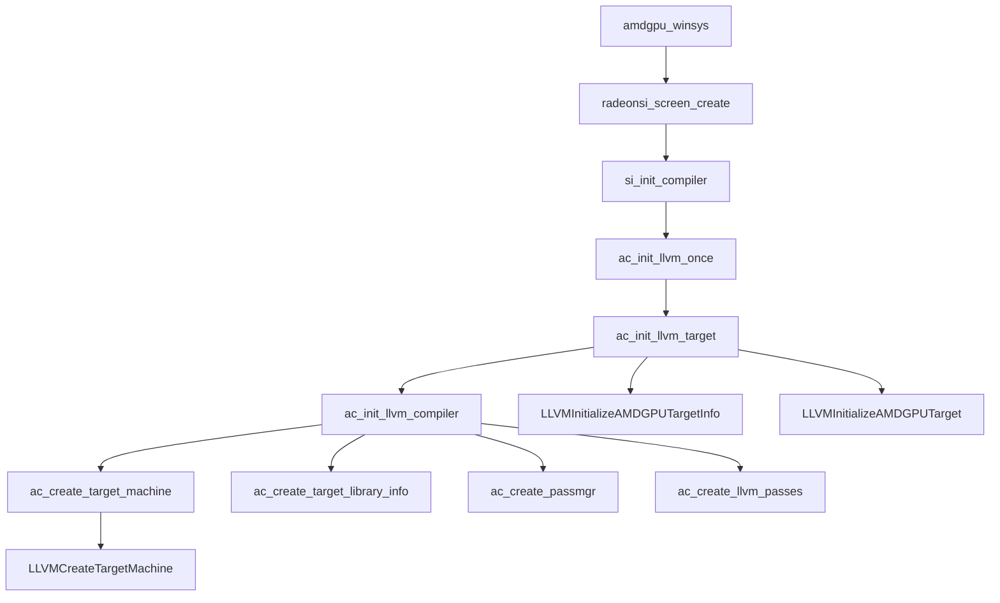
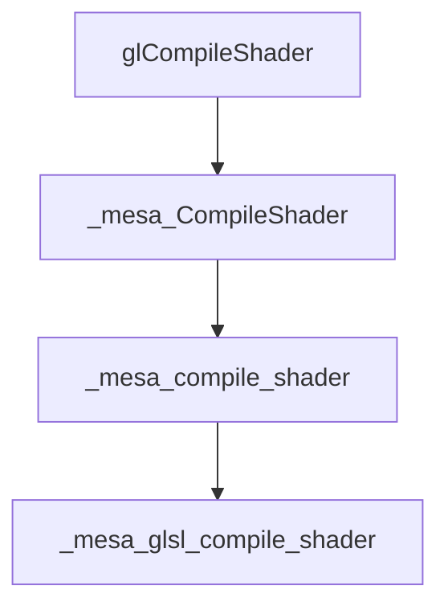
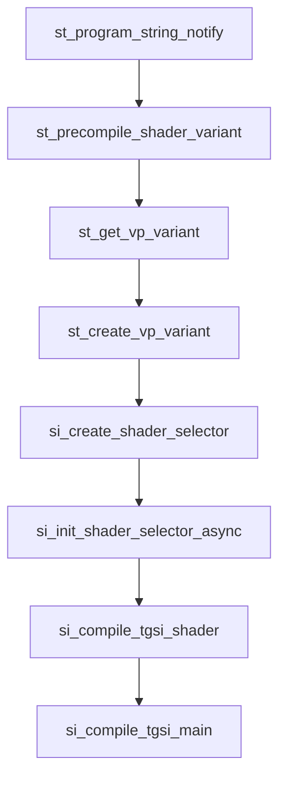
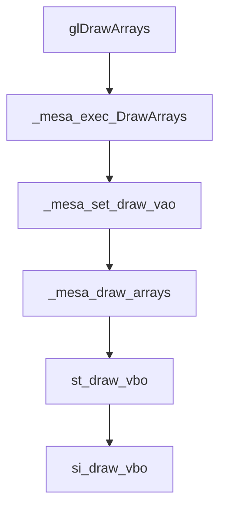
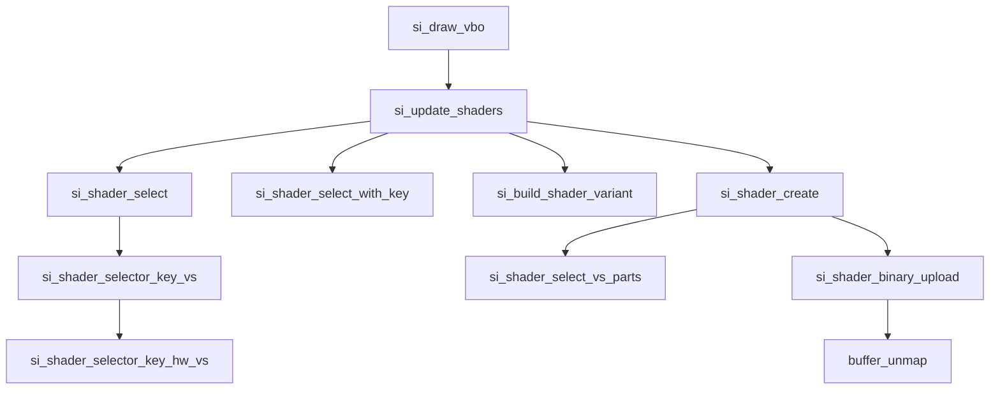
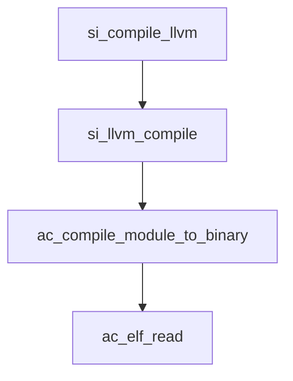

# Shader学习总结

## 什么是Shader

OpenGL（Open Graphics Library）是一种用于渲染2D和3D矢量图形的跨语言、跨平台的应用程序编程接口（API）。OpenGL的应用领域包括游戏开发、模拟、图形渲染和数据可视化等。

Shader（着色器）是一种在图形硬件（GPU）上运行的程序，用于执行渲染3D场景的计算密集型任务。在OpenGL中，我们通常会使用GLSL（OpenGL Shading Language）编写着色器。


## Shader的类型

OpenGL的渲染管线是处理和呈现3D对象的一系列步骤，每个步骤都可以使用特定的着色器来定制。

1. 顶点着色器（Vertex Shader）：这是渲染管线的第一个阶段。它们处理3D物体的每一个顶点，对其位置、颜色、法线等属性进行操作。每个顶点都会独立地通过顶点着色器，所以顶点着色器可以并行执行，提高效率。

2. 曲面细分控制着色器（Tessellation Control Shader）：这个阶段主要用于在硬件上对几何体进行细分，生成更多的顶点。该阶段是可选的。

3. 曲面细分评估着色器（Tessellation Evaluation Shader）：该阶段用于根据细分控制阶段产生的数据，计算新的顶点位置和其它属性。同样，这个阶段也是可选的。

4. 几何着色器（Geometry Shader）：在顶点着色器之后，它接受顶点作为输入，可以生成新的图元（例如点、线、三角形）。这也是一个可选阶段，可以用于实现一些特殊的渲染效果。

5. 片元着色器（Fragment Shader）：也叫像素着色器，它处理的是每个像素的颜色和深度信息。这个阶段决定了每个像素的最终颜色，包括光照、纹理贴图、阴影等所有的视觉效果。

6. 计算着色器（Compute Shader）：这是一个独立于常规渲染管线的着色器，它可以执行一些并行的计算任务，不直接涉及到特定的渲染步骤。


##  OpenGL Shader的使用步骤


在OpenGL中使用shader（着色器）主要涉及以下步骤：

1. **创建着色器对象：** 使用 `glCreateShader` 函数来创建一个新的着色器对象。你需要传入着色器的类型，例如 `GL_VERTEX_SHADER` 对于顶点着色器，或 `GL_FRAGMENT_SHADER` 对于片段着色器。

```cpp
GLuint vertexShader = glCreateShader(GL_VERTEX_SHADER);
GLuint fragmentShader = glCreateShader(GL_FRAGMENT_SHADER);
```

2. **加载着色器源码：** 使用 `glShaderSource` 函数来加载你的GLSL源码到着色器对象。

```cpp
const GLchar* vertexShaderSource = "...";  // 你的顶点着色器GLSL代码
const GLchar* fragmentShaderSource = "...";  // 你的片段着色器GLSL代码
glShaderSource(vertexShader, 1, &vertexShaderSource, NULL);
glShaderSource(fragmentShader, 1, &fragmentShaderSource, NULL);
```

3. **编译着色器：** 使用 `glCompileShader` 函数来编译着色器。

```cpp
glCompileShader(vertexShader);
glCompileShader(fragmentShader);
```

检查是否有编译错误这可以通过调用 `glGetShaderiv` 和 `glGetShaderInfoLog` 来完成。

4. **创建并链接程序对象：** 首先，使用 `glCreateProgram` 函数创建一个新的程序对象。然后，使用 `glAttachShader` 函数将之前编译的着色器附加到程序对象。最后，使用 `glLinkProgram` 函数链接程序。

```cpp
GLuint shaderProgram = glCreateProgram();
glAttachShader(shaderProgram, vertexShader);
glAttachShader(shaderProgram, fragmentShader);
glLinkProgram(shaderProgram);
```


5. **使用程序对象：** 使用 `glUseProgram` 函数，将之前链接的程序设置为当前活动的程序就可以使用此着色器程序进行渲染。

```cpp
glUseProgram(shaderProgram);
```

6. **删除着色器：** 

```cpp
glDeleteShader(vertexShader);
glDeleteShader(fragmentShader);
```

## 简单的shader例子


顶点着色器（Vertex Shader）：
```glsl
#version 330 core
layout (location = 0) in vec3 aPos;

void main()
{
    gl_Position = vec4(aPos.x, aPos.y, aPos.z, 1.0);
}
```
这个顶点着色器接收一个名为 `aPos` 的3D位置向量，然后将其直接传递给 `gl_Position`。`gl_Position` 是一个预定义的变量，是顶点着色器的最终输出。在这个例子中，我们只是将输入的3D坐标直接赋值给 `gl_Position`，所以输入的顶点将直接显示在屏幕上。

片元着色器（Fragment Shader）：
```glsl
#version 330 core
out vec4 FragColor;

void main()
{
    FragColor = vec4(1.0f, 0.5f, 0.2f, 1.0f);
}
```
这个片元着色器将所有渲染的像素颜色设置为橙色。`FragColor` 是一个输出变量，将会被赋值到屏幕上的像素。在这个例子中，所有像素都将被赋值为同一种颜色（RGBA为(1.0, 0.5, 0.2, 1.0)的橙色）。


## Mesa中的Shader架构


值得注意的时,radeonsi是直接从GLSL IR到 tgsi

## RadeonSI中Shader实现分析(基于mesa-18.3.6)

### 对编译器的初始化等流程

```c
/* Per-thread persistent LLVM objects. */
/* 每个线程的持久化 LLVM 对象。*/
struct ac_llvm_compiler {
	LLVMTargetLibraryInfoRef	target_library_info;  // 目标库信息对象的引用
	LLVMPassManagerRef		passmgr;  // Pass 管理对象的引用

	/* Default compiler. */
	/* 默认编译器。*/
	LLVMTargetMachineRef		tm;  // 默认的编译器目标机器对象的引用
	struct ac_compiler_passes	*passes;  // 默认编译器的 Pass 配置

	/* Optional compiler for faster compilation with fewer optimizations.
	 * LLVM modules can be created with "tm" too. There is no difference.
	 */
	/* 用于更快速编译和较少优化的可选编译器。
	 * LLVM 模块也可以使用 "tm" 创建。没有区别。
	 */
	LLVMTargetMachineRef		low_opt_tm;  // 用于快速编译且较少优化的编译器目标机器对象的引用
	struct ac_compiler_passes	*low_opt_passes;  // 快速编译且较少优化的编译器的 Pass 配置
};


```


## 编译Shader GLSL-> GLSL IR





`_mesa_compiler_shader `

1. 在这个函数内，首先调用`disk_cache_compute_key()` 和 `disk_cache_has_key()` 来检查缓存。

2. 如果缓存不存在，那么它会创建一个新的`_mesa_glsl_parse_state`对象，并调用`glcpp_preprocess()`进行预处理。

3. 如果预处理成功，接着进行词法和语法解析，分别通过`_mesa_glsl_lexer_ctor()`, `_mesa_glsl_parse()`, `_mesa_glsl_lexer_dtor()`和`do_late_parsing_checks()`完成。

4. 然后，如果指定了打印AST，会遍历并打印所有的AST节点。

5. 接着，会通过`_mesa_ast_to_hir()`将AST转换为HIR，并调用`validate_ir_tree()`来验证。

6. 如果没有错误，接着会调用`set_shader_inout_layout()`来设定着色器的输入输出布局。

7. 最后，如果没有错误并且着色器IR非空，会执行`assign_subroutine_indexes()`和`lower_subroutine()`对子程序进行处理，并可能调用`opt_shader_and_create_symbol_table()`来优化着

使用glsl_compiler --dump-builder的输出 

```c++
ir_variable *const r0001 = new(mem_ctx) ir_variable(glsl_type::vec4_type, "gl_Position", ir_var_shader_out);
body.emit(r0001);
ir_variable *const r0002 = new(mem_ctx) ir_variable(glsl_type::vec3_type, "position", ir_var_shader_in);
body.emit(r0002);
ir_variable *const r0003 = new(mem_ctx) ir_variable(glsl_type::vec3_type, "color", ir_var_shader_in);
body.emit(r0003);
ir_variable *const r0004 = new(mem_ctx) ir_variable(glsl_type::vec3_type, "fragmentColor", ir_var_shader_out);
body.emit(r0004);
ir_function_signature *
main(void *mem_ctx, builtin_available_predicate avail)
{
   ir_function_signature *const sig =
      new(mem_ctx) ir_function_signature(glsl_type::void_type, avail);
   ir_factory body(&sig->body, mem_ctx);
   sig->is_defined = true;

   ir_variable *const r0005 = body.make_temp(glsl_type::vec4_type, "vec_ctor");
   body.emit(assign(r0005, body.constant(1.000000f), 0x08));

   ir_swizzle *const r0006 = swizzle(r0002, MAKE_SWIZZLE4(SWIZZLE_X, SWIZZLE_Y, SWIZZLE_Z, SWIZZLE_X), 3);
   body.emit(assign(r0005, r0006, 0x07));

   body.emit(assign(r0001, r0005, 0x0f));

   body.emit(assign(r0004, r0003, 0x07));

   return sig;
}

```


### GLSL IR-> tgsi


```mermaid
graph TD
	glLinkProgram --> link_program
    link_program --> _mesa_glsl_link_shader
    _mesa_glsl_link_shader --> st_link_shader
    st_link_shader --> st_program_string_notify
	st_program_string_notify --> st_translate_mesa_program

````
### st_program_string_notify 

该函数是一个用于程序更改通知的回调函数，当程序的文本或代码发生更改时被调用。函数根据目标类型和程序类型进行相应的处理。 

1. 获取目标类型对应的着色器阶段。

2. 根据目标类型进行不同的处理逻辑。

3. 处理GL_FRAGMENT_PROGRAM_ARB目标类型（片段程序）：
   - 释放片段程序的变体和对应的Gallium着色器。
   - 将片段程序翻译为TGSI指令。
   - 更新脏标志。

4. 处理GL_GEOMETRY_PROGRAM_NV目标类型（几何程序）：
   - 释放几何程序的基本变体和对应的Gallium着色器。
   - 将几何程序翻译为TGSI指令。
   - 更新脏标志。

5. 处理GL_VERTEX_PROGRAM_ARB目标类型（顶点程序）：
   - 释放顶点程序的变体和对应的Gallium着色器。
   - 将顶点程序翻译为TGSI指令。
   - 更新脏标志。

6. 处理GL_TESS_CONTROL_PROGRAM_NV目标类型（Tessellation控制程序）：
   - 释放Tessellation控制程序的基本变体和对应的Gallium着色器。
   - 将Tessellation控制程序翻译为TGSI指令。
   - 更新脏标志。

7. 处理GL_TESS_EVALUATION_PROGRAM_NV目标类型（Tessellation评估程序）：
   - 释放Tessellation评估程序的基本变体和对应的Gallium着色器。
   - 将Tessellation评估程序翻译为TGSI指令。
   - 更新脏标志。

8. 处理GL_COMPUTE_PROGRAM_NV目标类型（计算程序）：
   - 释放计算程序的变体和对应的Gallium着色器。
   - 将计算程序翻译为TGSI指令。
   - 更新脏标志。

9. 处理GL_FRAGMENT_SHADER_ATI目标类型（ATI片段着色器）：
   - 初始化ATI片段着色器。
   - 释放片段程序的变体和对应的Gallium着色器。
   - 将片段程序翻译为TGSI指令。
   - 更新脏标志。

10. 根据调试标志和着色器是否只有一个变体的条件，预编译着色器变体。

11. 返回GL_TRUE表示处理成功。


### st_translate_mesa_program 


```c

/**
 * Translate a vertex program.
 */
bool
st_translate_vertex_program(struct st_context *st,
                            struct st_vertex_program *stvp)
```

* 重要函数调用

`st_translate_vertex_program`     
   
   `_mesa_insert_mvp_code`：如果顶点程序具有位置不变性（IsPositionInvariant），则插入MVP（Model-View-Projection）代码。
   
   `_mesa_remove_output_reads`：在ARB_vp（ARB顶点程序）中，移除对输出属性的读取。该函数用于处理ARB_vp中的输出属性。  
   
   `st_translate_stream_output_info2`：根据顶点程序的流输出信息，进行流输出的翻译和设置。它根据给定的顶点程序和输出属性映射信息，将流输出信息进行翻译和设置。  
   
   `st_store_ir_in_disk_cache`：将IR（中间表示）存储在磁盘缓存中。它用于将顶点程序的IR存储在磁盘缓存中，以便后续使用。  
   
   `st_translate_program`：将GLSL程序翻译为TGSI指令。它接受GLSL程序作为输入，并将其翻译为TGSI指令。该函数使用了GLSL到TGSI的访问者（visitor）。  
   
   `free_glsl_to_tgsi_visitor`：释放GLSL到TGSI的访问者。该函数用于释放先前创建的GLSL到TGSI的访问者对象。  
   
   `st_translate_mesa_program`：将Mesa程序翻译为TGSI指令。它接受Mesa程序作为输入，并将其翻译为TGSI指令。  
   
   `ureg_create_with_screen`：创建TGSI指令生成器。该函数用于创建TGSI指令生成器（ureg）对象，用于生成TGSI指令。  
   
   `ureg_destroy`：销毁TGSI指令生成器。该函数用于销毁先前创建的TGSI指令生成器对象。  

* 函数体大致流程

1. 在函数开始处，初始化一些变量和数组。

2. 如果顶点程序具有位置不变性（IsPositionInvariant），则调用`_mesa_insert_mvp_code`函数在顶点程序中插入MVP代码。这可能是为了处理具有位置不变性的顶点程序的特殊情况。

3. 接下来，使用一个循环遍历所有顶点属性（VERT_ATTRIB_x）来确定顶点程序的输入属性数量、输入属性到TGSI通用输入索引的映射关系，并更新相应的计数器和映射数组。

4. 然后，对于每个VARYING_SLOT（用于输出属性），判断是否被顶点程序写入（outputs_written）。如果是，将其与输出槽位（slot）建立映射关系，并记录输出属性的语义信息。

5. 类似地，为了处理可能未使用的边缘标志（edgeflag）输出，对其进行类似的处理。

6. 根据顶点程序的类型（ARB_vp）进行特定操作。如果顶点程序是ARB_vp类型且不是从GLSL转换而来，执行特定操作，如删除输出属性的读取，确定受影响的状态等。

7. 如果顶点程序是使用shader_program编写的，则从最后一个顶点程序中获取流输出信息，并存储IR（中间表示）到磁盘缓存中。然后返回true，表示翻译成功。

8. 否则，创建一个TGSI指令生成器（ureg），根据顶点程序的信息配置它。

9. 如果顶点程序是从GLSL转换而来的，使用`st_translate_program`函数将其翻译为TGSI指令。翻译过程中会使用先前创建的GLSL到TGSI的访问者（glsl_to_tgsi_visitor）对象，并将输入输出属性的映射信息传递给翻译函数。

10. 否则，使用`st_translate_mesa_program`函数将顶点程序从Mesa格式翻译为TGSI指令。

11. 最后，将生成的TGSI指令存储在`stvp->tgsi.tokens`中，记录TGSI指令的数量，并销毁TGSI指令生成器。

12. 如果顶点程序是通过GLSL转换而来的，释放先前创建的GLSL到TGSI的访问者。

13. 返回翻译是否成功的布尔值。

总体而言，该函数的目标是将顶点程序翻译为TGSI指令，以便后续的图形渲染管线可以使用这些指令进行渲染。它涉及到顶点属性的映射、属性语义的处理、顶点程序类型的特定操作以及将顶点程序从不同格式翻译为TGSI指令的过程。


### tgsi-> LLVM main IR




### si_create_shader_selector

```c
static void *si_create_shader_selector(struct pipe_context *ctx,
				       const struct pipe_shader_state *state);
```


### si_init_shader_selector_async

`static void si_init_shader_selector_async(void *job, int thread_index)`

1. 首先，函数获取 `sel`（着色器选择器）的指针和相关的屏幕信息。

2. 然后，函数进行一些断言检查，确保调试相关的设置正确。

3. 接下来，函数检查是否使用了单片式着色器。如果不使用单片式着色器，则会创建一个 `si_shader` 结构体的实例，并对其进行初始化。

4. 分配并初始化了一个 `shader` 结构体，并初始化了其中的一些成员变量。

5. 设置 `shader` 的选择器为当前的 `sel`。

6. 通过调用 `si_parse_next_shader_property` 函数，解析着色器的属性。

7. 如果 `sel` 中有 tokens 或 nir，那么通过调用 `si_get_ir_binary` 函数获取着色器的 IR 二进制数据。

8. 接下来，函数会尝试从着色器缓存中加载着色器。如果成功加载，就无需编译，直接使用缓存中的着色器。否则，需要进行编译。

9. 如果需要编译着色器，会调用 `si_compile_tgsi_shader` 函数来编译着色器。

10. 如果成功编译了着色器，会将它插入着色器缓存中。

11. 将 `shader` 设置为 `sel` 的主要着色器部分。

12. 如果非单片式着色器启用，会对一些已经转换为 `DEFAULT_VAL` 的输出进行处理，以避免在后续的着色器优化过程中尝试消除最终着色器中不存在的输出。

13. 如果 `sel` 的类型是 GEOMETRY 类型，会生成并设置一个 GS COPY 着色器。

总的来说，这个函数的主要作用是异步初始化着色器选择器。它根据不同的条件来选择是从缓存中加载着色器还是进行编译，然后设置相应的着色器部分，并处理一些特定情况下的输出。


### si_compile_tgsi_shader

```c
int si_compile_tgsi_shader(struct si_screen *sscreen,
			   struct ac_llvm_compiler *compiler,
			   struct si_shader *shader,
			   struct pipe_debug_callback *debug)
```

1. 首先，函数从输入参数中获取着色器选择器 (`shader->selector`)、屏幕信息 (`sscreen`)、LLVM 编译器 (`compiler`) 和调试回调 (`debug`)。

2. 如果满足条件，则在进行 TGSI->LLVM 转换之前，将 TGSI 代码转储到控制台。这可以通过调用 `si_can_dump_shader` 函数来检查是否满足转储条件。

3. 初始化着色器上下文 (`ctx`)，并使用 `si_init_shader_ctx` 函数设置相关信息。

4. 清空着色器信息结构体中的 `vs_output_param_offset` 数组。

5. 设置着色器的 `uses_instanceid` 标志位，指示是否使用了 `instanceid`。

6. 调用 `si_compile_tgsi_main` 函数来执行 TGSI->LLVM 的转换，并生成主要的 LLVM 函数。

7. 如果着色器是单片式（`is_monolithic`），且类型为顶点着色器（`PIPE_SHADER_VERTEX`），则根据需要生成顶点着色器的 prolog 和 epilog，并构建包装函数。

8. 如果着色器是单片式且类型为细分控制着色器（`PIPE_SHADER_TESS_CTRL`），则根据需要生成细分控制着色器的 epilog，并构建包装函数。在 GFX9 架构之后的硬件上，还会生成作为细分控制着色器的顶点着色器（LS）的主要部分，并构建包装函数。

9. 如果着色器是单片式且类型为几何着色器（`PIPE_SHADER_GEOMETRY`），则根据需要生成几何着色器的 prolog，并构建包装函数。在 GFX9 架构之后的硬件上，还会生成作为几何着色器的顶点着色器（ES）的主要部分，并构建包装函数。

10. 如果着色器是单片式且类型为片段着色器（`PIPE_SHADER_FRAGMENT`），则根据需要生成片段着色器的 prolog 和 epilog，并构建包装函数。

11. 对生成的 LLVM 模块进行优化。

12. 对顶点着色器的输出进行优化处理。

13. 如果需要进行调试或转储着色器，会记录着色器的私有内存 VGPR 数量。

14. 确保输入参数是指针而不是整数。

15. 将 LLVM 模块编译成字节码。

16. 验证计算着色器的 SGPR 和 VGPR 使用情况，以检测编译器的错误。如果超出硬件限制，则输出错误信息。

17. 对于计算着色器，计算最大的 SIMD 波数。

18. 计算片段着色器的输入 VGPR 数量。

19. 计算着色器的最大 SIMD 波数，并进行一些统计和调试输出。


### si_compile_tgsi_main

 `static bool si_compile_tgsi_main(struct si_shader_context *ctx);`

 `si_compile_tgsi_main` 是 `si_compile_tgsi_shader` 函数的辅助函数，用于处理特定类型的 TGSI 着色器。

1. 首先，函数从上下文中获取着色器 (`ctx->shader`) 和着色器选择器 (`ctx->shader->selector`)。

2. 根据上下文的类型 (`ctx->type`)，根据不同的着色器类型，设置不同的函数指针和功能：
   - 顶点着色器 (`PIPE_SHADER_VERTEX`)：设置加载输入函数 (`ctx->load_input`) 和发射输出函数 (`ctx->abi.emit_outputs`)。
   - 细分控制着色器 (`PIPE_SHADER_TESS_CTRL`)：设置输入和输出的数据获取函数 (`bld_base->emit_fetch_funcs`)，以及加载细分曲面参数和输出细分控制着色器数据的函数。
   - 细分评估着色器 (`PIPE_SHADER_TESS_EVAL`)：设置输入数据获取函数，加载细分曲面参数和坐标的函数，以及发射输出函数。
   - 几何着色器 (`PIPE_SHADER_GEOMETRY`)：设置输入数据获取函数，加载输入数据的函数，发射顶点和图元的函数，以及发射输出函数。
   - 片段着色器 (`PIPE_SHADER_FRAGMENT`)：设置加载输入函数、发射输出函数、插值参数查找函数、加载样本位置的函数、加载样本屏蔽掩码的函数和发射丢弃指令的函数。
   - 计算着色器 (`PIPE_SHADER_COMPUTE`)：设置加载本地工作组大小的函数。

3. 创建 LLVM 函数。

4. 预加载环形缓冲区。

5. 对于 GFX9 架构的合并着色器：
   - 如果着色器不是单片式 (`!shader->is_monolithic`)，且满足一定条件，则设置 EXEC 寄存器，以便于在片段着色器或顶点着色器的主函数中使用。
   - 如果是细分控制着色器 (`PIPE_SHADER_TESS_CTRL`) 或几何着色器 (`PIPE_SHADER_GEOMETRY`)，则创建一个 if 语句块，用于执行屏障之前的代码。
   - 如果是细分控制着色器 (`PIPE_SHADER_TESS_CTRL`) 或几何着色器 (`PIPE_SHADER_GEOMETRY`)，则在块内执行屏障。

6. 对于细分控制着色器 (`PIPE_SHADER_TESS_CTRL`)，如果细分曲面参数在所有调用中都被定义，则为每个细分曲面参数创建 LLVM 寄存器。

7. 对于几何着色器 (`PIPE_SHADER_GEOMETRY`)，为每个输出顶点创建 LLVM 寄存器。

8. 如果需要在丢弃指令之后执行正确的导数计算，则为推迟执行的丢弃指令创建 LLVM 寄存器，并将其初始化为 `true`。

9. 根据着色器选择器的信息，将 TGSI 代码或 NIR 中间表示翻译为 LLVM 代码。

10. 使用 `si_llvm_build_ret` 函数构建返回语句。

11. 如果成功翻译，则返回 `true`，否则返回 `false`。

这个函数的作用是根据不同类型的 TGSI 着色器设置相应的函数指针，并将 TGSI 或 NIR 着色器代码翻译为 LLVM 代码。它还进行一些特定类型的着色器的预处理和设置。
20. 返回编译结果，0 表示成功，-1 表示失败。

总的来说，这个函数的作用是编译 TGSI 格式的着色器为字节码，并进行优化和验证。它根据着色器的类型和单片式标志生成不同的着色器部分，并构建包装函数。


### 关于Shader prolog/epilog 

prolog和epilog是可选字段. vertex shader只有prolog

这个阶段发生在glDraw\*等函数调用时.

* glDrawArrays 流程


* u_vbuf_draw_vbo : 这个函数的主要目的是执行一个绘制操作，但是它也处理了许多复杂的情况，例如间接绘制、索引绘制、用户空间的顶点缓冲区、顶点翻译等。这些复杂的处理使得这个函数能够适应各种不同的使用场景，并最大限度地优化绘制性能。

* si_draw_vbo : 这个函数主要涉及到了图形渲染的一些关键步骤，如资源管理、纹理处理、着色器更新、渲染命令的提交等，同时也进行了一些特定硬件的优化和工作流程，例如利用异步计算、处理硬件的 bug 等。
在该函数`si_draw_vbo`中，如果当前绘制指令的原语类型（primitive type）与上一个绘制指令的原语类型不同，或者绘制需要LS VGPR修复但当前并未开启，或者GS的三角形剥离邻接性修复（GS triangle strip adjacency fix）的需要发生变化时，函数会标记着色器需要更新。

## si_update_shaders 阶段

这个阶段主要生成vs的prolog和ps的epilog函数，当然如果是monolic架构，还会进行si_compile_tgsi_shader,对此次调试来说已经在linkProgram生成。

```
si_draw_vbo
	si_update_shaders
		si_shader_select si_shader_selector_key 
					si_shader_selector_key_vs
						si_shader_selector_key_hw_vs
		si_shader_select_with_key
		si_build_shader_variant
		si_shader_create
			si_shader_select_vs_parts
			si_shader_binary_upload
				buffer_unmap(amdgpu_bo_unmap) // winsys层
```


### si_shader_create

```
int si_shader_create(struct si_screen *sscreen, struct ac_llvm_compiler *compiler,
		     struct si_shader *shader,
		     struct pipe_debug_callback *debug)
```
1. 函数参数：
   - `sscreen`: 这个参数代表GPU硬件的相关信息和状态。
   - `compiler`: 这个参数包含了用于编译着色器的编译器信息。
   - `shader`: 这是要创建的shader。
   - `debug`: 用于调试信息的回调。

2. 函数开始时，它会检查是否为"monolithic" shader。这是一个完整编译的shader，可能有很多变体，并且可能需要较长时间来编译。对于这种类型的shader，函数会调用`si_compile_tgsi_shader`函数进行编译。

3. 对于非"monolithic" shader，它包含多个部分：
   - 用户着色器中间部分，它只有一个变体，并且在创建着色器选择器时已经被编译过。
   - 在开始时插入的prolog部分。
   - 在结束时插入的epilog部分。
   这些prolog和epilog有很多（但是简单）的变体。
   通过si_shader_select_vs_parts 生成实际的llvm IR prolog。


4. 在选择shader的各个部分后，函数会更新shader的SGPR和VGPR的数量。这些寄存器在GPU中存储着色器的输入和输出数据。

5. 函数会计算最大的simd波形数（si_calculate_max_simd_waves）。在AMD的GPU中，每个硬件线程（也被称为"wavefront"或者"wave"）可以执行多个并行的shader操作。

6. 函数会修复资源使用（si_fix_resource_usage）。如果某个资源在shader中没有被使用，那么这个函数会对这个资源的使用进行修复。

7. 函数会把shader的二进制代码上传到GPU（si_shader_binary_upload）。

8. 最后，如果一切都成功，函数会返回0。否则，如果在任何阶段出现错误，函数会返回错误代码。


### si_get_shader_part

`si_shader_select_vs_parts->si_get_vs_prolog-> si_get_shader_part-> build(si_build_vs_prolog_function)`

关于si_get_shader_part

```
static bool si_get_vs_prolog(struct si_screen *sscreen,
			     struct ac_llvm_compiler *compiler,
			     struct si_shader *shader,
			     struct pipe_debug_callback *debug,
			     struct si_shader *main_part,
			     const struct si_vs_prolog_bits *key)
```

这个函数用于创建、编译和返回一个着色器部分（prolog或epilog）。

以下是它的主要部分的详解：

1. 函数参数：  
   - `sscreen`: 这个参数包含了显卖的相关信息和状态。  
   - `list`: 同一类别的着色器部分列表。  
   - `type`: 着色器类型。
   - `prolog`: 是否正在请求prolog部分。
   - `key`: 着色器部分的key。
   - `compiler`: 用于编译着色器的编译器。
   - `debug`: 用于调试信息的回调函数。
   - `build`: 负责构建主函数的回调函数。
   - `name`: 名称。

2. 首先，函数尝试在已有的着色器部分中查找是否存在符合key的着色器部分。

3. 如果找不到，那么函数将编译一个新的着色器部分。它首先初始化一个新的着色器上下文，然后根据不同的着色器类型设置着色器的key。然后，调用提供的`build`函数进行构建。

4. 在构建完成后，函数会进行LLVM的优化并编译新的着色器部分。如果编译过程中出现错误，函数将释放新创建的着色器部分并返回NULL。

5. 如果新的着色器部分编译成功，函数将新的着色器部分添加到list中，并返回新的着色器部分。

注意，在查找和添加着色器部分时，函数都会使用互斥锁进行同步，以避免在多线程环境下产生数据竞争。


这里的build函数是si_build_vs_prolog_function

### si_build_vs_prolog_function

```c
/**
* 构建顶点着色器（Vertex Shader）prolog函数
*
*函数的输入与顶点着色器（VS）的输入一致，包括许多标量通用寄存器（SGPRs）和4个向量通用寄存器（VGPR）系统值。所有的输入都会原样返回。在这些输入后面存储的是顶点加载索引，这些索引将被API的顶点着色器用于获取输入。
*
*例如，当实例分频器（instance_divisors）数组为{0, 1, 2}时，预期的输出为：
*- 输入变量v0
*- 输入变量v1
*- 输入变量v2
*- 输入变量v3
*- （VertexID + BaseVertex）
*- （InstanceID + StartInstance） *- （InstanceID / 2 + StartInstance） */
 static void si_build_vs_prolog_function(struct si_shader_context *ctx,
					union si_shader_part_key *key)
{
    //初始化一个si_function_info结构体，这个结构体主要包含了函数参数的类型和数量等信息。
	struct si_function_info fninfo;

    //创建一个LLVM类型引用指针returns，这个指针将用来保存函数返回值的类型。
	LLVMTypeRef *returns;

	//声明LLVM值引用ret和func，它们分别用于保存LLVM的返回值和函数对象。
	LLVMValueRef ret, func;
	int num_returns, i;

	//获取prolog部分合并的下一个阶段的数量，并保存在first_vs_vgpr中。
	unsigned first_vs_vgpr = key->vs_prolog.num_merged_next_stage_vgprs;

	//计算输入向量通用寄存器（VGPRs）的数量，它是prolog部分的合并的下一阶段的数量加上4，然后保存在num_input_vgprs中。
	unsigned num_input_vgprs = key->vs_prolog.num_merged_next_stage_vgprs + 4;

	//声明一个包含9个元素的LLVM值引用数组input_vgprs，它用于保存输入的向量通用寄存器（VGPRs）。
	LLVMValueRef input_vgprs[9];

	//计算所有输入寄存器的数量，它是输入标量通用寄存器（SGPRs）的数量加上输入向量通用寄存器（VGPRs）的数量，然后保存在num_all_input_regs中。
	unsigned num_all_input_regs = key->vs_prolog.num_input_sgprs +
				      num_input_vgprs;

	//计算用户的标量通用寄存器（SGPRs）的基础值，如果prolog部分的合并的下一个阶段的数量大于0，那么基础值就是8，否则就是0。
	unsigned user_sgpr_base = key->vs_prolog.num_merged_next_stage_vgprs ? 8 : 0;

	//使用alloca函数分配内存空间给returns，空间的大小由所有输入寄存器的数量、prolog部分的最后一个输入以及1的总和乘以LLVMTypeRef的大小得出。
	si_init_function_info(&fninfo);

	/* 4 preloaded VGPRs + vertex load indices as prolog outputs */
	returns = alloca((num_all_input_regs + key->vs_prolog.last_input + 1) *
			 sizeof(LLVMTypeRef));
	num_returns = 0;

     
	/* Declare input and output SGPRs. */
	for (i = 0; i < key->vs_prolog.num_input_sgprs; i++) {
		add_arg(&fninfo, ARG_SGPR, ctx->i32);
		returns[num_returns++] = ctx->i32;
	}

	/* Preloaded VGPRs (outputs must be floats) */
	for (i = 0; i < num_input_vgprs; i++) {
		add_arg_assign(&fninfo, ARG_VGPR, ctx->i32, &input_vgprs[i]);
		returns[num_returns++] = ctx->f32;
	}

	/* Vertex load indices. */
	for (i = 0; i <= key->vs_prolog.last_input; i++)
		returns[num_returns++] = ctx->f32;

	//使用前面构建的函数信息fninfo，创建一个名为"vs_prolog"的LLVM函数。
	si_create_function(ctx, "vs_prolog", returns, num_returns, &fninfo, 0);
	func = ctx->main_fn;

	if (key->vs_prolog.num_merged_next_stage_vgprs) {

		//如果存在合并的VGPRs，则执行以下操作：
		//检查key->vs_prolog.is_monolithic是否为false，如果是，则调用si_init_exec_from_input函数，将第3个输入参数作为执行掩码，并将0作为偏移量。
		if (!key->vs_prolog.is_monolithic)
			si_init_exec_from_input(ctx, 3, 0);

	//如果是局部着色器（LS）且屏幕具有LS VGPR初始化错误，则执行以下操作：
	//使用LLVM构建器ctx->ac.builder创建一个整数比较指令，比较第3个输入参数的8到15位与ctx->i32_0（零值）是否不相等。结果存储在has_hs_threads变量中。
	///执行一个循环，从4到1递减，将input_vgprs[i + 1]设置为input_vgprs[i - 1]或input_vgprs[i + 1]的选择，具体取决于has_hs_threads的值。
		if (key->vs_prolog.as_ls &&
		    ctx->screen->has_ls_vgpr_init_bug) {
			/* If there are no HS threads, SPI loads the LS VGPRs
			 * starting at VGPR 0. Shift them back to where they
			 * belong.
			 */
			LLVMValueRef has_hs_threads =
				LLVMBuildICmp(ctx->ac.builder, LLVMIntNE,
				    si_unpack_param(ctx, 3, 8, 8),
				    ctx->i32_0, "");

			for (i = 4; i > 0; --i) {
				input_vgprs[i + 1] =
					LLVMBuildSelect(ctx->ac.builder, has_hs_threads,
						        input_vgprs[i + 1],
						        input_vgprs[i - 1], "");
			}
		}
	}

	ctx->abi.vertex_id = input_vgprs[first_vs_vgpr];
	ctx->abi.instance_id = input_vgprs[first_vs_vgpr + (key->vs_prolog.as_ls ? 2 : 1)];

	/* Copy inputs to outputs. This should be no-op, as the registers match,
	 * but it will prevent the compiler from overwriting them unintentionally.
	 */
	ret = ctx->return_value;
	for (i = 0; i < key->vs_prolog.num_input_sgprs; i++) {
		LLVMValueRef p = LLVMGetParam(func, i);
		ret = LLVMBuildInsertValue(ctx->ac.builder, ret, p, i, "");
	}
	for (i = 0; i < num_input_vgprs; i++) {
		LLVMValueRef p = input_vgprs[i];
		p = ac_to_float(&ctx->ac, p);
		ret = LLVMBuildInsertValue(ctx->ac.builder, ret, p,
					   key->vs_prolog.num_input_sgprs + i, "");
	}

	/* Compute vertex load indices from instance divisors. */
	LLVMValueRef instance_divisor_constbuf = NULL;


	//如果key->vs_prolog.states.instance_divisor_is_fetched为true，则执行以下操作：
	//调用si_prolog_get_rw_buffers函数获取读写缓冲列表的LLVM值。
	//创建一个表示常量缓冲区索引的buf_index值。
	//使用ac_build_load_to_sgpr函数将常量缓冲区加载到SGPR中，得到instance_divisor_constbuf的值。
	if (key->vs_prolog.states.instance_divisor_is_fetched) {
		LLVMValueRef list = si_prolog_get_rw_buffers(ctx);
		LLVMValueRef buf_index =
			LLVMConstInt(ctx->i32, SI_VS_CONST_INSTANCE_DIVISORS, 0);
		instance_divisor_constbuf =
			ac_build_load_to_sgpr(&ctx->ac, list, buf_index);
	}

	// 下面主要是对是否是多实例渲染进行index增加，插入相关值
	for (i = 0; i <= key->vs_prolog.last_input; i++) {
		bool divisor_is_one =
			key->vs_prolog.states.instance_divisor_is_one & (1u << i);
		bool divisor_is_fetched =
			key->vs_prolog.states.instance_divisor_is_fetched & (1u << i);
		LLVMValueRef index = NULL;

		if (divisor_is_one) {
			index = ctx->abi.instance_id;
		} else if (divisor_is_fetched) {
			LLVMValueRef udiv_factors[4];

			for (unsigned j = 0; j < 4; j++) {
				udiv_factors[j] =
					buffer_load_const(ctx, instance_divisor_constbuf,
							  LLVMConstInt(ctx->i32, i*16 + j*4, 0));
				udiv_factors[j] = ac_to_integer(&ctx->ac, udiv_factors[j]);
			}
			/* The faster NUW version doesn't work when InstanceID == UINT_MAX.
			 * Such InstanceID might not be achievable in a reasonable time though.
			 */
			index = ac_build_fast_udiv_nuw(&ctx->ac, ctx->abi.instance_id,
						       udiv_factors[0], udiv_factors[1],
						       udiv_factors[2], udiv_factors[3]);
		}

		if (divisor_is_one || divisor_is_fetched) {
			/* Add StartInstance. */
			index = LLVMBuildAdd(ctx->ac.builder, index,
					     LLVMGetParam(ctx->main_fn, user_sgpr_base +
							  SI_SGPR_START_INSTANCE), "");
		} else {
			/* VertexID + BaseVertex */
			index = LLVMBuildAdd(ctx->ac.builder,
					     ctx->abi.vertex_id,
					     LLVMGetParam(func, user_sgpr_base +
								SI_SGPR_BASE_VERTEX), "");
		}

		index = ac_to_float(&ctx->ac, index);
		ret = LLVMBuildInsertValue(ctx->ac.builder, ret, index,
					   fninfo.num_params + i, "");
	}


	//使用si_llvm_build_ret函数构建函数的返回语句，返回ret变量的值。
	si_llvm_build_ret(ctx, ret);
}
```


下面是调试时的输出可以和上面代码进行对照参考

```bash
radeonsi: Compiling shader 2
Vertex Shader Prolog LLVM IR:

; ModuleID = 'mesa-shader'
source_filename = "mesa-shader"
target datalayout = "e-p:64:64-p1:64:64-p2:32:32-p3:32:32-p4:64:64-p5:32:32-p6:32:32-i64:64-v16:16-v24:32-v32:32-v48:64-v96:128-v192:256-v256:256-v512:512-v1024:1024-v2048:2048-n32:64-S32-A5"
target triple = "amdgcn--"

define amdgpu_vs <{ i32, i32, i32, i32, i32, i32, i32, i32, i32, float, float, float, float, float }> @vs_prolog(i32 inreg, i32 inreg, i32 inreg, i32 inreg, i32 inreg, i32 inreg, i32 inreg, i32 inreg, i32 inreg, i32, i32, i32, i32) #0 {
main_body:
  %13 = insertvalue <{ i32, i32, i32, i32, i32, i32, i32, i32, i32, float, float, float, float, float }> undef, i32 %0, 0
  %14 = insertvalue <{ i32, i32, i32, i32, i32, i32, i32, i32, i32, float, float, float, float, float }> %13, i32 %1, 1
  %15 = insertvalue <{ i32, i32, i32, i32, i32, i32, i32, i32, i32, float, float, float, float, float }> %14, i32 %2, 2
  %16 = insertvalue <{ i32, i32, i32, i32, i32, i32, i32, i32, i32, float, float, float, float, float }> %15, i32 %3, 3
  %17 = insertvalue <{ i32, i32, i32, i32, i32, i32, i32, i32, i32, float, float, float, float, float }> %16, i32 %4, 4
  %18 = insertvalue <{ i32, i32, i32, i32, i32, i32, i32, i32, i32, float, float, float, float, float }> %17, i32 %5, 5
  %19 = insertvalue <{ i32, i32, i32, i32, i32, i32, i32, i32, i32, float, float, float, float, float }> %18, i32 %6, 6
  %20 = insertvalue <{ i32, i32, i32, i32, i32, i32, i32, i32, i32, float, float, float, float, float }> %19, i32 %7, 7
  %21 = insertvalue <{ i32, i32, i32, i32, i32, i32, i32, i32, i32, float, float, float, float, float }> %20, i32 %8, 8
  %22 = bitcast i32 %9 to float
  %23 = insertvalue <{ i32, i32, i32, i32, i32, i32, i32, i32, i32, float, float, float, float, float }> %21, float %22, 9
  %24 = bitcast i32 %10 to float
  %25 = insertvalue <{ i32, i32, i32, i32, i32, i32, i32, i32, i32, float, float, float, float, float }> %23, float %24, 10
  %26 = bitcast i32 %11 to float
  %27 = insertvalue <{ i32, i32, i32, i32, i32, i32, i32, i32, i32, float, float, float, float, float }> %25, float %26, 11
  %28 = bitcast i32 %12 to float
  %29 = insertvalue <{ i32, i32, i32, i32, i32, i32, i32, i32, i32, float, float, float, float, float }> %27, float %28, 12
  %30 = add i32 %9, %5
  %31 = bitcast i32 %30 to float
  %32 = insertvalue <{ i32, i32, i32, i32, i32, i32, i32, i32, i32, float, float, float, float, float }> %29, float %31, 13
  ret <{ i32, i32, i32, i32, i32, i32, i32, i32, i32, float, float, float, float, float }> %32
}

attributes #0 = { "no-signed-zeros-fp-math"="true" }
```


### 对Shader的动态链接

RadeonSI 通过ac_elf_read多个ELF对象合并为一个单独的二进制文件
目前是临时的方法：将.text部分粘贴在一起
目标：支持（一些）额外的部分和真正的重定位

根据llvm 后端处理流程来看， elf文件的首先是产生目标对象文件

RadesonSI 通过调用ac_compile_module_to_binary等函数将目标文件的符号等信息写入到ac_compiler_passes里面的code_string 。

###  主要函数调用流程



### ac_compile_module_to_binary 

这个函数主要有两处需要注意
1. `p->passmgr.run(*llvm::unwrap(module))`: 这一行代码调用了 `passmgr` 对象的 `run` 方法，并传入了 `module` 参数。它是一个对 LLVM Pass Manager 进行运行的调用。通过这个调用，编译器将对给定的 LLVM 模块进行一系列的优化和转换操作。这函数启动了passmgr，这个会将pass过程中的对象文件数据逐个获取从而给下面函数进行链接。

2. `bool success = ac_elf_read(data.data(), data.size(), binary)`: 这一行代码调用了 `ac_elf_read` 函数，传入了 `data` 字节码数据、字节码数据的大小以及 `binary` 结构体的指针。它的目的是将字节码数据解析为 ELF 格式，并将解析结果存储到 `binary` 结构体中。

总体而言，`ac_compile_module_to_binary` 函数是一个将 LLVM 模块编译为 ELF 字节码数据的过程。它通过运行 LLVM Pass Manager 对模块进行优化和转换，生成 ELF 字节码数据并解析到 `binary` 结构体中。在解析过程中，如果出现错误，会输出相应的错误消息。这个函数是整个编译过程中的重要环节，将模块转换为 ELF 字节码数据，为后续的处理和操作提供了基础。

### ac_elf_read

它接收一个 ELF 数据的指针、ELF 数据的大小以及一个用于存储结果的结构体 `ac_shader_binary` 的指针。这个函数用到了大量libelf的接口， 关于接口的使用可详细参考官方参考手册[libelf-doc]()

以下是对该函数的分析：

1. 首先，函数初始化了一些变量和数据结构，包括 ELF 文件的缓冲区、`Elf` 结构体和相关的辅助变量。

2. 接下来，函数通过调用 `elf_memory()` 以内存中的数据创建一个 ELF 对象。

3. 然后，函数通过循环遍历 ELF 文件的各个节（section）来读取不同的节数据。对于每个节，函数根据其名称进行判断，并根据不同的名称执行相应的处理逻辑。

4. 当节的名称为 ".text" 时，函数将读取该节的数据，并将其存储到 `binary` 结构体中的 `code` 字段。

5. 当节的名称为 ".AMDGPU.config" 时，函数将读取该节的数据，并将其存储到 `binary` 结构体中的 `config` 字段。

6. 当节的名称为 ".AMDGPU.disasm" 时，函数将读取该节的数据，并将其存储为 `binary` 结构体中的 `disasm_string` 字段。

7. 当节的名称以 ".rodata" 开头时，函数将读取该节的数据，并将其存储到 `binary` 结构体中的 `rodata` 字段。

8. 当节的名称为 ".symtab" 时，函数将读取该节的数据，并将其解析为符号表，将相关信息存储到 `binary` 结构体中。

9. 当节的名称为 ".rel.text" 时，函数将读取该节的数据，并根据相关信息解析重定位表。

10. 最后，函数进行一些清理操作，释放内存，并返回一个布尔值表示操作是否成功。

该函数的主要目的是根据给定的 ELF 数据解析出相关的代码、配置信息、符号表等，并将这些信息存储到 `ac_shader_binary` 结构体中。


## 调试

使用简单三角形进行调试

```c++
// draw_triangle.cpp
// CPP program to render a triangle using Shaders
#define GL_GLEXT_PROTOTYPES 1
#include <GL/gl.h>
#include <GL/freeglut.h>
#include <GL/glut.h>
#include <GL/glcorearb.h>
#include <iostream>
#include <string>
 
#include <GL/glext.h>

std::string vertexShader = "#version 430\n"
                           "in vec3 pos;"
                           "void main() {"
                           "gl_Position = vec4(pos, 1);"
                           "}";
 
std::string fragmentShader = "#version 430\n"
							 "out vec4 FragColor;\n"
                             "void main() {"
                             "FragColor = vec4(1, 0, 0, 1);"
                             "}";
 
// Compile and create shader object and returns its id
GLuint compileShaders(std::string shader, GLenum type)
{
 
    const char* shaderCode = shader.c_str();
    GLuint shaderId = glCreateShader(type);
 
    if (shaderId == 0) { // Error: Cannot create shader object
        std::cout << "Error creating shaders";
        return 0;
    }
 
    // Attach source code to this object
    glShaderSource(shaderId, 1, &shaderCode, NULL);
    glCompileShader(shaderId); // compile the shader object
 
    GLint compileStatus;
 
    // check for compilation status
    glGetShaderiv(shaderId, GL_COMPILE_STATUS, &compileStatus);
 
    if (!compileStatus) { // If compilation was not successful
        int length;
        glGetShaderiv(shaderId, GL_INFO_LOG_LENGTH, &length);
        char* cMessage = new char[length];
 
        // Get additional information
        glGetShaderInfoLog(shaderId, length, &length, cMessage);
        std::cout << "Cannot Compile Shader: " << cMessage;
        delete[] cMessage;
        glDeleteShader(shaderId);
        return 0;
    }
 
    return shaderId;
}
 
// Creates a program containing vertex and fragment shader
// links it and returns its ID
GLuint linkProgram(GLuint vertexShaderId, GLuint fragmentShaderId)
{
    GLuint programId = glCreateProgram(); // create a program
 
    if (programId == 0) {
        std::cout << "Error Creating Shader Program";
        return 0;
    }
 
    // Attach both the shaders to it
    glAttachShader(programId, vertexShaderId);
    glAttachShader(programId, fragmentShaderId);
 
    // Create executable of this program
    glLinkProgram(programId);
 
    GLint linkStatus;
 
    // Get the link status for this program
    glGetProgramiv(programId, GL_LINK_STATUS, &linkStatus);
 
    if (!linkStatus) { // If the linking failed
        std::cout << "Error Linking program";
        glDetachShader(programId, vertexShaderId);
        glDetachShader(programId, fragmentShaderId);
        glDeleteProgram(programId);
 
        return 0;
    }
 
    return programId;
}
 
// Load data in VBO and return the vbo's id
GLuint loadDataInBuffers()
{
    GLfloat vertices[] = { // vertex coordinates
                           -0.7, -0.7, 0,
                           0.7, -0.7, 0,
                           0, 0.7, 0
    };
 
    GLuint vboId;
 
    // allocate buffer space and pass data to it
    glGenBuffers(1, &vboId);
    glBindBuffer(GL_ARRAY_BUFFER, vboId);
    glBufferData(GL_ARRAY_BUFFER, sizeof(vertices), vertices, GL_STATIC_DRAW);
 
    // unbind the active buffer
    glBindBuffer(GL_ARRAY_BUFFER, 0);
 
    return vboId;
}
 
// Initialize and put everything together
void init()
{
    // clear the framebuffer each frame with black color
    glClearColor(0, 0, 0, 0);
 
    GLuint vboId = loadDataInBuffers();
 
    GLuint vShaderId = compileShaders(vertexShader, GL_VERTEX_SHADER);
    GLuint fShaderId = compileShaders(fragmentShader, GL_FRAGMENT_SHADER);
 
    GLuint programId = linkProgram(vShaderId, fShaderId);
 
    // Get the 'pos' variable location inside this program
    GLuint posAttributePosition = glGetAttribLocation(programId, "pos");
 
    GLuint vaoId;
    glGenVertexArrays(1, &vaoId); // Generate VAO
 
    // Bind it so that rest of vao operations affect this vao
    glBindVertexArray(vaoId);
 
    // buffer from which 'pos' will receive its data and the format of that data
    glBindBuffer(GL_ARRAY_BUFFER, vboId);
    glVertexAttribPointer(posAttributePosition, 3, GL_FLOAT, false, 0, 0);
 
    // Enable this attribute array linked to 'pos'
    glEnableVertexAttribArray(posAttributePosition);
 
    // Use this program for rendering.
    glUseProgram(programId);
}
 
// Function that does the drawing
// glut calls this function whenever it needs to redraw
void display()
{
    // clear the color buffer before each drawing
    glClear(GL_COLOR_BUFFER_BIT);
 
    // draw triangles starting from index 0 and
    // using 3 indices
    glDrawArrays(GL_TRIANGLES, 0, 3);
 
    // swap the buffers and hence show the buffers
    // content to the screen
    glutSwapBuffers();
}
 
// main function
// sets up window to which we'll draw
int main(int argc, char** argv)
{
    glutInit(&argc, argv);
    glutInitDisplayMode(GLUT_RGB | GLUT_DOUBLE);
    glutInitWindowSize(500, 500);
    glutInitWindowPosition(100, 50);
    glutCreateWindow("Triangle Using OpenGL");
    init();
    glutDisplayFunc(display);
    glutMainLoop();
    return 0;
}


```
* 编译命令

```bash
g++ ./a.cpp -lGL -lglut -g

```

### 设置环境变量

* RADEON_DUMP_SHADERS=1   ; 禁用异步处理

* MESA_GLSL_CACHE_DIABLE=1；禁用shader缓存

* MESA_GLSL=dump  ； 调试打印相关shader

关于MESA_GLSL的其他选项

```c

#define GLSL_DUMP      0x1  /**< 将着色器转储到标准输出 */
#define GLSL_LOG       0x2  /**< 将着色器写入文件 */
#define GLSL_UNIFORMS  0x4  /**< 打印glUniform调用 */
#define GLSL_NOP_VERT  0x8  /**< 强制使用无操作的顶点着色器 */
#define GLSL_NOP_FRAG 0x10  /**< 强制使用无操作的片段着色器 */
#define GLSL_USE_PROG 0x20  /**< 记录glUseProgram调用 */
#define GLSL_REPORT_ERRORS 0x40  /**< 打印编译错误 */
#define GLSL_DUMP_ON_ERROR 0x80 /**< 编译错误时将着色器转储到标准错误输出 */
#define GLSL_CACHE_INFO 0x100 /**< 打印有关着色器缓存的调试信息 */
#define GLSL_CACHE_FALLBACK 0x200 /**< 强制使用着色器缓存的备用路径 */

/**
 * Return mask of GLSL_x flags by examining the MESA_GLSL env var.
 */
GLbitfield
_mesa_get_shader_flags(void)
{
   GLbitfield flags = 0x0;
   const char *env = getenv("MESA_GLSL");

   if (env) {
      if (strstr(env, "dump_on_error"))
         flags |= GLSL_DUMP_ON_ERROR;
      else if (strstr(env, "dump"))
         flags |= GLSL_DUMP;
      if (strstr(env, "log"))
         flags |= GLSL_LOG;
      if (strstr(env, "cache_fb"))
         flags |= GLSL_CACHE_FALLBACK;
      if (strstr(env, "cache_info"))
         flags |= GLSL_CACHE_INFO;
      if (strstr(env, "nopvert"))
         flags |= GLSL_NOP_VERT;
      if (strstr(env, "nopfrag"))
         flags |= GLSL_NOP_FRAG;
      if (strstr(env, "uniform"))
         flags |= GLSL_UNIFORMS;
      if (strstr(env, "useprog"))
         flags |= GLSL_USE_PROG;
      if (strstr(env, "errors"))
         flags |= GLSL_REPORT_ERRORS;
   }

   return flags;
}

```

使用glsl_compiler 调试编译时的hir, lir, builder 

构建配置
```
meson configure -Dtools="glsl"

```
IR 相关打印函数

* _mesa_print_ir

* _mesa_print_builder_for_ir

* si_dump_streamout

* tgsi_dump_to_file

* LLVM

### 调试记录

```bash
//glCompileShader 後

: GLSL source for vertex shader 1:
: #version 430
in vec3 pos;void main() {gl_Position = vec4(pos, 1);}
: GLSL IR for shader 1:
(
(declare (location=17 shader_out ) (array float 0) gl_ClipDistance)
(declare (location=12 shader_out ) float gl_PointSize)
(declare (location=0 shader_out ) vec4 gl_Position)
(declare (shader_in ) vec3 pos)
( function main
  (signature void
    (parameters
    )
    (
      (declare (temporary ) vec4 vec_ctor)
      (assign  (w) (var_ref vec_ctor)  (constant float (1.000000)) ) 
      (assign  (xyz) (var_ref vec_ctor)  (var_ref pos) ) 
      (assign  (xyzw) (var_ref gl_Position)  (var_ref vec_ctor) ) 
    ))

)

)
: 

: GLSL source for fragment shader 2:
: #version 430
out vec4 FragColor;
void main() {FragColor = vec4(1, 0, 0, 1);}
: GLSL IR for shader 2:
(
(declare (location=23 shader_in flat) int gl_ViewportIndex)
(declare (location=22 shader_in flat) int gl_Layer)
(declare (location=21 shader_in flat) int gl_PrimitiveID)
(declare (location=25 shader_in ) vec2 gl_PointCoord)
(declare (location=17 shader_in ) (array float 0) gl_ClipDistance)
(declare (shader_out ) vec4 FragColor)
( function main
  (signature void
    (parameters
    )
    (
      (assign  (xyzw) (var_ref FragColor)  (constant vec4 (1.000000 0.000000 0.000000 1.000000)) ) 
    ))

)

)
:  

在glLinkProgram， gl下断点
 
Thread 1 "a.out" hit Breakpoint 6, 0x00007ffff7fa7880 in glLinkProgramARB () from /home/shiji/mesa-18.3.6/build/install/lib/x86_64-linux-gnu/libGL.so.1
(gdb) c
Continuing.

Thread 1 "a.out" hit Breakpoint 7, link_program (no_error=false, shProg=0x555555aa8a60, ctx=0x555555a5d1f0) at ../src/mesa/main/shaderapi.c:1286
1286	   link_program(ctx, shProg, false);
(gdb) c
Continuing.

Thread 1 "a.out" hit Breakpoint 7, link_program (no_error=<optimized out>, shProg=<optimized out>, ctx=<optimized out>) at ../src/mesa/main/shaderapi.c:1284
1284	link_program_error(struct gl_context *ctx, struct gl_shader_program *shProg)
(gdb) c
Continuing.

Thread 1 "a.out" hit Breakpoint 8, st_link_shader (ctx=0x555555a5d1f0, prog=0x555555aa8a60) at ../src/mesa/state_tracker/st_glsl_to_tgsi.cpp:7304
7304	   struct pipe_screen *pscreen = ctx->st->pipe->screen;
(gdb) c
Continuing.
: 
: GLSL IR for linked vertex program 3:
(
(declare (location=0 shader_out ) vec4 gl_Position)
(declare (location=16 shader_in ) vec3 pos)
( function main
  (signature void
    (parameters
    )
    (
      (declare (temporary ) vec4 vec_ctor)
      (assign  (w) (var_ref vec_ctor)  (constant float (1.000000)) ) 
      (assign  (xyz) (var_ref vec_ctor)  (var_ref pos) ) 
      (assign  (xyzw) (var_ref gl_Position)  (var_ref vec_ctor) ) 
    ))

)

)

接下来首先生成vs的 llvm IR

Thread 1 "a.out" hit Breakpoint 5, si_create_shader_selector (ctx=0x555555589a50, state=0x555555aa9120) at ../src/gallium/drivers/radeonsi/si_state_shaders.c:2216
2216		struct si_screen *sscreen = (struct si_screen *)ctx->screen;
(gdb) c
Continuing.
[Switching to Thread 0x7ffff1515700 (LWP 30896)]

Thread 3 "a.out:sh0" hit Breakpoint 4, si_init_shader_selector_async (job=job@entry=0x555555a8e2b0, thread_index=thread_index@entry=0) at ../src/gallium/drivers/radeonsi/si_state_shaders.c:2042
2042		struct si_screen *sscreen = sel->screen;
(gdb) c
Continuing.

Thread 3 "a.out:sh0" hit Breakpoint 9, si_compile_tgsi_shader (sscreen=sscreen@entry=0x55555561e5b0, compiler=compiler@entry=0x55555561ecc8, shader=shader@entry=0x7fffe4000b20, 
    debug=debug@entry=0x555555a8e2d0) at ../src/gallium/drivers/radeonsi/si_shader.c:6751
6751		struct si_shader_selector *sel = shader->selector;
(gdb) n
// 首先dump出vs tgsi

VERT
PROPERTY NEXT_SHADER FRAG
DCL IN[0]
DCL OUT[0], POSITION
DCL TEMP[0], LOCAL
IMM[0] FLT32 {    1.0000,     0.0000,     0.0000,     0.0000}
  0: MOV TEMP[0].w, IMM[0].xxxx
  1: MOV TEMP[0].xyz, IN[0].xyzx
  2: MOV OUT[0], TEMP[0]
  3: END


解释 

1. `DCL IN[0]`：声明输入寄存器IN[0]，通常用于接收顶点数据。
2. `DCL OUT[0], POSITION`：声明输出寄存器OUT[0]，并指定其为位置（position）寄存器，用于输出变换后的顶点位置。
3. `DCL TEMP[0], LOCAL`：声明局部寄存器TEMP[0]，用于存储临时数据。
4. `IMM[0] FLT32 {1.0000, 0.0000, 0.0000, 0.0000}`：声明浮点数常量寄存器IMM[0]，并初始化为{1.0, 0.0, 0.0, 0.0}。
5. `0: MOV TEMP[0].w, IMM[0].xxxx`：将IMM[0]的x分量复制到TEMP[0]的w分量，即将1.0赋值给TEMP[0].w。
6. `1: MOV TEMP[0].xyz, IN[0].xyzx`：将输入寄存器IN[0]的xyzx分量复制到TEMP[0]的xyz分量，即将输入的顶点坐标复制到TEMP[0]的xyz分量。
7. `2: MOV OUT[0], TEMP[0]`：将TEMP[0]的值复制到输出寄存器OUT[0]，即将变换后的顶点位置输出。
8. `3: END`：标记着色器的结束。


6763			si_dump_streamout(&sel->so);
(gdb) n
//  si_compile_tgsi_main 生成vs main函数

radeonsi: Compiling shader 1
Vertex Shader as VS LLVM IR:

; ModuleID = 'mesa-shader'
source_filename = "mesa-shader"
target datalayout = "e-p:64:64-p1:64:64-p2:32:32-p3:32:32-p4:64:64-p5:32:32-p6:32:32-i64:64-v16:16-v24:32-v32:32-v48:64-v96:128-v192:256-v256:256-v512:512-v1024:1024-v2048:2048-n32:64-S32-A5"
target triple = "amdgcn--"

define amdgpu_vs void @main([0 x <4 x i32>] addrspace(6)* inreg noalias dereferenceable(18446744073709551615), [0 x <8 x i32>] addrspace(6)* inreg noalias dereferenceable(18446744073709551615), [0 x <4 x i32>] addrspace(6)* inreg noalias dereferenceable(18446744073709551615), [0 x <8 x i32>] addrspace(6)* inreg noalias dereferenceable(18446744073709551615), i32 inreg, i32 inreg, i32 inreg, i32 inreg, [0 x <4 x i32>] addrspace(6)* inreg noalias dereferenceable(18446744073709551615), i32, i32, i32, i32, i32) #0 {
main_body:
  %14 = getelementptr inbounds [0 x <4 x i32>], [0 x <4 x i32>] addrspace(6)* %8, i32 0, i32 0, !amdgpu.uniform !0
  %15 = load <4 x i32>, <4 x i32> addrspace(6)* %14, align 16, !invariant.load !0
  %16 = call nsz <4 x float> @llvm.amdgcn.buffer.load.format.v4f32(<4 x i32> %15, i32 %13, i32 0, i1 false, i1 false) #3
  %17 = extractelement <4 x float> %16, i32 0
  %18 = extractelement <4 x float> %16, i32 1
  %19 = extractelement <4 x float> %16, i32 2
  call void @llvm.amdgcn.exp.f32(i32 12, i32 15, float %17, float %18, float %19, float 1.000000e+00, i1 true, i1 false) #2
  ret void
}

; Function Attrs: nounwind readonly
declare <4 x float> @llvm.amdgcn.buffer.load.format.v4f32(<4 x i32>, i32, i32, i1, i1) #1

; Function Attrs: nounwind
declare void @llvm.amdgcn.exp.f32(i32, i32, float, float, float, float, i1, i1) #2

attributes #0 = { "no-signed-zeros-fp-math"="true" }
attributes #1 = { nounwind readonly }
attributes #2 = { nounwind }
attributes #3 = { nounwind readnone }

!0 = !{}


si_compile_tgsi_shader (sscreen=sscreen@entry=0x55555561e5b0, compiler=compiler@entry=0x55555561ecc8, shader=shader@entry=0x7fffe4000b20, debug=debug@entry=0x555555a8e2d0)
    at ../src/gallium/drivers/radeonsi/si_shader.c:6981
6981		si_llvm_dispose(&ctx);
(gdb) n
6982		if (r) {

下面生成 fs的 llvm IR，这个与vs 流程一致 
....
....

(gdb) c
Continuing.

: 
: GLSL IR for linked fragment program 3:
(
(declare (location=4 shader_out ) vec4 FragColor)
( function main
  (signature void
    (parameters
    )
    (
      (assign  (xyzw) (var_ref FragColor)  (constant vec4 (1.000000 0.000000 0.000000 1.000000)) ) 
    ))

)

)
: 

[Switching to Thread 0x7ffff673ed40 (LWP 30894)]

Thread 1 "a.out" hit Breakpoint 5, si_create_shader_selector (ctx=0x555555589a50, state=0x7fffffffdd10) at ../src/gallium/drivers/radeonsi/si_state_shaders.c:2216
2216		struct si_screen *sscreen = (struct si_screen *)ctx->screen;
(gdb) n
2218		struct si_shader_selector *sel = CALLOC_STRUCT(si_shader_selector);
(gdb) c
Continuing.
[Switching to Thread 0x7ffff0d14700 (LWP 30897)]

Thread 4 "a.out:sh1" hit Breakpoint 4, si_init_shader_selector_async (job=job@entry=0x555555aa25d0, thread_index=thread_index@entry=1) at ../src/gallium/drivers/radeonsi/si_state_shaders.c:2042
2042		struct si_screen *sscreen = sel->screen;
(gdb) c
Continuing.

Thread 4 "a.out:sh1" hit Breakpoint 9, si_compile_tgsi_shader (sscreen=sscreen@entry=0x55555561e5b0, compiler=compiler@entry=0x55555561ecf8, shader=shader@entry=0x7fffe0000b20, 
    debug=debug@entry=0x555555aa25f0) at ../src/gallium/drivers/radeonsi/si_shader.c:6751
6751		struct si_shader_selector *sel = shader->selector;
(gdb) n
6757		if (si_can_dump_shader(sscreen, sel->info.processor) &&
(gdb) n
6759			if (sel->tokens)
(gdb) n
6760				tgsi_dump(sel->tokens, 0);
(gdb) n
// fs tgsi 
FRAG
DCL OUT[0], COLOR
IMM[0] FLT32 {    1.0000,     0.0000,     0.0000,     0.0000}
  0: MOV OUT[0], IMM[0].xyyx
  1: END
6763			si_dump_streamout(&sel->so);
(gdb) 

Thread 4 "a.out:sh1" hit Breakpoint 3, si_get_shader_name (shader=0x7fffe0000b20, processor=1) at ../src/gallium/drivers/radeonsi/si_shader.c:5500
5500		switch (processor) {
(gdb) 
radeonsi: Compiling shader 2
Pixel Shader LLVM IR:

; ModuleID = 'mesa-shader'
source_filename = "mesa-shader"
target datalayout = "e-p:64:64-p1:64:64-p2:32:32-p3:32:32-p4:64:64-p5:32:32-p6:32:32-i64:64-v16:16-v24:32-v32:32-v48:64-v96:128-v192:256-v256:256-v512:512-v1024:1024-v2048:2048-n32:64-S32-A5"
target triple = "amdgcn--"

define amdgpu_ps <{ i32, i32, i32, i32, i32, float, float, float, float, float, float, float, float, float, float, float, float, float, float, float }> @main([0 x <4 x i32>] addrspace(6)* inreg noalias dereferenceable(18446744073709551615), [0 x <8 x i32>] addrspace(6)* inreg noalias dereferenceable(18446744073709551615), [0 x <4 x i32>] addrspace(6)* inreg noalias dereferenceable(18446744073709551615), [0 x <8 x i32>] addrspace(6)* inreg noalias dereferenceable(18446744073709551615), float inreg, i32 inreg, <2 x i32>, <2 x i32>, <2 x i32>, <3 x i32>, <2 x i32>, <2 x i32>, <2 x i32>, float, float, float, float, float, i32, i32, float, i32) #0 {
main_body:
  %22 = bitcast float %4 to i32
  %23 = insertvalue <{ i32, i32, i32, i32, i32, float, float, float, float, float, float, float, float, float, float, float, float, float, float, float }> undef, i32 %22, 4
  %24 = insertvalue <{ i32, i32, i32, i32, i32, float, float, float, float, float, float, float, float, float, float, float, float, float, float, float }> %23, float 1.000000e+00, 5
  %25 = insertvalue <{ i32, i32, i32, i32, i32, float, float, float, float, float, float, float, float, float, float, float, float, float, float, float }> %24, float 0.000000e+00, 6
  %26 = insertvalue <{ i32, i32, i32, i32, i32, float, float, float, float, float, float, float, float, float, float, float, float, float, float, float }> %25, float 0.000000e+00, 7
  %27 = insertvalue <{ i32, i32, i32, i32, i32, float, float, float, float, float, float, float, float, float, float, float, float, float, float, float }> %26, float 1.000000e+00, 8
  %28 = insertvalue <{ i32, i32, i32, i32, i32, float, float, float, float, float, float, float, float, float, float, float, float, float, float, float }> %27, float %20, 19
  ret <{ i32, i32, i32, i32, i32, float, float, float, float, float, float, float, float, float, float, float, float, float, float, float }> %28
}

attributes #0 = { "InitialPSInputAddr"="0xb077" "no-signed-zeros-fp-math"="true" }

(gdb) p tgsi_dump_to_file(state->tokens, 0, stdout)

```


## Reference 

1. [https://www.phoronix.com/search/RadeonSI](https://www.phoronix.com/search/RadeonSI)
.................

............
`

