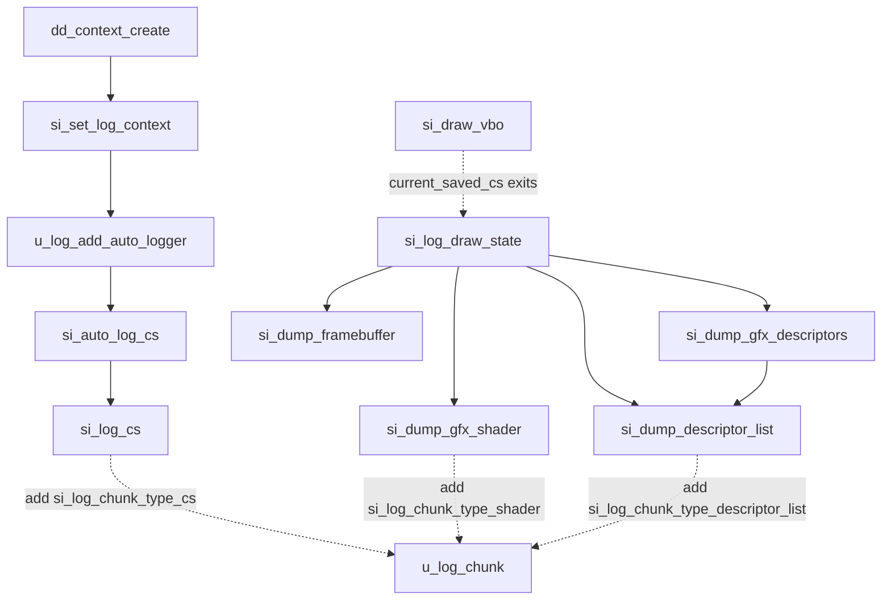
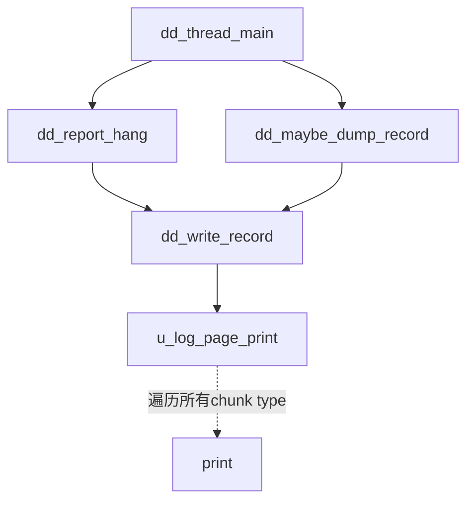
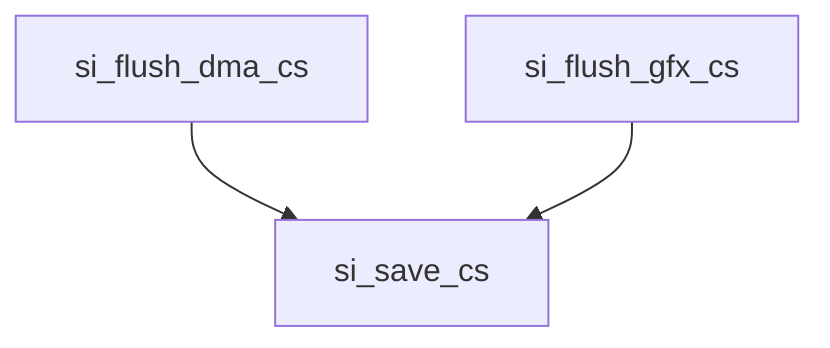
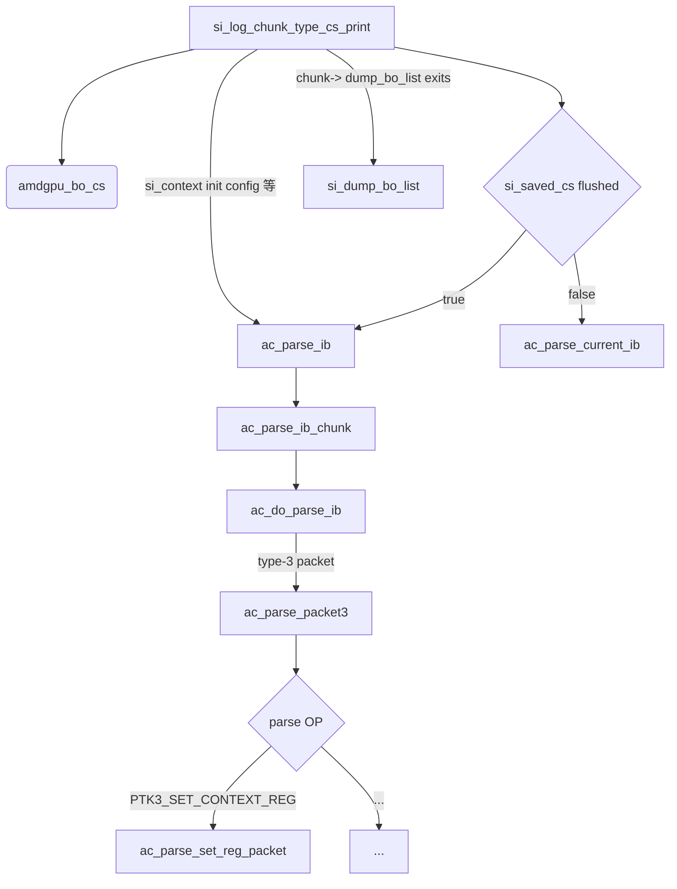
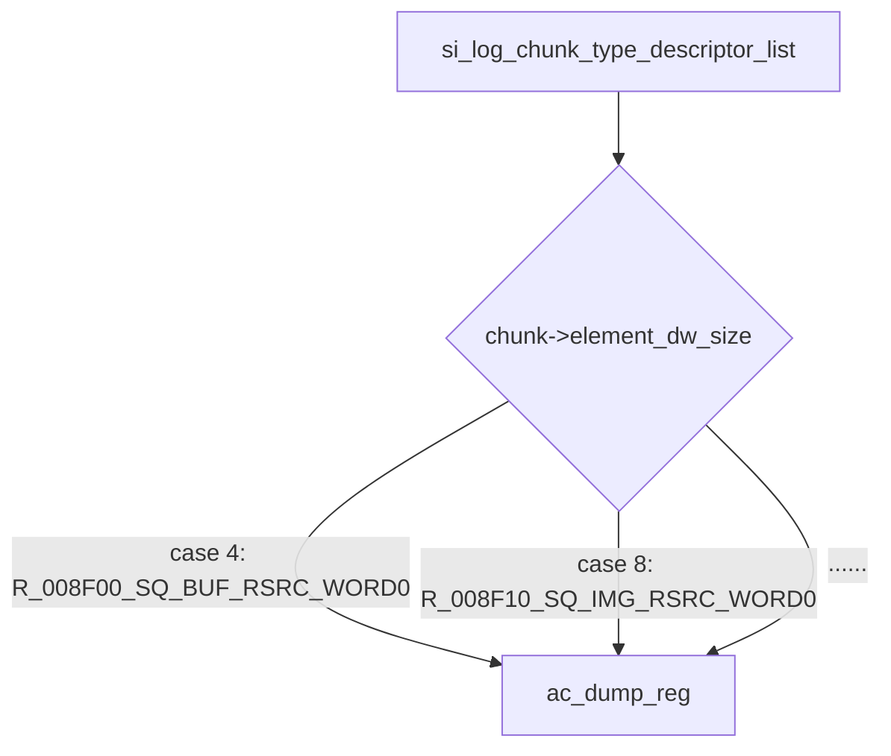

# si_debug 功能分析


这篇文档主要介绍了关于GALLIUM radeonsi中命令流、Shader、描述符列表寄存器相关信息的打印调试功能分析。  
打印通过一个log_context记录当前的chunk信息  
si_context创建时会将log_context进行注册。   
当dd_context_create时会将dd_context中的log绑定到si_context的log  
每次u_log_flush时都会重置当前的log_context   

si对log chunk的打印分为三种， shader,cs, descriptor_list   
log chunk记录了传输给CP的命令流，当前shader，draw的信息，描述列表。

```c

static struct u_log_chunk_type si_log_chunk_type_shader = {
	.destroy = si_log_chunk_shader_destroy,
	.print = si_log_chunk_shader_print,
};


static const struct u_log_chunk_type si_log_chunk_type_cs = {
	.destroy = si_log_chunk_type_cs_destroy,
	.print = si_log_chunk_type_cs_print,
};

static const struct u_log_chunk_type si_log_chunk_type_descriptor_list = {
	.destroy = si_log_chunk_desc_list_destroy,
	.print = si_log_chunk_desc_list_print,
};

```

每次输出调试信息都会调用这里的print函数。

## print的设置流程



## 触发print

有两种情况会触发:

* 当gpu hang的时候会打印
* dump 记录的时候

不过都需要开启debug_mode,  这个通过设置GALLIUM_DDEBUG环境变量开启。 默认dump路径是$HOME/ddebug_dumps

关于具体选项设置可以首先通过设置GALLIUM_DDEBUG=help 后会自动显示相关帮助信息

### 触发流程


所以可以看出当dump log时也能打印shader编译信息


### 关于dd_thread_main

dd_context_create会创将dd_thread_main线程,保存在dd_context中的thread.

`dd_thread_main`是一个用于管线挂起的检测线程。 每次绘制调用时，都会有一个基于内存的栅栏被clear_buffer递增。不使用驱动程序栅栏。在每次绘制调用后，都会创建一个新的dd_draw_record，其中包含所有状态的副本，pipe_context::dump_debug_state的输出， 并且它具有分配的栅栏号。这样做是不知道该绘制调用是否有问题的。记录将添加到所有记录的列表中。独立的、单独的线程循环遍历记录列表并检查它们的栅栏。已信号标记的记录将被释放。
在栅栏超时时，该线程会转储正在进行的绘制的记录。

## IB 的来源流程

si_flush_dma_cs会将si_context中的dma_cs 保存  
si_flush_gfx_cs 会将gfx_cs 拷贝。

如下图所示


`si_saved_cs` 通过参数拷贝si_context中gfx_cs的IB chunks, 通过winsys得到buffer list保存在saved 的bo_list中。


## si_log_chunk_type_cs_print 打印命令流





## si_log_chunk_type_shader 打印shader

这块比较简单就是调用了si_dump_shader， 之前文档有说明


##  si_log_chunk_type_descriptor_list

根据dw_size dump出不同资源的描述符。



