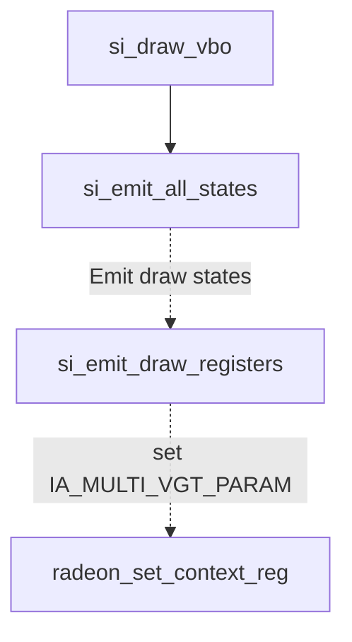
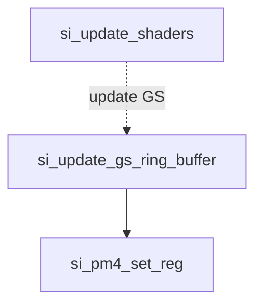
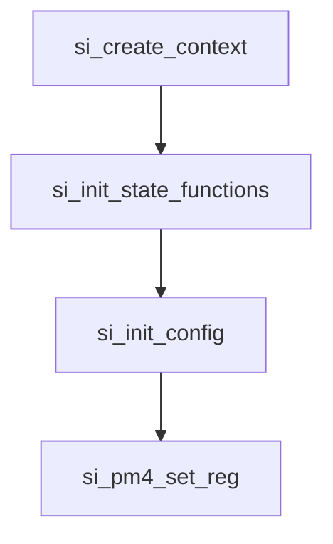
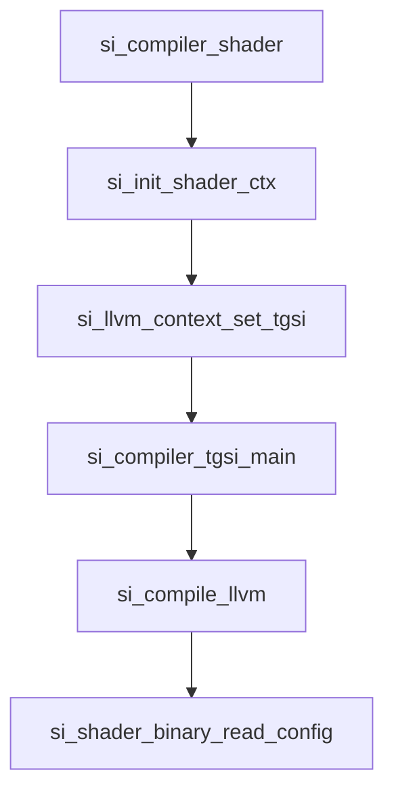

## RadeonSI寄存器分析 

首先分管线中各个阶段他们的设置使用到的寄存器。

## 3D Engine Programing 中的寄存器配置

在R6xx_R7xx_3D.pdf该书中寄存器配置分为   CP , PA ,SQ ,Vertex resource , Texture , Shader , 	SPI ,	 DB, CB , Draw,.

不过在South Islands中， 已经移除所有的常量硬件寄存器， 把这些资源放在内存中。 所以关于这些Vertex resource ,Texture寄存器已经被 **Shader Resource Descriptors (SRD)** 代替。 这类寄存器有SHADER BUFFER RESOURCE DESCRIPTOR， SHADER IMAGE RESOURCE DESCRIPTOR ， SHADER IMAGE RESOURCE SAMPLER DESCRIPTOR 。

接下来逐个分析各类寄存器

###  CP（Command Processor) setup

CP微码必须加载，并且必须像以前的芯片一样初始化环形缓冲区以及读写指针，然后才能使用CP。R6xx/R7xx芯片与以前的一代芯片不同，因为必须为CP微引擎（ME）和CP预取解析器（PFP）分别加载微码。

* 表面同步数据包序列

通过一个单一的接口，PM4命令流和主机CPU可以确定渲染是否完成到一个表面，并刷新和使缓存无效。该机制基于使用四个寄存器（CP_COHER_STATUS、CP_COHER_CNTL、CP_COHER_SIZE、CP_COHER_BASE），状态管理逻辑以及SSU逻辑，以确定何时所有排队的渲染完成到一个表面。

在纹理设置时，驱动程序将同步源缓存，在绘制图元时，驱动程序将同步目标缓存。

源缓存位于纹理缓存（TC）、顶点缓存（VC）和序列指令缓存（SH）。对于每个这些提取缓存，与表面范围相交的每个缓存行都将被使无效。使源缓存无效与使目标缓存无效的方式不同。驱动程序将使用源缓存来写入CP_COHER_CNTL寄存器，以使指定的表面无效，但不会设置任何基地址寄存器。然后，它会设置CP_COHER_BASE。

对于目标缓存，表面一致性机制可以选择将CP_COHER_BASE地址与一个或多个硬件目标地址进行比较。CP中的目标地址寄存器包括：
1. CB_COLOR_BASE[7:0]
2. DB_DEPTH_BASE
3. VGT_STRMOUT_BUFFER_BASE[3:0]
4. COHER_DEST_BASE[1:0]

比较过程仅在每次写入CP_COHER_BASE寄存器时发生。

### VGT(Vertex Grouper Tessellattor ) Setup 

这个对应Vertex Grouper and Tessellator Registers 

* IA_ENHANCE (0x28a70) 

"Late Additions of Control Bits"（晚期添加控制位）这个术语在计算机硬件或数字设计的上下文中，指的是在系统或电路的设计后期，将额外的控制信号或位加入到系统中的做法。

在数字系统中，控制位用于管理和控制各种功能或操作。它们决定了数据在系统内部的处理、路由和操作方式。在初始设计阶段，工程师可能无法预料到所有需要的控制信号，或者可能还没有最终确定系统行为的某些方面。因此，当有更多信息或需求可用时，可能会在后期添加或修改一些控制位。

晚期添加控制位可能是由于以下原因：

1. **需求演变：** 随着系统需求和规格的演变，可能需要引入新的控制信号以适应变化。

2. **调试和优化：** 在系统开发的早期，可能无法完全预测到最佳设计，因此可能需要在后期根据实际需求添加或调整控制位，以实现更好的性能或功能。

3. **外部接口：** 当与其他组件或设备进行集成时，可能需要在后期添加额外的控制位，以满足接口要求。

晚期添加控制位是一种常见的设计实践，允许在设计过程中灵活地适应变化和优化系统功能。


* IA_MULTI_VGT_PARAM (0x28aa8) 

看描述是明确多个VGT配置信息
解释如下

| 字段名称            | 位   | 默认值 | 描述                                                                                                                                                                                                                           |
|-------------------|------|--------|------------------------------------------------------------------------------------------------------------------------------------------------------------------------------------------------------------------------------|
| PRIMGROUP_SIZE     | 15:0 | 0xFF   | 在切换到下一个VGT块之前发送到一个VGT块的图元数量。隐含加1（0 = 1 prim/group; 255 = 256 prims/group）。将此值设置大于255会导致性能下降。对于PATCH图元，此值不应大于（（256 /输入控制点数量）- 1）。对于tessellation，应将其设置为线程组每个patch的倍数。如果将此值设置为0（1 prim/group），则在内部视为1（2 prims/group）。如果PARTIAL_ES_WAVE_ON为OFF并且启用了streamout，2个SE设计的primgroup大小必须小于256。对于相邻的primtypes，它应该小于128。在Major Mode 1中，primgroup_size编程不能超过63。       |
| PARTIAL_VS_WAVE_ON | 16   | 0x0    | 如果设置了此位，则VGT将在一个primgroup完成后立即发出vswave。否则，VGT将在绘制调用内的一个primgroup到下一个primgroup继续vswave。如果启用了streamout，则必须启用此选项。                                                                                                               |
| SWITCH_ON_EOP      | 17   | 0x0    | 如果设置了此位，则IA将在数据包边界处切换VGT块，否则将根据PRIMGROUP_SIZE的编程来切换。如果在没有Tess的情况下使用Major Mode 1，即Passthru等，则必须设置为1。                                                                                               |
| PARTIAL_ES_WAVE_ON | 18   | 0x0    | 如果设置了此位，则VGT将在一个primgroup完成后立即发出eswave。否则，VGT将在绘制调用内的一个primgroup到下一个primgroup继续eswave。                                                                                                 |
| SWITCH_ON_EOI      | 19   | 0x0    | 如果设置了此位，则IA将在实例边界的末尾切换VGT块，否则将根据PRIMGROUP_SIZE的编程来切换。如果使用tessellation并且需要在HS中使用prim_id，则必须将此设置为1。如果设置了此项，则PARTIAL_ES_WAVE_ON必须设置。                                                   |

该寄存器在radeonsi中si_state_draw.c中的si_emit_draw_registers函数中用到,用来发射绘制状态。属于SET_CONTEXT_REG。 
流程：




* VGT_CACHE_INVALIDATION 

这个寄存器用于指定是通过VC（Vertex Cache）还是TC（Texture Cache）进行ES2GS和GS2VS环形缓冲区的缓存失效。在低成本的部件中，可能没有VC存在，因此所有的ES2GS/GS2VS环形缓冲区的获取都是通过TC进行的，因此缓存失效将通过TC进行。

| 字段名称               | 位    | 默认值 | 描述                                                                                                                                                      |
|----------------------|-------|--------|---------------------------------------------------------------------------------------------------------------------------------------------------------|
| VS_NO_EXTRA_BUFFER   | 5     | 0x0    | 如果设置为1，则禁用gs_on位。                                                                                                                         |
| STREAMOUT_FULL_FLUSH | 13    | 0x0    | 如果设置为1，SO_VGTSTREAMOUT_FLUSH事件的工作方式类似于R7xx和之前的版本。VGT在通知CP之前等待VS线程完成。                                                     |
| ES_LIMIT             | 20:16 | 0x0    | 性能调整参数，用于限制ES波浪提前于GS波浪的程度。这是允许在ESGS环形缓冲区中存在的ES波浪数量。该字段经过位移，因此表示2的幂值，即ES波浪数量为2的ES_LIMIT次幂。 |


* VGT_DMA_BASE 

这是一个只写寄存器。为了保持一致性，VGT DMA控制寄存器有8个地址集。写入特定的地址集对于VGT DMA控制寄存器与写入任何其他一对VGT DMA控制寄存器是相同的。换句话说，写入这个寄存器和其他相关的VGT DMA控制寄存器是类似的，没有特殊的区别或注意事项。


| 字段名称    | 位      | 默认值 | 描述                                                                                                                                                     |
|-----------|---------|--------|----------------------------------------------------------------------------------------------------------------------------------------------------------|
| BASE_ADDR | 31:0    | none   | VGT DMA基地址。                                                                                                                                           |
|           |         |        | 此地址必须自然对齐到一个16位字（word）。因此，该寄存器的第0位必须为0。                                                                                 |

该寄存器名为BASE_ADDR，占据32个位，用于存储VGT DMA的基地址。必须确保此地址是以16位字（word）为单位的自然对齐。这意味着该地址的最低有效位（bit 0）必须为0，确保地址按照16位对齐，而不是8位对齐或其他方式。对于有效访问和正确功能，应注意按照规定对BASE_ADDR进行设置。

* VGT_DMA_BASE_HI

根据提供的信息，VGT_DMA_BASE_HI是一个只写寄存器，占据32位，用于VGT DMA控制寄存器的地址设置。为了保持一致性，VGT DMA控制寄存器有8个地址集。写入特定的地址集对于VGT DMA控制寄存器与写入任何其他一对VGT DMA控制寄存器是相同的。该寄存器包含DMA基地址的高8位（即40位地址中的位31到位24）。

具体字段如下：

| 字段名称    | 位   | 默认值 | 描述                                                 |
|-----------|------|--------|------------------------------------------------------|
| BASE_ADDR | 7:0  | none   | DMA地址的高8位，用于设置40位DMA地址中的位31到位24。|

根据描述，VGT_DMA_BASE_HI寄存器的作用是设置DMA的高位地址，它与VGT_DMA_BASE_LO寄存器（用于设置低位地址）一起组成完整的40位DMA地址。请注意，该寄存器是只写的，因此只能通过写入来配置DMA地址的高8位。

* VGT_DMA_INDEX_TYPE

根据提供的信息，VGT_DMA_INDEX_TYPE是一个只写寄存器，占据32位，用于配置VGT DMA控制寄存器的索引类型和数据交换模式。为了保持一致性，VGT DMA控制寄存器有8个地址集。写入特定的地址集对于VGT DMA控制寄存器与写入任何其他一对VGT DMA控制寄存器是相同的。

具体字段如下：

| 字段名称     | 位    | 默认值 | 描述                                                              |
|------------|-------|--------|-------------------------------------------------------------------|
| INDEX_TYPE | 1:0   | none   | VGT DMA索引类型。                                                 |
|            |       |        | 可能的值：                                                        |
|            |       |        | 00 - VGT_INDEX_16：16位索引。                                       |
|            |       |        | 01 - VGT_INDEX_32：32位索引。                                       |
| SWAP_MODE  | 3:2   | none   | DMA数据交换模式。                                                 |
|            |       |        | 可能的值：                                                        |
|            |       |        | 00 - VGT_DMA_SWAP_NONE：无交换。                                     |
|            |       |        | 01 - VGT_DMA_SWAP_16_BIT：16位交换，0xAABBCCDD -> 0xBBAADDCC。       |
|            |       |        | 02 - VGT_DMA_SWAP_32_BIT：32位交换，0xAABBCCDD -> 0xDDCCBBAA。       |
|            |       |        | 03 - VGT_DMA_SWAP_WORD：字交换，0xAABBCCDD -> 0xCCDDAABB。            |

根据描述，VGT_DMA_INDEX_TYPE寄存器用于设置VGT DMA的索引类型和数据交换模式。其中，INDEX_TYPE字段用于选择索引类型（16位索引或32位索引），而SWAP_MODE字段用于指定DMA数据的交换模式（无交换、16位交换、32位交换或字交换）。请注意，该寄存器是只写的，因此只能通过写入来配置这些字段的值。

* VGT_DMA_MAX_SIZE

根据提供的信息，VGT_DMA_MAX_SIZE是一个只写寄存器，占据32位，用于处理索引越界问题。驱动程序将此寄存器设置为小于或等于VGT_DMA_SIZE的值，指定从索引缓冲区中读取多少个实际有效的数据。如果VGT_MAX_SIZE < VGT_DMA_SIZE，则在VGT中将其余的获取的索引设置为零。

具体字段如下：

| 字段名称   | 位    | 默认值 | 描述                                               |
|----------|-------|--------|----------------------------------------------------|
| MAX_SIZE | 31:0  | none   | VGT DMA最大索引数量，直到访问越界的索引缓冲区。|

根据描述，VGT_DMA_MAX_SIZE寄存器用于指定在访问越界的索引缓冲区之前，从索引缓冲区中读取的最大索引数量。驱动程序应该将该寄存器的值设置为小于或等于VGT_DMA_SIZE，以确保读取的数据不会超出索引缓冲区的范围。如果VGT_MAX_SIZE小于VGT_DMA_SIZE，则VGT会将其余获取的索引设置为零，避免访问越界。请注意，由于该寄存器是只写的，因此只能通过写入来配置MAX_SIZE字段的值。

* VGT_DMA_NUM_INSTANCES 

根据提供的信息，VGT_DMA_NUM_INSTANCES是一个只写寄存器，占据32位，用于指定绘制调用中指定的实例数量值。如果未启用实例，则此寄存器设置为零或一。该寄存器的GPUF0MMReg地址为0x28a88。

具体字段如下：

| 字段名称         | 位     | 默认值 | 描述                                             |
|----------------|--------|--------|--------------------------------------------------|
| NUM_INSTANCES  | 31:0   | none   | VGT DMA实例数量，最小值为1。                              |

根据描述，VGT_DMA_NUM_INSTANCES寄存器用于指定绘制调用中的实例数量。如果绘制调用未启用实例化，则此寄存器设置为0或1。请注意，该寄存器是只写的，因此只能通过写入来配置NUM_INSTANCES字段的值。最小值为1，即至少要有一个实例。

地址说明：GPUF0MMReg：0x28a88 表示该寄存器在GPU寄存器空间中的地址为0x28a88。这是在GPU内部的物理地址，用于对该寄存器进行读写操作。


* VGT_DMA_SIZE

VGT_DMA_SIZE是一个只写寄存器，占据32位，用于指定VGT DMA控制寄存器中的索引数量。为了保持一致性，VGT DMA控制寄存器有8个地址集。写入特定的地址集对于VGT DMA控制寄存器与写入任何其他一对VGT DMA控制寄存器是相同的。该寄存器的GPUF0MMReg地址为`0x28a74`。

具体字段如下：

| 字段名称      | 位     | 默认值 | 描述                                              |
|-------------|--------|--------|---------------------------------------------------|
| NUM_INDICES | 31:0   | none   | VGT DMA索引数量。                                   |

根据描述，VGT_DMA_SIZE寄存器用于指定VGT DMA控制寄存器中的索引数量。该寄存器是只写的，用于配置索引数量的值。请注意，该寄存器是只写的，因此只能通过写入来配置NUM_INDICES字段的值。

*  VGT_DRAW_INITIATOR

VGT_DRAW_INITIATOR是一个只写寄存器，占据32位，用于触发执行绘制数据包（2D或3D）。该寄存器的GPUF0MMReg地址为`0x287f0`。

该寄存器用于在VGT中触发绘制数据包的执行。写入该寄存器是一个触发器，启动VGT中的处理过程。VGT_DRAW_INITIATOR寄存器有8个地址，但在Wekiva芯片中并没有8个寄存器的副本。写入特定地址的绘制启动器寄存器会导致将一个状态上下文分配给绘制触发器的其中一个八个状态上下文。该状态上下文分配会向下传播，并被芯片中所有涉及执行此绘制触发器的各个部件使用。以下是关于绘制启动器寄存器中信息的描述。

具体字段如下：

| 字段名称         | 位     | 默认值 | 描述                                           |
|----------------|--------|--------|------------------------------------------------|
| SOURCE_SELECT  | 1:0   | none   | 输入源选择。                                   |
|                |        |        | 如果源选择字段设置为“自动增量索引”模式，并且基本类型设置为“带标志的三角形列表”，则绘制启动器将被处理为普通的“三角形列表”。 |
|                |        |        | 可能的值：                                     |
|                |        |        | 00 - DI_SRC_SEL_DMA：VGT DMA数据                |
|                |        |        | 01 - DI_SRC_SEL_IMMEDIATE：立即数据              |
|                |        |        | 02 - DI_SRC_SEL_AUTO_INDEX：自动增量索引        |
|                |        |        | 03 - DI_SRC_SEL_RESERVED：保留 - 未使用           |
| MAJOR_MODE     | 3:2   | none   | 主模式。                                       |
|                |        |        | 可能的值：                                     |
|                |        |        | 00 - DI_MAJOR_MODE_0：正常（隐式）模式 - 仅适用于基本类型0-21。在此模式中，某些VGT状态寄存器将被忽略（其值隐含）。 |
|                |        |        | 01 - DI_MAJOR_MODE_1：显式模式 - 配置完全由状态寄存器指定。                                   |
| NOT_EOP        | 5      | none   | 此位表示该绘制启动器不应产生数据包结束信号，因为它将后跟一个或多个链式绘制启动器。必须确保该绘制启动器立即在硬件接口上后跟一个链式绘制启动器。换句话说，链式绘制启动器不能分隔在可以中断的驱动程序缓冲区边界上。该位主要由CP设置，以改善小型2D位块的处理并行性。 |
|                |        |        | 可能的值：                                     |
|                |        |        | 00 - 正常的eop                                |
|                |        |        | 01 - 抑制eop                                 |
| USE_OPAQUE     | 6      | none   | 此位表示此绘制调用是不透明绘制调用。          |
|                |        |        | 可能的值：                                     |
|                |        |        | 00 - 非不透明绘制                             |
|                |        |        | 01 - 不透明绘制                               |

根据描述，VGT_DRAW_INITIATOR寄存器用于触发执行绘制数据包（2D或3D）。写入该寄存器是一个触发器，启动VGT中的处理过程。通过写入特定地址的绘制启动器寄存器，可以将其中一个八个状态上下文分配给绘制触发器。该寄存器具有多个字段，用于选择输入源、主模式以及设置是否生成结束信号等。这些字段用于配置绘制数据包的处理方式。请注意，VGT_DRAW


* VGT_ENHANCE

VGT_ENHANCE是一个可读写寄存器，占据32位，用于用于添加控制位的后期扩展。

该寄存器的GPUF0MMReg地址为`0x28a50`。

具体字段如下：

| 字段名称  | 位    | 默认值 | 描述      |
|---------|-------|--------|-----------|
| MISC    | 31:0  | none   | 杂项位。  |

根据描述，VGT_ENHANCE寄存器用于后期添加控制位。该寄存器具有一个名为"Misc"的32位字段，但没有提供更详细的说明或默认值。这可能意味着这个字段的具体功能在描述中没有详细解释，或者可能在不同的硬件版本中有不同的含义。由于缺乏具体信息，我们无法进一步解释这个字段的作用和功能。如果需要了解更多细节，最好查阅相关的技术文档或硬件规格表。

* VGT_ESGS_RING_ITEMSIZE 

VGT_ESGS_RING_ITEMSIZE是一个可读写寄存器，占据32位，用于指定写入ESGS环形缓冲区的每个顶点的大小。

该寄存器的GPUF0MMReg地址为`0x28aac`。

具体字段如下：

| 字段名称   | 位     | 默认值 | 描述                                      |
|----------|--------|--------|-------------------------------------------|
| ITEMSIZE | 14:0   | none   | 指定以双字为单位的大小。必须至少为4个双字，并且必须是4个双字的倍数。  |

根据描述，VGT_ESGS_RING_ITEMSIZE寄存器用于指定写入ESGS环形缓冲区的每个顶点的大小。大小以双字为单位，字段的范围为14位，即可以表示的最大值为2^14个双字。然而，它必须至少为4个双字，并且必须是4个双字的倍数。这是因为ESGS环形缓冲区的写入需要满足一定的对齐和大小要求。通过配置ITEMSIZE字段的值，可以确保每个顶点写入ESGS环形缓冲区时满足这些要求。

该寄存器在radeonsi中si_state_shaders.c中的si_emit_shader_es用到

```mermaid
graph TD 
si_shader_es -.设置atom.emit.-> si_emit_shader_es
si_emit_all_states--> A
A[si_pm4_emit] --> B[si_emit_shader_es] 

```


*  VGT_ESGS_RING_SIZE

VGT_ESGS_RING_SIZE是一个可读写寄存器，占据32位，用于指定ESGS环形缓冲区的大小，以256字节的倍数来表示。

该寄存器的GPUF0MMReg地址为`0x88c8`。

具体字段如下：

| 字段名称   | 位     | 默认值 | 描述                                      |
|----------|--------|--------|-------------------------------------------|
| MEM_SIZE | 31:0   | none   | 指定以256字节为单位的大小。对于双着色器引擎的部分，大小必须设置为512字节的倍数，因为环形缓冲区的一半用于每个着色器引擎。  |

根据描述，VGT_ESGS_RING_SIZE寄存器用于指定ESGS环形缓冲区的大小，以256字节的倍数表示。字段MEM_SIZE表示环形缓冲区的大小，以256字节为单位。对于双着色器引擎的部分，环形缓冲区的大小必须设置为512字节的倍数，因为环形缓冲区的一半将用于每个着色器引擎。通过配置MEM_SIZE字段的值，可以确定ESGS环形缓冲区的实际大小。


改寄存器在radeonsi中的si_state_shaders.c中的si_update_gs_ring_buffers中用到。




* VGT_ES_PER_GS

VGT_ES_PER_GS是一个可读写寄存器，占据32位，用于指定每个GS线程处理的最大ES顶点数。

该寄存器的GPUF0MMReg地址为`0x28a58`。

具体字段如下：

| 字段名称   | 位       | 默认值 | 描述                                |
|----------|----------|--------|-------------------------------------|
| ES_PER_GS | 10:0     | none   | 每个GS线程处理的最大ES顶点数。        |

根据描述，VGT_ES_PER_GS寄存器用于指定每个GS线程处理的最大ES顶点数。字段ES_PER_GS的范围为11位，因此可以表示的最大值为2^11，即2048。通过配置ES_PER_GS字段的值，可以确定GS线程在处理ES阶段时可以处理的最大ES顶点数。





* VGT_EVENT_INITIATOR  

VGT_EVENT_INITIATOR是一个可写寄存器，占据32位，用于触发事件。

该寄存器的GPUF0MMReg地址为`0x28a90`。

具体字段如下：

| 字段名称         | 位     | 默认值 | 描述                                                                                                              |
|----------------|--------|--------|-------------------------------------------------------------------------------------------------------------------|
| EVENT_TYPE     | 5:0    | none   | 事件类型（也称为事件ID）--目前，VGT和PA之间的硬件接口仅支持6位事件类型。                                                  |
| ADDRESS_HI     | 26:18  | none   | 用于ZPASS事件的地址位39:31。                                                                                          |
| EXTENDED_EVENT | 27     | none   | 0表示单个DW事件，1表示双DW事件。                                                                                      |

根据描述，VGT_EVENT_INITIATOR寄存器用于触发事件。EVENT_TYPE字段指定事件类型，共有多种可选值，例如用于样本统计、缓存刷新、性能计数等。不同的EVENT_TYPE值对应不同的事件，具体含义和功能由每个EVENT_TYPE决定。

ADDRESS_HI字段用于ZPASS事件，指定了事件地址的高位。

EXTENDED_EVENT字段用于指示事件是否是扩展事件，0表示单个DW事件，1表示双DW事件。

通过配置EVENT_TYPE字段，可以触发不同的事件，进而控制GPU的不同行为或功能。


* VGT_VTX_VECT_EJECT_REG : 


这个寄存器定义了在组装单个顶点向量时允许通过的图元数量。在达到这个图元数量后，即使顶点向量没有填满，它也会被提交给着色器进行处理。


## Shader Program Registers

在GCN 硬件阶段可分为LS,HS, ES,GS,VS,PS
如下图

下面寄存器名中**HI**代表高位[63:32], **LO**代表低位[31:0]，所有下面的寄存器都是32 位。

### Shader Program 基址相关

在 AMD 的显卡中，着色器程序被分为两个部分：`SPI_SHADER_PGM_LO` 和 `SPI_SHADER_PGM_HI`。

具体来说：

- `SPI_SHADER_PGM_LO_VS` 是用于顶点着色器程序的低位地址部分。
- `SPI_SHADER_PGM_HI_VS` 是用于顶点着色器程序的高位地址部分。

这两个寄存器结合在一起，形成了顶点着色器程序的完整地址，指向存储在显存中的顶点着色器代码。

在显卡的驱动程序或硬件中，通过将顶点着色器程序加载到这些寄存器中，显卡就可以在渲染过程中使用顶点着色器来处理传入的顶点数据，并执行必要的变换、光照等计算，以生成最终的图形显示。

这些寄存器通常是由驱动程序在渲染任务开始之前设置好的，以确保着色器程序正确加载并准备执行。它们是图形渲染流水线中非常重要的部分，有助于实现图形渲染的高性能和效率。

* SPI_SHADER_PGM_HI_ES
* SPI_SHADER_PGM_HI_GS
* SPI_SHADER_PGM_HI_HS
* SPI_SHADER_PGM_HI_LS
* SPI_SHADER_PGM_HI_PS
* SPI_SHADER_PGM_HI_VS
* SPI_SHADER_PGM_LO_ES
* SPI_SHADER_PGM_LO_GS
* SPI_SHADER_PGM_LO_HS
* SPI_SHADER_PGM_LO_LS
* SPI_SHADER_PGM_LO_PS
* SPI_SHADER_PGM_LO_VS


### Shader Program设置 相关


下面这些寄存器主要是shader program的配置。

* SPI_SHADER_PGM_RSRC1_ES
* SPI_SHADER_PGM_RSRC1_GS
* SPI_SHADER_PGM_RSRC1_HS
* SPI_SHADER_PGM_RSRC1_LS
* SPI_SHADER_PGM_RSRC1_PS
* SPI_SHADER_PGM_RSRC1_VS
* 
* SPI_SHADER_PGM_RSRC2_ES
* SPI_SHADER_PGM_RSRC2_GS
* SPI_SHADER_PGM_RSRC2_HS
* SPI_SHADER_PGM_RSRC2_LS
* SPI_SHADER_PGM_RSRC2_PS
* SPI_SHADER_PGM_RSRC2_VS


以 SPI_SHADER_PGM_RSRC1_VS (0xb128) 为例， 下表给出了各个字段的含义 :

这些字段描述了SPI_SHADER_PGM_RSRC1_VS寄存器中的不同位段的作用和含义。这个寄存器用于配置Vertex Shader（VS）程序的设置，比如VGPRs数量、SGPRs数量、浮点模式、优先级等。这些配置设置将影响VS程序的运行行为和性能。

| 字段名称       | 位数   | 默认值 | 描述                                               |
| -------------- | ------ | ------ | -------------------------------------------------- |
| VGPRS          | 5:0    | 0x0    | VGPRs的数量，以4为粒度，范围为0-63，分配方式为4,8,12 ... 256 |
| SGPRS          | 9:6    | 0x0    | SGPRs的数量，以8为粒度，范围为0-15，分配方式为8,16,24 ... 128 |
| PRIORITY       | 11:10  | 0x0    | 驱动spi_sq newWave指令中的spi_priority |
| FLOAT_MODE     | 19:12  | 0x0    | 驱动spi_sq newWave指令中的float_mode |
| PRIV           | 20     | 0x0    | 驱动spi_sq newWave指令中的priv |
| DX10_CLAMP     | 21     | 0x0    | 驱动spi_sq newWave指令中的dx10_clamp |
| DEBUG_MODE     | 22     | 0x0    | 驱动spi_sq newWave指令中的debug |
| IEEE_MODE      | 23     | 0x0    | 驱动spi_sq newWave指令中的ieee |
| VGPR_COMP_CNT  | 25:24  | 0x0    | 告诉SPI要加载多少VGPR组件 |
| CU_GROUP_ENABLE| 26     | 0x0    | 当设置为1时，VS优先发送一个wave给CU中的每个SIMD；当设置为0时，VS只发送一个wave给一个CU中的一个SIMD |


* SPI_SHADER_PGM_RSRC2_VS 


| **字段名称**  | **位数** | **默认值** | **描述**                                              |
|-------------|--------|---------|---------------------------------------------------|
| SCRATCH_EN  | 0      | 0x0     | 该波（Wave）是否使用寄存器临时空间进行寄存器溢出。       |
| USER_SGPR   | 5-1    | 0x0     | SPI 应初始化的 USER_DATA 寄存器数量。范围：0-16。      |
| TRAP_PRESENT| 6      | 0x0     | 是否启用陷阱处理。设置该位会使 SPI 分配额外的 16 个 SGPR，并将 TBA/TMA 值写入 SGPR 中。|
| OC_LDS_EN   | 7      | 0x0     | 是否启用将与 offchip 相关的信息加载到 SGPR 中。        |
| SO_BASE0_EN | 8      | 0x0     | 是否启用将 Stream Out Base 0 加载到 SGPR 中。           |
| SO_BASE1_EN | 9      | 0x0     | 是否启用将 Stream Out Base 1 加载到 SGPR 中。           |
| SO_BASE2_EN | 10     | 0x0     | 是否启用将 Stream Out Base 2 加载到 SGPR 中。           |
| SO_BASE3_EN | 11     | 0x0     | 是否启用将 Stream Out Base 3 加载到 SGPR 中。           |
| SO_EN       | 12     | 0x0     | 是否启用将 Stream Out 缓冲区配置加载到 SGPR 中。        |
| EXCP_EN     | 19-13  | 0x0     | 在 spi_sq newWave 命令中设置 excp 位的驱动。                |

### TBA 相关

**陷阱处理程序基地址TBA (Trap Base Address)**
TBA 是一个 64 位的寄存器，它用于保存指向当前陷阱（trap）处理程序的指针。在计算机图形学中，陷阱是一种异常或中断，用于处理特定的条件或情况。着色器程序可以使用 TBA 寄存器来存储当前陷阱处理程序的地址，以便在需要时跳转到相应的处理程序。


* SPI_SHADER_TBA_HI_ES
* SPI_SHADER_TBA_HI_GS
* SPI_SHADER_TBA_HI_HS
* SPI_SHADER_TBA_HI_LS
* SPI_SHADER_TBA_HI_PS
* SPI_SHADER_TBA_HI_VS

* SPI_SHADER_TBA_LO_ES
* SPI_SHADER_TBA_LO_GS
* SPI_SHADER_TBA_LO_HS
* SPI_SHADER_TBA_LO_LS
* SPI_SHADER_TBA_LO_PS
* SPI_SHADER_TBA_LO_VS


### TMA 相关

**指向陷阱处理程序在内存中使用的数据的指针TMA (Trap Memory Address)**:
TMA 是另一个 64 位的寄存器，它用于在着色器操作中作为临时寄存器。着色器是在图形渲染管线中运行的小型程序，用于控制图形元素的渲染过程。TMA 寄存器用于暂存某些中间结果或计算过程中的数据，以便在需要时进行临时存储和处理。

* SPI_SHADER_TMA_HI_ES
* SPI_SHADER_TMA_HI_GS
* SPI_SHADER_TMA_HI_HS
* SPI_SHADER_TMA_HI_LS
* SPI_SHADER_TMA_HI_PS
* SPI_SHADER_TMA_HI_VS

* SPI_SHADER_TMA_LO_ES
* SPI_SHADER_TMA_LO_GS
* SPI_SHADER_TMA_LO_HS
* SPI_SHADER_TMA_LO_LS
* SPI_SHADER_TMA_LO_PS
* SPI_SHADER_TMA_LO_VS

### USER_DATA

USER_DATA相关寄存器是SGPR Initialization用到的寄存器。

SGPR（Scalar General Purpose Register）初始化是指在图形着色器中加载不会在每个线程中变化的着色器输入。这个过程也会根据着色器类型而有所不同。

在着色器中，SGPR可以用来存储通用目的的数据。在初始化过程中，SGPR主要用来加载一些与着色器相关的常量或数据，这些数据在整个着色器执行过程中保持不变。

在AMD的图形处理架构中，有一种称为 "USER_DATA" 的机制，用于将数据加载到SGPR中。通过使用 "SPI_SHADER_USER_DATA_xx_0-15" 硬件寄存器，驱动程序可以通过PM4 SET命令写入数据到这些SGPR中。用户数据用于向着色器传递一些关键信息，其中最重要的是视频内存中资源常量的内存地址。


* SPI_SHADER_USER_DATA_ES_[0-15]
* SPI_SHADER_USER_DATA_GS_[0-15]
* SPI_SHADER_USER_DATA_HS_[0-15]
* SPI_SHADER_USER_DATA_LS_[0-15]
* SPI_SHADER_USER_DATA_PS_[0-15]
* SPI_SHADER_USER_DATA_VS_[0-15]


TMA和TBA都用在Scalar ALU Operations 中。

## 分析case中的寄存器配置

从IB 列表可以看出 ## 首先编译完成shader之后关于shader的状态如下图,今天主要分析了产生过程。

```
*** SHADER STATS ***
SGPRS: 16
VGPRS: 8
Spilled SGPRs: 0
Spilled VGPRs: 0
Private memory VGPRs: 0
Code Size: 68 bytes
LDS: 0 blocks
Scratch: 0 bytes per wave
Max Waves: 8
********************

```
## 流程


## 主要函数

```c
void ac_shader_binary_read_config(struct ac_shader_binary *binary,
                                  struct ac_shader_config *conf,
                                  unsigned symbol_offset,
                                  bool supports_spill)
{
    unsigned i;
    const unsigned char *config =
        ac_shader_binary_config_start(binary, symbol_offset);
    bool really_needs_scratch = false;
    uint32_t wavesize = 0;

    // 检查是否真的需要scratch缓冲区，根据是否支持spill来判断
    if (supports_spill) {
        really_needs_scratch = true;
    } else {
        // 如果不支持spill，则检查是否有关于scratch资源的符号重定位信息
        for (i = 0; i < binary->reloc_count; i++) {
            const struct ac_shader_reloc *reloc = &binary->relocs[i];

            // 通过比较符号的名字来确定是否需要scratch缓冲区
            if (!strcmp(scratch_rsrc_dword0_symbol, reloc->name) ||
                !strcmp(scratch_rsrc_dword1_symbol, reloc->name)) {
                really_needs_scratch = true;
                break;
            }
        }
    }

    // 从二进制的配置数据中读取寄存器值并填充到ac_shader_config结构体中
    for (i = 0; i < binary->config_size_per_symbol; i += 8) {
        unsigned reg = util_le32_to_cpu(*(uint32_t*)(config + i));
        unsigned value = util_le32_to_cpu(*(uint32_t*)(config + i + 4));
        switch (reg) {
        case R_00B028_SPI_SHADER_PGM_RSRC1_PS:
        case R_00B128_SPI_SHADER_PGM_RSRC1_VS:
        case R_00B228_SPI_SHADER_PGM_RSRC1_GS:
        case R_00B848_COMPUTE_PGM_RSRC1:
        case R_00B428_SPI_SHADER_PGM_RSRC1_HS:
            // 读取SGPRs和VGPRs数量，并存储到ac_shader_config结构体中
            conf->num_sgprs = MAX2(conf->num_sgprs, (G_00B028_SGPRS(value) + 1) * 8);
            conf->num_vgprs = MAX2(conf->num_vgprs, (G_00B028_VGPRS(value) + 1) * 4);
            conf->float_mode =  G_00B028_FLOAT_MODE(value);
            break;
        case R_00B02C_SPI_SHADER_PGM_RSRC2_PS:
            // 读取LDS（Local Data Share）大小，并存储到ac_shader_config结构体中
            conf->lds_size = MAX2(conf->lds_size, G_00B02C_EXTRA_LDS_SIZE(value));
            break;
        case R_00B84C_COMPUTE_PGM_RSRC2:
            // 读取LDS大小（Compute模式），并存储到ac_shader_config结构体中
            conf->lds_size = MAX2(conf->lds_size, G_00B84C_LDS_SIZE(value));
            break;
        case R_0286CC_SPI_PS_INPUT_ENA:
            // 读取SPI_PS_INPUT_ENA寄存器值，并存储到ac_shader_config结构体中
            conf->spi_ps_input_ena = value;
            break;
        case R_0286D0_SPI_PS_INPUT_ADDR:
            // 读取SPI_PS_INPUT_ADDR寄存器值，并存储到ac_shader_config结构体中
            conf->spi_ps_input_addr = value;
            break;
        case R_0286E8_SPI_TMPRING_SIZE:
        case R_00B860_COMPUTE_TMPRING_SIZE:
            // 读取WAVESIZE，并存储到ac_shader_config结构体中
            // WAVESIZE是以256个DWORD为单位的
            wavesize = value;
            break;
        case SPILLED_SGPRS:
            // 读取被spill的SGPRs数量，并存储到ac_shader_config结构体中
            conf->spilled_sgprs = value;
            break;
        case SPILLED_VGPRS:
            // 读取被spill的VGPRs数量，并存储到ac_shader_config结构体中
            conf->spilled_vgprs = value;
            break;
        default:
            // 处理未知的配置寄存器，输出警告信息
            {
                static bool printed;

                if (!printed) {
                    fprintf(stderr, "Warning: LLVM emitted unknown "
                        "config register: 0x%x\n", reg);
                    printed = true;
                }
            }
            break;
        }

        // 设置SPI_PS_INPUT_ADDR为SPI_PS_INPUT_ENA（如果未设置）
        if (!conf->spi_ps_input_addr)
            conf->spi_ps_input_addr = conf->spi_ps_input_ena;
    }

    // 如果真的需要scratch缓冲区，则计算每个wave所需的scratch缓冲区大小，并存储到ac_shader_config结构体中
    if (really_needs_scratch) {
        // WAVESIZE以256个DWORD为单位，计算scratch_bytes_per_wave
        conf->scratch_bytes_per_wave = G_00B860_WAVESIZE(wavesize) * 256 * 4;
    }
}


```

## Reference 

* [southern-islands-instruction-set-architecture.pdf](https://www.amd.com/system/files/TechDocs/southern-islands-instruction-set-architecture.pdf)

* [R6xx_R7xx_3D.pdf](https://www.x.org/docs/AMD/old/R6xx_R7xx_3D.pdf)

* [si_programming_guide_v2.pdf](https://www.x.org/docs/AMD/old/si_programming_guide_v2.pdf)

* [SI_3D_registers.pdf](https://www.x.org/docs/AMD/old/SI_3D_registers.pdf)


