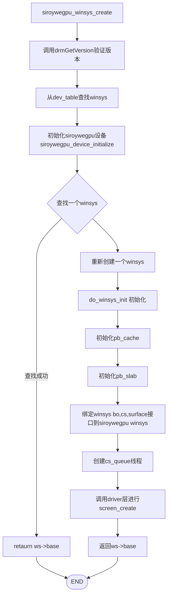
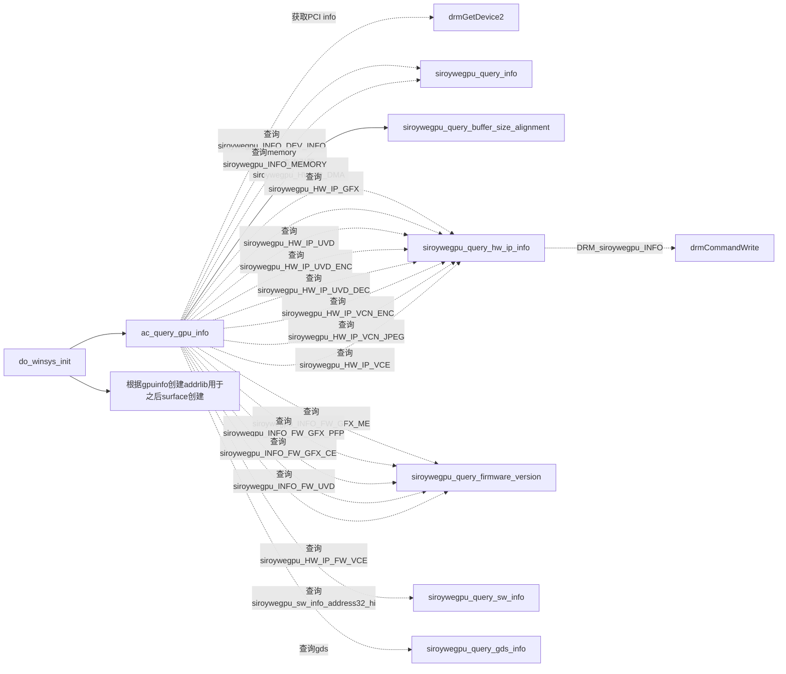
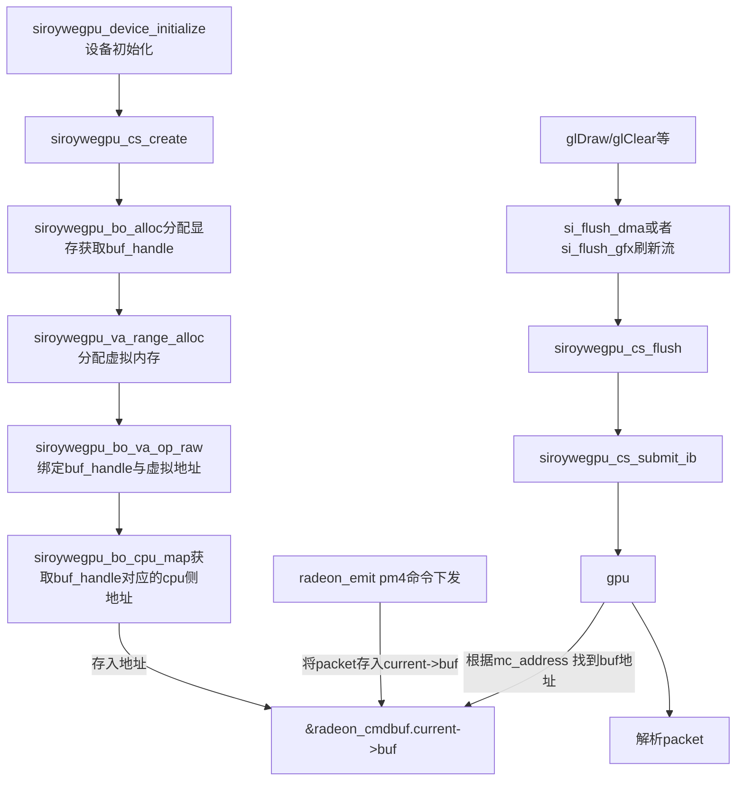
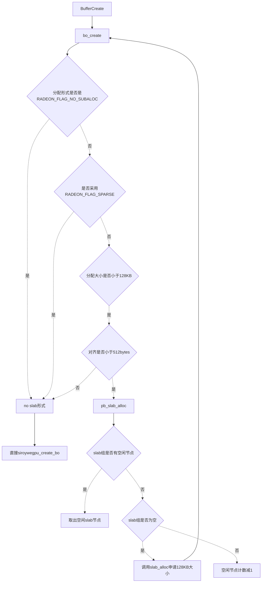

# mesa-18.3.6 siroywegpu winsys 调试记录

### 总结siroywegpu.h 提供的接口

可以根据功能分为以下几类:

* device 

这些函数用于初始化和反初始化 siroywegpu 设备，以及获取与设备通信所需的文件描述符。

1. **siroywegpu_device_initialize：**
   初始化 siroywegpu 设备，使用给定的文件描述符（fd）连接到设备。

2. **siroywegpu_device_deinitialize：**
   反初始化 siroywegpu 设备，释放相关资源并关闭与设备的连接。

3. **siroywegpu_device_get_fd：**
   获取 siroywegpu 设备的文件描述符（fd），用于与设备进行通信。


* cs (command stream),

用于执行命令解析上下文的创建，命令提交，状态重置查询等。


1. **siroywegpu_cs_ctx_create2：**
   创建 siroywegpu 命令提交上下文，可以指定特定属性和标志。

2. **siroywegpu_cs_ctx_create：**
   创建 siroywegpu 命令提交上下文，提供设备句柄。

3. **siroywegpu_cs_ctx_free：**
   释放先前创建的 siroywegpu 命令提交上下文。

4. **siroywegpu_cs_ctx_override_priority：**
   覆盖指定上下文的命令提交优先级。

5. **siroywegpu_cs_ctx_stable_pstate：**
   设置指定上下文的命令提交是否稳定。

6. **siroywegpu_cs_query_reset_state：**
   查询指定上下文的命令提交是否需要重置。

7. **siroywegpu_cs_query_reset_state2：**
   查询指定上下文的命令提交是否需要重置，支持更多参数。

8. **siroywegpu_cs_submit：**
   提交命令到指定上下文，使其在 GPU 上执行。

9. **siroywegpu_cs_query_fence_status：**
   查询指定的命令提交的同步栅栏状态。

10. **siroywegpu_cs_wait_fences：**
    等待多个命令提交的同步栅栏完成。

11. **siroywegpu_cs_create_semaphore：**
    创建一个信号量对象，用于同步命令提交。

12. **siroywegpu_cs_signal_semaphore：**
    发送信号量信号，用于同步命令提交。

13. **siroywegpu_cs_wait_semaphore：**
    等待信号量，用于同步命令提交。

14. **siroywegpu_cs_destroy_semaphore：**
    销毁先前创建的信号量。

15. **siroywegpu_cs_create_syncobj2：**
    创建同步对象，支持更多参数。

16. **siroywegpu_cs_create_syncobj：**
    创建同步对象。

17. **siroywegpu_cs_destroy_syncobj：**
    销毁同步对象。

18. **siroywegpu_cs_syncobj_reset：**
    重置同步对象。

19. **siroywegpu_cs_syncobj_signal：**
    发送同步对象信号。

20. **siroywegpu_cs_syncobj_timeline_signal：**
    发送同步对象时间线信号。

21. **siroywegpu_cs_syncobj_wait：**
    等待同步对象。

22. **siroywegpu_cs_syncobj_timeline_wait：**
    等待同步对象时间线。

23. **siroywegpu_cs_syncobj_query：**
    查询同步对象状态。

24. **siroywegpu_cs_syncobj_query2：**
    查询同步对象状态，支持更多参数。

25. **siroywegpu_cs_export_syncobj：**
    导出同步对象句柄。

26. **siroywegpu_cs_import_syncobj：**
    导入同步对象句柄。

27. **siroywegpu_cs_syncobj_export_sync_file：**
    导出同步对象到文件描述符。

28. **siroywegpu_cs_syncobj_import_sync_file：**
    从文件描述符导入同步对象。

29. **siroywegpu_cs_syncobj_export_sync_file2：**
    导出同步对象到文件描述符，支持更多参数。

30. **siroywegpu_cs_syncobj_import_sync_file2：**
    从文件描述符导入同步对象，支持更多参数。

31. **siroywegpu_cs_syncobj_transfer：**
    转移同步对象。

32. **siroywegpu_cs_fence_to_handle：**
    将栅栏转换为句柄。

33. **siroywegpu_cs_submit_raw：**
    原始命令提交。

34. **siroywegpu_cs_submit_raw2：**
    原始命令提交，支持更多参数。

35. **siroywegpu_cs_chunk_fence_to_dep：**
    将块栅栏转换为依赖。

36. **siroywegpu_cs_chunk_fence_info_to_data：**
    将块栅栏信息转换为数据。


* bo(buffer object)

管理bo的创建，删除，与cpu内存的映射，解映射。


1. **siroywegpu_bo_alloc：**
   在指定的 siroywegpu 设备上分配一个缓冲区（Buffer Object，BO），用于 GPU 内存操作。

2. **siroywegpu_bo_set_metadata：**
   设置分配的缓冲区的元数据信息，例如显存类型、属性等。

3. **siroywegpu_bo_query_info：**
   查询关于缓冲区（BO）的信息，例如大小、对齐等。

4. **siroywegpu_bo_export：**
   导出缓冲区句柄，使其可以在不同的进程之间共享。

5. **siroywegpu_bo_import：**
   从另一个进程导入缓冲区句柄，使当前进程可以使用之前在其他进程中分配的缓冲区。

6. **siroywegpu_create_bo_from_user_mem：**
   从用户提供的内存中创建缓冲区。

7. **siroywegpu_find_bo_by_cpu_mapping：**
   根据 CPU 内存映射找到对应的缓冲区。

8. **siroywegpu_bo_free：**
   释放之前分配的缓冲区，释放相关资源。

9. **siroywegpu_bo_inc_ref：**
   增加缓冲区的引用计数。

10. **siroywegpu_bo_cpu_map：**
    将缓冲区映射到 CPU 地址空间。

11. **siroywegpu_bo_cpu_unmap：**
    解除缓冲区在 CPU 地址空间的映射。

12. **siroywegpu_bo_wait_for_idle：**
    等待缓冲区变为空闲状态。

13. **siroywegpu_bo_list_create_raw：**
    创建原始缓冲区列表。

14. **siroywegpu_bo_list_destroy_raw：**
    销毁原始缓冲区列表。

15. **siroywegpu_bo_list_create：**
    创建缓冲区列表。

16. **siroywegpu_bo_list_destroy：**
    销毁缓冲区列表。

17. **siroywegpu_bo_list_update：**
    更新缓冲区列表。

18. **siroywegpu_bo_va_op：**
    对缓冲区的虚拟地址执行操作。

19. **siroywegpu_bo_va_op_raw：**
    对缓冲区的虚拟地址执行原始操作。

* vm(virtual memory)

用于虚拟内存的分配等。


1. **siroywegpu_va_range_alloc：**
   在指定的 siroywegpu 设备上为虚拟地址范围分配资源。虚拟地址范围是显存中的一块区域，可以用于映射 GPU 内存。

2. **siroywegpu_va_range_free：**
   释放先前使用 `siroywegpu_va_range_alloc` 分配的虚拟地址范围资源。

3. **siroywegpu_va_range_query：**
   查询关于虚拟地址范围的信息，例如起始地址、大小等。

4. **siroywegpu_vm_reserve_vmid：**
   在指定的 siroywegpu 设备上保留 VMID（Virtual Machine Identifier）。VMID 是一种标识符，用于区分不同的虚拟机或进程在 GPU 上的资源使用。

5. **siroywegpu_vm_unreserve_vmid：**
   取消先前保留的 VMID，释放相关的资源。

* gpu_info  
 
用于GPU相关信息的查询。

1. **siroywegpu_query_buffer_size_alignment：**
   查询指定 siroywegpu 设备的内存缓冲区大小和对齐要求。

2. **siroywegpu_query_firmware_version：**
   查询指定 siroywegpu 设备上特定固件类型的版本信息，如固件版本、日期等。

3. **siroywegpu_query_hw_ip_count：**
   查询指定 siroywegpu 设备上特定类型硬件 IP（Intellectual Property）的数量。

4. **siroywegpu_query_hw_ip_info：**
   查询指定 siroywegpu 设备上特定类型硬件 IP 的详细信息，如版本、特性等。

5. **siroywegpu_query_heap_info：**
   查询指定 siroywegpu 设备上特定堆（Heap）的信息，如大小、属性等。

6. **siroywegpu_query_crtc_from_id：**
   通过 ID 查询指定 siroywegpu 设备上的 CRTC（Cathode Ray Tube Controller）信息。

7. **siroywegpu_query_gpu_info：**
   查询指定 siroywegpu 设备的 GPU（Graphics Processing Unit）信息，如名字、ID 等。

8. **siroywegpu_query_info：**
   查询指定 siroywegpu 设备上的一般信息，通过指定信息 ID 获取相关信息。

9. **siroywegpu_query_sw_info：**
   查询指定 siroywegpu 设备的软件信息，如 OpenCL 版本、DRM 版本等。

10. **siroywegpu_query_gds_info：**
    查询指定 siroywegpu 设备上的 GDS（Global Data Share）信息，如大小、特性等。

11. **siroywegpu_query_sensor_info：**
    查询指定 siroywegpu 设备上特定传感器类型的信息，如温度、电压等。

12. **siroywegpu_query_video_caps_info：**
    查询指定 siroywegpu 设备上特定视频功能的信息，如视频解码能力等。

13. **siroywegpu_read_mm_registers：**
    读取指定 siroywegpu 设备上的寄存器信息，通过指定偏移量获取寄存器值。


##  IB简介 

"IB" 表示 "Indirect Buffer"，即间接缓冲区。IB 是一种数据结构，用于指导 GPU 在执行命令流时从内存中读取指令和数据。

在图形编程中，GPU 执行的操作通常由一系列命令组成，这些命令告诉 GPU 如何绘制图形、计算和其他图形任务。这些命令存储在一块内存区域中，即所谓的命令流（command stream）。命令流通常会很大，由于 GPU 访问内存的速度较慢，直接将所有命令放在一个连续的内存区域中可能会导致性能下降。因此，引入了 IB 来优化这个问题。

IB 是一种特殊的缓冲区，其中包含了指向真正命令流的指针。GPU 首先读取 IB 中的指针，然后按需从内存中加载命令流的一部分。这使得 GPU 可以更有效地获取命令，并且不需要一次性加载整个命令流。

通常情况下，IB 可以包含不同类型的指令，如图元绘制、计算指令等，这取决于正在执行的任务类型。通过使用 IB，siroywegpu 可以更加高效地管理和执行命令，从而提高图形渲染和计算的性能。

## winsys 设计

### 纵览


### 驱动初始化流程


#### do_winsys_init 



## IB 提交流程

流程



### bo的分配内存域

这个参数主要是在调用siroywegpu_bo_alloc 传入 , 有以下几类:

1. **siroywegpu_GEM_DOMAIN_CPU**：不可由 GPU 访问的系统内存。此池中的内存可以在存在压力时被交换到磁盘。

2. **siroywegpu_GEM_DOMAIN_GTT**：GPU 可访问的系统内存，通过 GART（图形地址重映射表）映射到 GPU 的虚拟地址空间中。GART 内存会线性化系统内存的非连续页面，允许 GPU 以线性化方式访问系统内存。

3. **siroywegpu_GEM_DOMAIN_VRAM**：本地视频内存。对于 APU（加速处理单元），这是由 BIOS 划分出来的内存。

4. **siroywegpu_GEM_DOMAIN_GDS**：全局片上数据存储，用于在线程间共享数据。

5. **siroywegpu_GEM_DOMAIN_GWS**：全局波浪同步，用于同步设备上的所有波浪的执行。

6. **siroywegpu_GEM_DOMAIN_OA**：有序追加，由 3D 或计算引擎用于追加数据。

7. **siroywegpu_GEM_DOMAIN_DOORBELL**：门铃。这是一个用于向用户模式队列发送信号的 MMIO（内存映射输入/输出）区域。


而值得注意的是xst暂时只支持VRAM，尚未求证。

### IB 提交接口

IB提交接口有三个分别是 siroywegpu_cs_submit 、 siroywegpu_cs_submit_raw、siroywegpu_cs_sumbit_raw2

### siroywegpu_cs_submit

```
int siroywegpu_cs_submit(siroywegpu_context_handle context,
              uint64_t flags,
              struct siroywegpu_cs_request *ibs_request,
              uint32_t number_of_requests);
```


其中siroywegpu_cs_submit提交最为简单， 也是drm测试例子中给出的类型。
把所有的提交信息放到siroywegpu_cs_request中。

实际上是siroywegpu_cs_sbumit封装了siroywegpu_cs_submit_raw接口, 它根据不同的chunk类型如fence,bo等从siroywegpu_cs_request取出相关信息，插入到一个drm_siroywegpu_cs_chunk数组中,最终提交给内核。
关于siroywegpu_cs_request

```
/**
 * 描述提交请求的结构体
 *
 * \note 我们可以有多个 IB 作为数据包。例如，gfx 中的 CE、CE、DE 情况
 *
 * \sa siroywegpu_cs_submit()
 */
struct siroywegpu_cs_request {
    /** 用于附加信息的标志位 */
    uint64_t flags;

    /** 指定要发送 IB 的硬件 IP 块类型 */
    unsigned ip_type;

    /** 如果有多个相同类型的 IP，则是 IP 实例索引 */
    unsigned ip_instance;

    /**
     * 指定 IP 的环索引。在同一个 IP 中可能有多个环，例如 SDMA0 的索引为 0，SDMA1 的索引为 1。
     */
    uint32_t ring;

    /**
     * 与此请求使用的资源相关的列表句柄。
     */
    siroywegpu_bo_list_handle resources;

    /**
     * 此命令提交在开始执行之前需要等待的依赖项数量。
     */
    uint32_t number_of_dependencies;

    /**
     * 需要满足的在执行开始前的依赖项数组。
     */
    struct siroywegpu_cs_fence *dependencies;

    /** 要在 ibs 字段中提交的 IB 数量 */
    uint32_t number_of_ibs;

    /**
     * 要提交的 IB。这些 IB 将作为单个实体一起提交。
     */
    struct siroywegpu_cs_ib_info *ibs;

    /**
     * 用于命令提交的返回序列号
     */
    uint64_t seq_no;

    /**
     * 关于 fence 的信息
     */
    struct siroywegpu_cs_fence_info fence_info;
};

```

request结构体里包括bo,  fence , dependency, ib. 具体的ib 放在siroywegpu_cs_ib_info结构体

```
/**
 * 描述 IB 的结构体
 *
 * \sa siroywegpu_cs_request, siroywegpu_cs_submit()
 *
 */
struct siroywegpu_cs_ib_info {
    /** 特殊标志位 */
    uint64_t flags;

    /** 命令缓冲区的虚拟 MC 地址 */
    uint64_t ib_mc_address;

    /**
     * 要提交的命令缓冲区的大小。
     *   - 大小以 dwords（4 字节）为单位。
     *   - 可以为 0
     */
    uint32_t size;
};

```

这个ib_mc_address 保存着虚拟mc地址， gpu根据映射关系获取cpu侧的命令内存地址，进而读取命令。

###  siroywegpu_cs_submit_raw

```
int siroywegpu_cs_submit_raw(siroywegpu_device_handle dev,
			 siroywegpu_context_handle context,
			 siroywegpu_bo_list_handle bo_list_handle,
			 int num_chunks,
			 struct drm_siroywegpu_cs_chunk *chunks,
			 uint64_t *seq_no);

```

这个接口把chunks的封装交给用户去分配，siroywegpu_winsys采用了这种形式。
示例：

```c

      /* Convert from dwords to bytes. */
      cs->ib[IB_MAIN].ib_bytes *= 4;

      /* IB */
      chunks[num_chunks].chunk_id = siroywegpu_CHUNK_ID_IB;
      chunks[num_chunks].length_dw = sizeof(struct drm_siroywegpu_cs_chunk_ib) / 4;
      chunks[num_chunks].chunk_data = (uintptr_t)&cs->ib[IB_MAIN];
      num_chunks++;

      /* Fence */
      if (has_user_fence) {
         chunks[num_chunks].chunk_id = siroywegpu_CHUNK_ID_FENCE;
         chunks[num_chunks].length_dw = sizeof(struct drm_siroywegpu_cs_chunk_fence) / 4;
         chunks[num_chunks].chunk_data = (uintptr_t)&acs->fence_chunk;
         num_chunks++;
      }

      /* Dependencies */
      unsigned num_dependencies = cs->num_fence_dependencies;
      unsigned num_syncobj_dependencies = 0;

      if (num_dependencies) {
         struct drm_siroywegpu_cs_chunk_dep *dep_chunk =
            alloca(num_dependencies * sizeof(*dep_chunk));
         unsigned num = 0;

         for (unsigned i = 0; i < num_dependencies; i++) {
            struct siroywegpu_fence *fence =
               (struct siroywegpu_fence*)cs->fence_dependencies[i];

            if (siroywegpu_fence_is_syncobj(fence)) {
               num_syncobj_dependencies++;
               continue;
            }

            assert(util_queue_fence_is_signalled(&fence->submitted));
            siroywegpu_cs_chunk_fence_to_dep(&fence->fence, &dep_chunk[num++]);
         }

         chunks[num_chunks].chunk_id = siroywegpu_CHUNK_ID_DEPENDENCIES;
         chunks[num_chunks].length_dw = sizeof(dep_chunk[0]) / 4 * num;
         chunks[num_chunks].chunk_data = (uintptr_t)dep_chunk;
         num_chunks++;
      }

      /* Syncobj dependencies. */
      if (num_syncobj_dependencies) {
         struct drm_siroywegpu_cs_chunk_sem *sem_chunk =
            alloca(num_syncobj_dependencies * sizeof(sem_chunk[0]));
         unsigned num = 0;

         for (unsigned i = 0; i < num_dependencies; i++) {
            struct siroywegpu_fence *fence =
               (struct siroywegpu_fence*)cs->fence_dependencies[i];

            if (!siroywegpu_fence_is_syncobj(fence))
               continue;

            assert(util_queue_fence_is_signalled(&fence->submitted));
            sem_chunk[num++].handle = fence->syncobj;
         }

         chunks[num_chunks].chunk_id = siroywegpu_CHUNK_ID_SYNCOBJ_IN;
         chunks[num_chunks].length_dw = sizeof(sem_chunk[0]) / 4 * num;
         chunks[num_chunks].chunk_data = (uintptr_t)sem_chunk;
         num_chunks++;
      }

      /* Syncobj sygnals. */
      if (cs->num_syncobj_to_signal) {
         struct drm_siroywegpu_cs_chunk_sem *sem_chunk =
            alloca(cs->num_syncobj_to_signal * sizeof(sem_chunk[0]));

         for (unsigned i = 0; i < cs->num_syncobj_to_signal; i++) {
            struct siroywegpu_fence *fence =
               (struct siroywegpu_fence*)cs->syncobj_to_signal[i];

            assert(siroywegpu_fence_is_syncobj(fence));
            sem_chunk[i].handle = fence->syncobj;
         }

         chunks[num_chunks].chunk_id = siroywegpu_CHUNK_ID_SYNCOBJ_OUT;
         chunks[num_chunks].length_dw = sizeof(sem_chunk[0]) / 4
                                        * cs->num_syncobj_to_signal;
         chunks[num_chunks].chunk_data = (uintptr_t)sem_chunk;
         num_chunks++;
      }

      /* BO list */
      if (!use_bo_list_create) {
         chunks[num_chunks].chunk_id = siroywegpu_CHUNK_ID_BO_HANDLES;
         chunks[num_chunks].length_dw = sizeof(struct drm_siroywegpu_bo_list_in) / 4;
         chunks[num_chunks].chunk_data = (uintptr_t)&bo_list_in;
         num_chunks++;
      }

      assert(num_chunks <= ARRAY_SIZE(chunks));

      r = siroywegpu_cs_submit_raw(ws->dev, acs->ctx->ctx, bo_list,
                               num_chunks, chunks, &seq_no);


```

关于chunk的类型， syncobj相关暂时还没看到用到。

```

#define siroywegpu_CHUNK_ID_IB      0x01
#define siroywegpu_CHUNK_ID_FENCE       0x02
#define siroywegpu_CHUNK_ID_DEPENDENCIES    0x03
#define siroywegpu_CHUNK_ID_SYNCOBJ_IN      0x04
#define siroywegpu_CHUNK_ID_SYNCOBJ_OUT     0x05
#define siroywegpu_CHUNK_ID_BO_HANDLES      0x06
#define siroywegpu_CHUNK_ID_SCHEDULED_DEPENDENCIES  0x07
#define siroywegpu_CHUNK_ID_SYNCOBJ_TIMELINE_WAIT    0x08
#define siroywegpu_CHUNK_ID_SYNCOBJ_TIMELINE_SIGNAL  0x09

```

###  siroywegpu_cs_submit_raw2

```
int siroywegpu_cs_submit_raw2(siroywegpu_device_handle dev,
			  siroywegpu_context_handle context,
			  uint32_t bo_list_handle,
			  int num_chunks,
			  struct drm_siroywegpu_cs_chunk *chunks,
			  uint64_t *seq_no);

```
这个接口和_raw的却别就在于bo_handle是否是raw分批。


## 打印ib

gallium提供了各种调试手段比如ddebug，rdbug , trace_debug , noop_debug 
比较常用的ddebug， 通过GALLIUM_DDEBUG环境变量启动，可保存ib的各种数据fence, buffer。
数据输出位于主目录下的ddebug_dumps目录中。

原理是在winsys_create之后 插入一个dd_context，这样在stack_tracker层就会首先调用


------------------------------------------

   st_flush                             StackTracker
								
----------------------------------------
    |  |                  |  |
	|  |                  |  | 未设置GALLIUM_DDEBUG启用ddebug调试
	 \/                   |  | 
----------------------------------------
						  |	 |			dd_context thread
	dd_context_flush	  |  |
---------------------------------------------
			|  |		  |  |
			|  |          |  |
			 \/	           \/
		----------------------
				si_flush              radeonsi (driver)
		----------------------


## BO 分配
-------------------------------------------------------------------------------


流程


### pb_slab的使用

pb_slab用于从较大的缓冲区（称为 "slabs"）中分割出较小的分配（称为 "(slab) entries"）。

该库支持维护不同的堆（例如 VRAM 和 GTT）。每个堆的含义在该库中被视为不透明。

该库允许延迟重新使用一个分配，即可以通过调用pb_slab_free 来释放一个分配，即使相应的缓冲区区域仍在被 GPU 使用。
一个回调函数会被调用来确定何时安全地再次分配该分配；使用该库的用户应该维护所需的围栏或类似物。


```
/* 管理 slab 分配的结构。使用此实用库的用户应该将此结构嵌入到某个位置，并在初始化/关闭时调用 pb_slab_init/pb_slab_deinit。 */
struct pb_slabs {
   mtx_t mutex;                // 互斥锁

   unsigned min_order;         // 最小阶数
   unsigned num_orders;        // 阶数数量
   unsigned num_heaps;         // 堆数量

   /* 每个 (heap, order) 组合对应一个 group。*/
   struct pb_slab_group *groups;

   /* 等待回收的分配的列表，即它们已经传递给 pb_slab_free，但可能尚不适合重新使用。tail 指向最近释放的分配。*/
   struct list_head reclaim;

   void *priv;
   slab_can_reclaim_fn *can_reclaim;  // 回收函数 slab_alloc_fn *slab_alloc;         // 分配函数
   slab_free_fn *slab_free;           // 释放函数
};


```
### pb_slab_alloc


### pb_alloc_init


pb_alloc_init 内部初始化pb_slab相关成员， 并且根据参数的group类型创建多少个group,其中每个group内部的分配块数由传入order数决定

```
enum radeon_heap {
    RADEON_HEAP_VRAM_NO_CPU_ACCESS,
    RADEON_HEAP_VRAM_READ_ONLY,
    RADEON_HEAP_VRAM_READ_ONLY_32BIT,
    RADEON_HEAP_VRAM_32BIT,
    RADEON_HEAP_VRAM,
    RADEON_HEAP_GTT_WC,
    RADEON_HEAP_GTT_WC_READ_ONLY,
    RADEON_HEAP_GTT_WC_READ_ONLY_32BIT,
    RADEON_HEAP_GTT_WC_32BIT,
    RADEON_HEAP_GTT,
    RADEON_MAX_SLAB_HEAPS,
    RADEON_MAX_CACHED_HEAPS = RADEON_MAX_SLAB_HEAPS,
};

```
