## RadeonSI寄存器分析 

首先分管线中各个阶段他们的设置使用到的寄存器。

## 3D Engine Programing 中的寄存器配置

在R6xx_R7xx_3D.pdf该书中寄存器配置分为   CP , PA ,SQ ,Vertex resource , Texture , Shader , 	SPI ,	 DB, CB , Draw,.

不过在South Islands中， 已经移除所有的常量硬件寄存器， 把这些资源放在内存中。 所以关于这些Vertex resource ,Texture寄存器已经被 **Shader Resource Descriptors (SRD)** 代替。 这类寄存器有SHADER BUFFER RESOURCE DESCRIPTOR， SHADER IMAGE RESOURCE DESCRIPTOR ， SHADER IMAGE RESOURCE SAMPLER DESCRIPTOR 。
接下来逐个分析各类寄存器

###  CP（Command Processor) setup

CP微码必须加载，并且必须像以前的芯片一样初始化环形缓冲区以及读写指针，然后才能使用CP。R6xx/R7xx芯片与以前的一代芯片不同，因为必须为CP微引擎（ME）和CP预取解析器（PFP）分别加载微码。

* 表面同步数据包序列

通过一个单一的接口，PM4命令流和主机CPU可以确定渲染是否完成到一个表面，并刷新和使缓存无效。该机制基于使用四个寄存器（CP_COHER_STATUS、CP_COHER_CNTL、CP_COHER_SIZE、CP_COHER_BASE），状态管理逻辑以及SSU逻辑，以确定何时所有排队的渲染完成到一个表面。

在纹理设置时，驱动程序将同步源缓存，在绘制图元时，驱动程序将同步目标缓存。
源缓存位于纹理缓存（TC）、顶点缓存（VC）和序列指令缓存（SH）。对于每个这些提取缓存，与表面范围相交的每个缓存行都将被使无效。使源缓存无效与使目标缓存无效的方式不同。驱动程序将使用源缓存来写入CP_COHER_CNTL寄存器，以使指定的表面无效，但不会设置任何基地址寄存器。然后，它会设置CP_COHER_BASE。

对于目标缓存，表面一致性机制可以选择将CP_COHER_BASE地址与一个或多个硬件目标地址进行比较。CP中的目标地址寄存器包括：
1. CB_COLOR_BASE[7:0]
2. DB_DEPTH_BASE
3. VGT_STRMOUT_BUFFER_BASE[3:0]
4. COHER_DEST_BASE[1:0]

比较过程仅在每次写入CP_COHER_BASE寄存器时发生。

### VGT(Vertex Grouper Tessellattor ) Setup 

这个对应Vertex Grouper and Tessellator Registers 

#### IA_ENHANCE (0x28a70) 

"Late Additions of Control Bits"（晚期添加控制位）这个术语在计算机硬件或数字设计的上下文中，指的是在系统或电路的设计后期，将额外的控制信号或位加入到系统中的做法。

在数字系统中，控制位用于管理和控制各种功能或操作。它们决定了数据在系统内部的处理、路由和操作方式。在初始设计阶段，工程师可能无法预料到所有需要的控制信号，或者可能还没有最终确定系统行为的某些方面。因此，当有更多信息或需求可用时，可能会在后期添加或修改一些控制位。

晚期添加控制位可能是由于以下原因：

1. **需求演变：** 随着系统需求和规格的演变，可能需要引入新的控制信号以适应变化。

2. **调试和优化：** 在系统开发的早期，可能无法完全预测到最佳设计，因此可能需要在后期根据实际需求添加或调整控制位，以实现更好的性能或功能。

3. **外部接口：** 当与其他组件或设备进行集成时，可能需要在后期添加额外的控制位，以满足接口要求。

晚期添加控制位是一种常见的设计实践，允许在设计过程中灵活地适应变化和优化系统功能。


#### IA_MULTI_VGT_PARAM (0x28aa8) 

看描述是明确多个VGT配置信息
解释如下

| 字段名称            | 位   | 默认值 | 描述                                                                                                                                                                                                                           |
|-------------------|------|--------|------------------------------------------------------------------------------------------------------------------------------------------------------------------------------------------------------------------------------|
| PRIMGROUP_SIZE     | 15:0 | 0xFF   | 在切换到下一个VGT块之前发送到一个VGT块的图元数量。隐含加1（0 = 1 prim/group; 255 = 256 prims/group）。将此值设置大于255会导致性能下降。对于PATCH图元，此值不应大于（（256 /输入控制点数量）- 1）。对于tessellation，应将其设置为线程组每个patch的倍数。如果将此值设置为0（1 prim/group），则在内部视为1（2 prims/group）。如果PARTIAL_ES_WAVE_ON为OFF并且启用了streamout，2个SE设计的primgroup大小必须小于256。对于相邻的primtypes，它应该小于128。在Major Mode 1中，primgroup_size编程不能超过63。       |
| PARTIAL_VS_WAVE_ON | 16   | 0x0    | 如果设置了此位，则VGT将在一个primgroup完成后立即发出vswave。否则，VGT将在绘制调用内的一个primgroup到下一个primgroup继续vswave。如果启用了streamout，则必须启用此选项。                                                                                                               |
| SWITCH_ON_EOP      | 17   | 0x0    | 如果设置了此位，则IA将在数据包边界处切换VGT块，否则将根据PRIMGROUP_SIZE的编程来切换。如果在没有Tess的情况下使用Major Mode 1，即Passthru等，则必须设置为1。                                                                                               |
| PARTIAL_ES_WAVE_ON | 18   | 0x0    | 如果设置了此位，则VGT将在一个primgroup完成后立即发出eswave。否则，VGT将在绘制调用内的一个primgroup到下一个primgroup继续eswave。                                                                                                 |
| SWITCH_ON_EOI      | 19   | 0x0    | 如果设置了此位，则IA将在实例边界的末尾切换VGT块，否则将根据PRIMGROUP_SIZE的编程来切换。如果使用tessellation并且需要在HS中使用prim_id，则必须将此设置为1。如果设置了此项，则PARTIAL_ES_WAVE_ON必须设置。                                                   |

该寄存器在radeonsi中si_state_draw.c中的si_emit_draw_registers函数中用到,用来发射绘制状态。属于SET_CONTEXT_REG。 
流程：

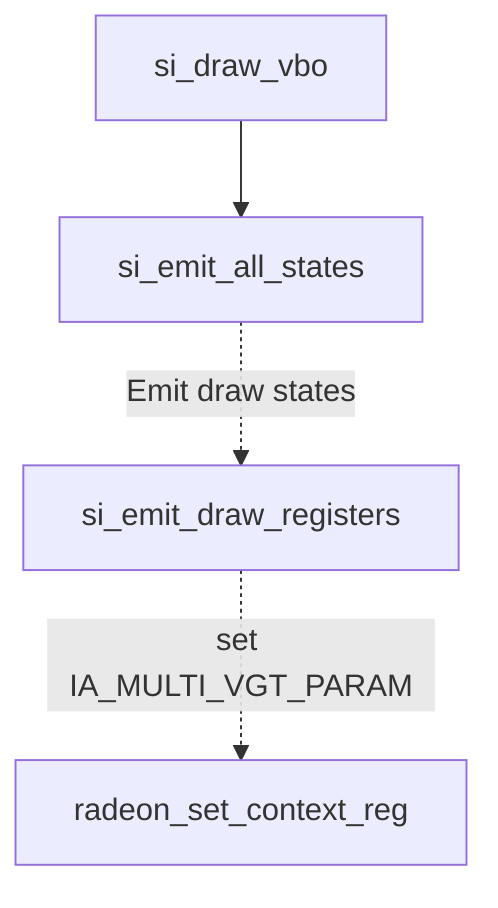


#### VGT_CACHE_INVALIDATION 

这个寄存器用于指定是通过VC（Vertex Cache）还是TC（Texture Cache）进行ES2GS和GS2VS环形缓冲区的缓存失效。在低成本的部件中，可能没有VC存在，因此所有的ES2GS/GS2VS环形缓冲区的获取都是通过TC进行的，因此缓存失效将通过TC进行。

| 字段名称               | 位    | 默认值 | 描述                                                                                                                                                      |
|----------------------|-------|--------|---------------------------------------------------------------------------------------------------------------------------------------------------------|
| VS_NO_EXTRA_BUFFER   | 5     | 0x0    | 如果设置为1，则禁用gs_on位。                                                                                                                         |
| STREAMOUT_FULL_FLUSH | 13    | 0x0    | 如果设置为1，SO_VGTSTREAMOUT_FLUSH事件的工作方式类似于R7xx和之前的版本。VGT在通知CP之前等待VS线程完成。                                                     |
| ES_LIMIT             | 20:16 | 0x0    | 性能调整参数，用于限制ES波浪提前于GS波浪的程度。这是允许在ESGS环形缓冲区中存在的ES波浪数量。该字段经过位移，因此表示2的幂值，即ES波浪数量为2的ES_LIMIT次幂。 |


#### VGT_DMA_BASE 

这是一个只写寄存器。为了保持一致性，VGT DMA控制寄存器有8个地址集。写入特定的地址集对于VGT DMA控制寄存器与写入任何其他一对VGT DMA控制寄存器是相同的。换句话说，写入这个寄存器和其他相关的VGT DMA控制寄存器是类似的，没有特殊的区别或注意事项。


| 字段名称    | 位      | 默认值 | 描述                                                                                                                                                     |
|-----------|---------|--------|----------------------------------------------------------------------------------------------------------------------------------------------------------|
| BASE_ADDR | 31:0    | none   | VGT DMA基地址。                                                                                                                                           |
|           |         |        | 此地址必须自然对齐到一个16位字（word）。因此，该寄存器的第0位必须为0。                                                                                 |

该寄存器名为BASE_ADDR，占据32个位，用于存储VGT DMA的基地址。必须确保此地址是以16位字（word）为单位的自然对齐。这意味着该地址的最低有效位（bit 0）必须为0，确保地址按照16位对齐，而不是8位对齐或其他方式。对于有效访问和正确功能，应注意按照规定对BASE_ADDR进行设置。

#### VGT_DMA_BASE_HI

根据提供的信息，VGT_DMA_BASE_HI是一个只写寄存器，占据32位，用于VGT DMA控制寄存器的地址设置。为了保持一致性，VGT DMA控制寄存器有8个地址集。写入特定的地址集对于VGT DMA控制寄存器与写入任何其他一对VGT DMA控制寄存器是相同的。该寄存器包含DMA基地址的高8位（即40位地址中的位31到位24）。

具体字段如下：

| 字段名称    | 位   | 默认值 | 描述                                                 |
|-----------|------|--------|------------------------------------------------------|
| BASE_ADDR | 7:0  | none   | DMA地址的高8位，用于设置40位DMA地址中的位31到位24。|

根据描述，VGT_DMA_BASE_HI寄存器的作用是设置DMA的高位地址，它与VGT_DMA_BASE_LO寄存器（用于设置低位地址）一起组成完整的40位DMA地址。请注意，该寄存器是只写的，因此只能通过写入来配置DMA地址的高8位。

#### VGT_DMA_INDEX_TYPE

根据提供的信息，VGT_DMA_INDEX_TYPE是一个只写寄存器，占据32位，用于配置VGT DMA控制寄存器的索引类型和数据交换模式。为了保持一致性，VGT DMA控制寄存器有8个地址集。写入特定的地址集对于VGT DMA控制寄存器与写入任何其他一对VGT DMA控制寄存器是相同的。

具体字段如下：

| 字段名称     | 位    | 默认值 | 描述                                                              |
|------------|-------|--------|-------------------------------------------------------------------|
| INDEX_TYPE | 1:0   | none   | VGT DMA索引类型。                                                 |
|            |       |        | 可能的值：                                                        |
|            |       |        | 00 - VGT_INDEX_16：16位索引。                                       |
|            |       |        | 01 - VGT_INDEX_32：32位索引。                                       |
| SWAP_MODE  | 3:2   | none   | DMA数据交换模式。                                                 |
|            |       |        | 可能的值：                                                        |
|            |       |        | 00 - VGT_DMA_SWAP_NONE：无交换。                                     |
|            |       |        | 01 - VGT_DMA_SWAP_16_BIT：16位交换，0xAABBCCDD -> 0xBBAADDCC。       |
|            |       |        | 02 - VGT_DMA_SWAP_32_BIT：32位交换，0xAABBCCDD -> 0xDDCCBBAA。       |
|            |       |        | 03 - VGT_DMA_SWAP_WORD：字交换，0xAABBCCDD -> 0xCCDDAABB。            |

根据描述，VGT_DMA_INDEX_TYPE寄存器用于设置VGT DMA的索引类型和数据交换模式。其中，INDEX_TYPE字段用于选择索引类型（16位索引或32位索引），而SWAP_MODE字段用于指定DMA数据的交换模式（无交换、16位交换、32位交换或字交换）。请注意，该寄存器是只写的，因此只能通过写入来配置这些字段的值。

#### VGT_DMA_MAX_SIZE

根据提供的信息，VGT_DMA_MAX_SIZE是一个只写寄存器，占据32位，用于处理索引越界问题。驱动程序将此寄存器设置为小于或等于VGT_DMA_SIZE的值，指定从索引缓冲区中读取多少个实际有效的数据。如果VGT_MAX_SIZE < VGT_DMA_SIZE，则在VGT中将其余的获取的索引设置为零。

具体字段如下：

| 字段名称   | 位    | 默认值 | 描述                                               |
|----------|-------|--------|----------------------------------------------------|
| MAX_SIZE | 31:0  | none   | VGT DMA最大索引数量，直到访问越界的索引缓冲区。|

根据描述，VGT_DMA_MAX_SIZE寄存器用于指定在访问越界的索引缓冲区之前，从索引缓冲区中读取的最大索引数量。驱动程序应该将该寄存器的值设置为小于或等于VGT_DMA_SIZE，以确保读取的数据不会超出索引缓冲区的范围。如果VGT_MAX_SIZE小于VGT_DMA_SIZE，则VGT会将其余获取的索引设置为零，避免访问越界。请注意，由于该寄存器是只写的，因此只能通过写入来配置MAX_SIZE字段的值。

#### VGT_DMA_NUM_INSTANCES 

根据提供的信息，VGT_DMA_NUM_INSTANCES是一个只写寄存器，占据32位，用于指定绘制调用中指定的实例数量值。如果未启用实例，则此寄存器设置为零或一。该寄存器的GPUF0MMReg地址为0x28a88。

具体字段如下：

| 字段名称         | 位     | 默认值 | 描述                                             |
|----------------|--------|--------|--------------------------------------------------|
| NUM_INSTANCES  | 31:0   | none   | VGT DMA实例数量，最小值为1。                              |

根据描述，VGT_DMA_NUM_INSTANCES寄存器用于指定绘制调用中的实例数量。如果绘制调用未启用实例化，则此寄存器设置为0或1。请注意，该寄存器是只写的，因此只能通过写入来配置NUM_INSTANCES字段的值。最小值为1，即至少要有一个实例。

地址说明：GPUF0MMReg：0x28a88 表示该寄存器在GPU寄存器空间中的地址为0x28a88。这是在GPU内部的物理地址，用于对该寄存器进行读写操作。


#### VGT_DMA_SIZE

VGT_DMA_SIZE是一个只写寄存器，占据32位，用于指定VGT DMA控制寄存器中的索引数量。为了保持一致性，VGT DMA控制寄存器有8个地址集。写入特定的地址集对于VGT DMA控制寄存器与写入任何其他一对VGT DMA控制寄存器是相同的。该寄存器的GPUF0MMReg地址为`0x28a74`。

具体字段如下：

| 字段名称      | 位     | 默认值 | 描述                                              |
|-------------|--------|--------|---------------------------------------------------|
| NUM_INDICES | 31:0   | none   | VGT DMA索引数量。                                   |

根据描述，VGT_DMA_SIZE寄存器用于指定VGT DMA控制寄存器中的索引数量。该寄存器是只写的，用于配置索引数量的值。请注意，该寄存器是只写的，因此只能通过写入来配置NUM_INDICES字段的值。

#### VGT_DRAW_INITIATOR

VGT_DRAW_INITIATOR是一个只写寄存器，占据32位，用于触发执行绘制数据包（2D或3D）。该寄存器的GPUF0MMReg地址为`0x287f0`。

该寄存器用于在VGT中触发绘制数据包的执行。写入该寄存器是一个触发器，启动VGT中的处理过程。VGT_DRAW_INITIATOR寄存器有8个地址，但在Wekiva芯片中并没有8个寄存器的副本。写入特定地址的绘制启动器寄存器会导致将一个状态上下文分配给绘制触发器的其中一个八个状态上下文。该状态上下文分配会向下传播，并被芯片中所有涉及执行此绘制触发器的各个部件使用。以下是关于绘制启动器寄存器中信息的描述。

具体字段如下：

| 字段名称         | 位     | 默认值 | 描述                                           |
|----------------|--------|--------|------------------------------------------------|
| SOURCE_SELECT  | 1:0   | none   | 输入源选择。                                   |
|                |        |        | 如果源选择字段设置为“自动增量索引”模式，并且基本类型设置为“带标志的三角形列表”，则绘制启动器将被处理为普通的“三角形列表”。 |
|                |        |        | 可能的值：                                     |
|                |        |        | 00 - DI_SRC_SEL_DMA：VGT DMA数据                |
|                |        |        | 01 - DI_SRC_SEL_IMMEDIATE：立即数据              |
|                |        |        | 02 - DI_SRC_SEL_AUTO_INDEX：自动增量索引        |
|                |        |        | 03 - DI_SRC_SEL_RESERVED：保留 - 未使用           |
| MAJOR_MODE     | 3:2   | none   | 主模式。                                       |
|                |        |        | 可能的值：                                     |
|                |        |        | 00 - DI_MAJOR_MODE_0：正常（隐式）模式 - 仅适用于基本类型0-21。在此模式中，某些VGT状态寄存器将被忽略（其值隐含）。 |
|                |        |        | 01 - DI_MAJOR_MODE_1：显式模式 - 配置完全由状态寄存器指定。                                   |
| NOT_EOP        | 5      | none   | 此位表示该绘制启动器不应产生数据包结束信号，因为它将后跟一个或多个链式绘制启动器。必须确保该绘制启动器立即在硬件接口上后跟一个链式绘制启动器。换句话说，链式绘制启动器不能分隔在可以中断的驱动程序缓冲区边界上。该位主要由CP设置，以改善小型2D位块的处理并行性。 |
|                |        |        | 可能的值：                                     |
|                |        |        | 00 - 正常的eop                                |
|                |        |        | 01 - 抑制eop                                 |
| USE_OPAQUE     | 6      | none   | 此位表示此绘制调用是不透明绘制调用。          |
|                |        |        | 可能的值：                                     |
|                |        |        | 00 - 非不透明绘制                             |
|                |        |        | 01 - 不透明绘制                               |

根据描述，VGT_DRAW_INITIATOR寄存器用于触发执行绘制数据包（2D或3D）。写入该寄存器是一个触发器，启动VGT中的处理过程。通过写入特定地址的绘制启动器寄存器，可以将其中一个八个状态上下文分配给绘制触发器。该寄存器具有多个字段，用于选择输入源、主模式以及设置是否生成结束信号等。这些字段用于配置绘制数据包的处理方式。请注意，VGT_DRAW


#### VGT_ENHANCE

VGT_ENHANCE是一个可读写寄存器，占据32位，用于用于添加控制位的后期扩展。

该寄存器的GPUF0MMReg地址为`0x28a50`。

具体字段如下：

| 字段名称  | 位    | 默认值 | 描述      |
|---------|-------|--------|-----------|
| MISC    | 31:0  | none   | 杂项位。  |

根据描述，VGT_ENHANCE寄存器用于后期添加控制位。该寄存器具有一个名为"Misc"的32位字段，但没有提供更详细的说明或默认值。这可能意味着这个字段的具体功能在描述中没有详细解释，或者可能在不同的硬件版本中有不同的含义。由于缺乏具体信息，我们无法进一步解释这个字段的作用和功能。如果需要了解更多细节，最好查阅相关的技术文档或硬件规格表。

#### VGT_ESGS_RING_ITEMSIZE 

VGT_ESGS_RING_ITEMSIZE是一个可读写寄存器，占据32位，用于指定写入ESGS环形缓冲区的每个顶点的大小。

该寄存器的GPUF0MMReg地址为`0x28aac`。

具体字段如下：

| 字段名称   | 位     | 默认值 | 描述                                      |
|----------|--------|--------|-------------------------------------------|
| ITEMSIZE | 14:0   | none   | 指定以双字为单位的大小。必须至少为4个双字，并且必须是4个双字的倍数。  |

根据描述，VGT_ESGS_RING_ITEMSIZE寄存器用于指定写入ESGS环形缓冲区的每个顶点的大小。大小以双字为单位，字段的范围为14位，即可以表示的最大值为2^14个双字。然而，它必须至少为4个双字，并且必须是4个双字的倍数。这是因为ESGS环形缓冲区的写入需要满足一定的对齐和大小要求。通过配置ITEMSIZE字段的值，可以确保每个顶点写入ESGS环形缓冲区时满足这些要求。

该寄存器在radeonsi中si_state_shaders.c中的si_emit_shader_es用到

```mermaid
graph TD 
si_shader_es -.设置atom.emit.-> si_emit_shader_es
si_draw_vbo-->si_emit_all_states--> A
A[si_pm4_emit] --> B[si_emit_shader_es] 

```


#### VGT_ESGS_RING_SIZE

VGT_ESGS_RING_SIZE是一个可读写寄存器，占据32位，用于指定ESGS环形缓冲区的大小，以256字节的倍数来表示。

该寄存器的GPUF0MMReg地址为`0x88c8`。

具体字段如下：

| 字段名称   | 位     | 默认值 | 描述                                      |
|----------|--------|--------|-------------------------------------------|
| MEM_SIZE | 31:0   | none   | 指定以256字节为单位的大小。对于双着色器引擎的部分，大小必须设置为512字节的倍数，因为环形缓冲区的一半用于每个着色器引擎。  |

根据描述，VGT_ESGS_RING_SIZE寄存器用于指定ESGS环形缓冲区的大小，以256字节的倍数表示。字段MEM_SIZE表示环形缓冲区的大小，以256字节为单位。对于双着色器引擎的部分，环形缓冲区的大小必须设置为512字节的倍数，因为环形缓冲区的一半将用于每个着色器引擎。通过配置MEM_SIZE字段的值，可以确定ESGS环形缓冲区的实际大小。


改寄存器在radeonsi中的si_state_shaders.c中的si_update_gs_ring_buffers中用到。

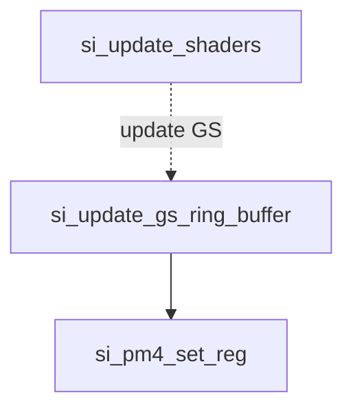


#### VGT_ES_PER_GS

VGT_ES_PER_GS是一个可读写寄存器，占据32位，用于指定每个GS线程处理的最大ES顶点数。

该寄存器的GPUF0MMReg地址为`0x28a58`。

具体字段如下：

| 字段名称   | 位       | 默认值 | 描述                                |
|----------|----------|--------|-------------------------------------|
| ES_PER_GS | 10:0     | none   | 每个GS线程处理的最大ES顶点数。        |

根据描述，VGT_ES_PER_GS寄存器用于指定每个GS线程处理的最大ES顶点数。字段ES_PER_GS的范围为11位，因此可以表示的最大值为2^11，即2048。通过配置ES_PER_GS字段的值，可以确定GS线程在处理ES阶段时可以处理的最大ES顶点数。


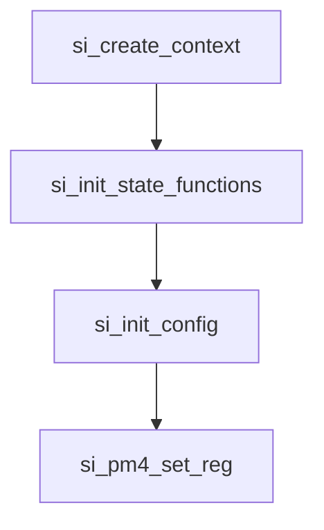


#### VGT_EVENT_INITIATOR  

VGT_EVENT_INITIATOR是一个可写寄存器，占据32位，用于触发事件。

该寄存器的GPUF0MMReg地址为`0x28a90`。

这个寄存器字段描述较多， 需要结合原手册。

具体字段如下：

| 字段名称         | 位     | 默认值 | 描述                                                                                                              |
|----------------|--------|--------|-------------------------------------------------------------------------------------------------------------------|
| EVENT_TYPE     | 5:0    | none   | 事件类型（也称为事件ID）--目前，VGT和PA之间的硬件接口仅支持6位事件类型。                                                  |
| ADDRESS_HI     | 26:18  | none   | 用于ZPASS事件的地址位39:31。                                                                                          |
| EXTENDED_EVENT | 27     | none   | 0表示单个DW事件，1表示双DW事件。                                                                                      |

根据描述，VGT_EVENT_INITIATOR寄存器用于触发事件。EVENT_TYPE字段指定事件类型，共有多种可选值，例如用于样本统计、缓存刷新、性能计数等。不同的EVENT_TYPE值对应不同的事件，具体含义和功能由每个EVENT_TYPE决定。

ADDRESS_HI字段用于ZPASS事件，指定了事件地址的高位。

EXTENDED_EVENT字段用于指示事件是否是扩展事件，0表示单个DW事件，1表示双DW事件。

通过配置EVENT_TYPE字段，可以触发不同的事件，进而控制GPU的不同行为或功能。

#### VGT_GROUP_DECR 

VGT_GROUP_DECR是一个可读写寄存器，占据32位，用于控制绘制初始化器索引计数的递减量，适用于除第一组之外的所有从输入流中获取的组。

该寄存器的GPUF0MMReg地址为`0x28a2c`。

具体字段如下：

| 字段名称 | 位   | 默认值 | 描述                                      |
|--------|------|--------|-------------------------------------------|
| DECR   | 3:0  | none   | 除了第一组之外的所有组的递减量。              |

根据描述，在Major Mode 0下，对于原始类型（Prim Types）0到21，该寄存器将被忽略，不起作用。而在其他模式下，该寄存器控制从输入流中获取的所有组，除了第一组之外，绘制初始化器索引计数的递减量。

通过配置DECR字段的值，可以调整绘制初始化器索引计数在不同组之间的递减量，从而影响绘制操作的处理方式。

#### VGT_GSVS_RING_ITEMSIZE 

VGT_GSVS_RING_ITEMSIZE是一个可读写寄存器，占据32位，用于指定写入GSVS环形缓冲区的每个图元的大小。

该寄存器的GPUF0MMReg地址为`0x28ab0`。

具体字段如下：

| 字段名称   | 位    | 默认值 | 描述                                  |
|----------|-------|--------|---------------------------------------|
| ITEMSIZE | 14:0  | none   | 指定以双字（dword）为单位的大小。必须至少为4个dword，并且必须是4个dword的倍数。 |

根据描述，VGT_GSVS_RING_ITEMSIZE寄存器用于设置写入GSVS环形缓冲区的每个图元的大小。图元大小以双字（dword）为单位进行指定，并且必须至少为4个dword，并且必须是4个dword的倍数。

通过配置ITEMSIZE字段的值，可以确定GSVS环形缓冲区中每个图元的大小，以适应特定的图元数据格式和需求。

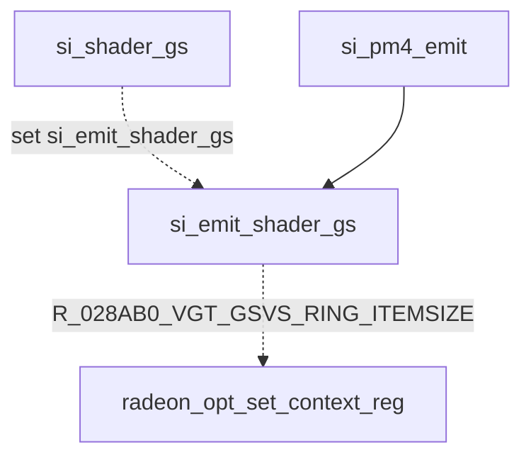

#### VGT_GSVS_RING_OFFSET_1 VGT_GSVS_RING_OFFSET_2 VGT_GSVS_RING_OFFSET_3 {#VGT_GSVS_RING_OFFSET_1 }

VGT_GSVS_RING_OFFSET_1-3是一个可读写寄存器，占据32位，用于设置GSVS环形缓冲区的偏移量。

该寄存器的GPUF0MMReg地址为`0x28a60`。

具体字段如下：

| 字段名称   | 位    | 默认值 | 描述                           |
|----------|-------|--------|--------------------------------|
| OFFSET   | 14:0  | none   | 用于指定GSVS环形缓冲区的偏移量。|

GSVS环形缓冲区是图形Shader（GS）和视口Shader（VS）之间的中间缓冲区，用于在图元传递阶段存储GS处理后的图元数据。通过配置OFFSET字段的值，可以设置GSVS环形缓冲区中的偏移量，以确定GS数据存储在缓冲区中的位置。这样，VS阶段就可以正确地读取GS产生的图元数据进行后续处理。

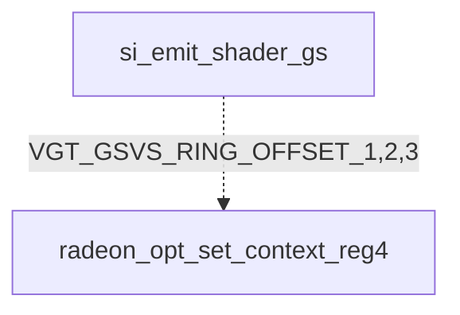

#### VGT_GSVS_RING_SIZE

VGT_GSVS_RING_SIZE是一个可读写寄存器，占据32位，用于设置GSVS环形缓冲区的大小。

该寄存器的GPUF0MMReg地址为`0x88cc`。

具体字段如下：

| 字段名称   | 位    | 默认值 | 描述                                                                                                 |
|----------|-------|--------|------------------------------------------------------------------------------------------------------|
| MEM_SIZE | 31:0  | none   | 用于指定GSVS环形缓冲区的大小，以256字节为单位的倍数表示。对于双着色器引擎部分，大小必须是512字节的倍数，因为环形缓冲区的一半用于每个着色器引擎。|

GSVS环形缓冲区是用于存储GS处理后的图元数据，供视口Shader（VS）使用的缓冲区。通过配置MEM_SIZE字段的值，可以设置GSVS环形缓冲区的大小，以256字节为单位的倍数表示。对于双着色器引擎（dual shader engine）的GPU部分，GSVS环形缓冲区的大小必须是512字节的倍数，因为环形缓冲区的一半用于每个着色器引擎，确保数据的正确处理和读取。


这个寄存器radeonsi中使用流程和VGT_ESGS_RING_SIZE一样。


#### VGT_GS_INSTANCE_CNT

VGT_GS_INSTANCE_CNT是一个可读写寄存器，占据32位，用于指定GS（几何着色器）图元实例化的数量。

该寄存器的GPUF0MMReg地址为`0x28b90`。

具体字段如下：

| 字段名称   | 位    | 默认值 | 描述                                                                                               |
|----------|-------|--------|----------------------------------------------------------------------------------------------------|
| ENABLE   | 0     | none   | 用于启用或禁用GS实例化。                                                                            |
| CNT      | 8:2   | none   | 用于指定GS图元实例的数量。如果设置为0，表示GS实例化被视为关闭，不提供实例ID。|

GS实例化是一种图形渲染技术，可以使用几何着色器在单次绘制调用中生成多个相似的图元实例。通过配置ENABLE字段来启用或禁用GS实例化，通过配置CNT字段来指定GS图元实例的数量。如果将CNT字段设置为0，则表示GS实例化被视为关闭，此时不提供实例ID。启用GS实例化后，GS将根据实例数量多次处理输入图元，并生成相应数量的实例输出。

该寄存器使用流程同[VGT_GSVS_RING_OFFSET_1](#VGT_GSVS_RING_OFFSET_1)


#### VGT_GS_MAX_VERT_OUT

VGT_GS_MAX_VERT_OUT是一个可读写寄存器，占据32位，用于指定GS（几何着色器）每个图元输出的最大顶点数。

该寄存器的GPUF0MMReg地址为`0x28b38`。

具体字段如下：

| 字段名称      | 位      | 默认值 | 描述                                                                                                                                                                      |
|-------------|---------|--------|---------------------------------------------------------------------------------------------------------------------------------------------------------------------------|
| MAX_VERT_OUT | 10:0    | none   | GS场景C：在场景C中，VGT使用该寄存器来确定GS输出的每个图元的最大顶点数。PA（光栅化器）根据着色器的处理结果来构造图元。                                                                         |
| MAX_VERT_OUT | 10:0    | none   | GS场景G：在场景G中，如果启用10xx选项，则VGT将根据该值对GS着色器的输出顶点数进行截断（之前会自动截断为默认值1024）。该寄存器在复位时没有默认值，如果不需要该特性，API应在初始化时将其设置为1024。|

VGT_GS_MAX_VERT_OUT寄存器用于控制GS输出的顶点数量。在不同的场景下（场景C和场景G），该寄存器的作用稍有不同。在场景C中，VGT根据该寄存器的设置来决定每个图元输出的最大顶点数，并由PA根据着色器生成的数据构造图元。而在场景G中，如果启用了10xx选项，VGT将对GS着色器的输出顶点数进行截断，使其不超过MAX_VERT_OUT指定的最大值。在寄存器复位时，没有默认值，如果不需要此功能，则应在初始化时将其设置为1024。

该寄存器使用流程同[VGT_GSVS_RING_OFFSET_1](#VGT_GSVS_RING_OFFSET_1)

#### VGT_GS_MODE 


```mermaid
si_shader_init_pm4_state --> si_shader_vs
si_init_shader_selector_async-->
si_shader_vs --> si_emit_shader_vs
si_emit_shader_vs --> radeon_opt_set_context_reg

```

#### VGT_GS_OUT_PRIM_TYPE

VGT_GS_OUT_PRIM_TYPE是一个可读写寄存器，占据32位，用于控制VGT（顶点图形处理单元）中GS（几何着色器）的输出图元类型。

该寄存器的GPUF0MMReg地址为`0x28a6c`。

具体字段如下：

| 字段名称                  | 位       | 默认值 | 描述                                                                                                                                              |
|-------------------------|----------|--------|---------------------------------------------------------------------------------------------------------------------------------------------------|
| OUTPRIM_TYPE             | 5:0      | 0x0    | GS输出图元类型，表示流0的图元类型。                                                                                                                      |
| OUTPRIM_TYPE_1           | 13:8     | 0x0    | GS输出图元类型，表示流1的图元类型。                                                                                                                      |
| OUTPRIM_TYPE_2           | 21:16    | 0x0    | GS输出图元类型，表示流2的图元类型。                                                                                                                      |
| OUTPRIM_TYPE_3           | 27:22    | 0x0    | GS输出图元类型，表示流3的图元类型。                                                                                                                      |
| UNIQUE_TYPE_PER_STREAM   | 31       | 0x0    | 如果为1，则OUTPRIM_TYPE字段表示流0的图元类型。如果为0，则OUTPRIM_TYPE字段适用于所有流。                                                                                                 |

该寄存器使用流程同[VGT_GSVS_RING_OFFSET_1](#VGT_GSVS_RING_OFFSET_1)

###  VGT_GS_PER_ES

VGT_GS_PER_ES是一个可读写寄存器，占据32位，用于控制VGT（顶点图形处理单元）中每个ES（顶点着色器）线程所处理的最大GS（几何着色器）图元数量。

该寄存器的GPUF0MMReg地址为`0x28a54`。

具体字段如下：

| 字段名称     | 位    | 默认值 | 描述                                                     |
|------------|-------|--------|----------------------------------------------------------|
| GS_PER_ES  | 10:0  |  none  | 每个ES线程所处理的最大GS图元数量。                          |
| PARTIAL_ES_WAVE_ON | 16    |  none  | 如果为1，则允许ES线程在不完整的波束上执行。如果为0，则ES线程将完整地执行。如果GS_PER_ES / primgroup_size大于(GPU_VGT__GS_TABLE_DEPTH - 3)，则该位必须为0。  |
R_028A54_VGT_GS_PER_ES,

该寄存器使用流程同VGT_ES_PER_GS


#### VGT_GS_PER_VS

VGT_GS_PER_VS是一个可读写寄存器，占据32位，用于控制VGT（顶点图形处理单元）中每个VS（顶点着色器）线程所处理的最大GS（几何着色器）线程数量。

该寄存器的GPUF0MMReg地址为`0x28a5c`。

具体字段如下：

| 字段名称   | 位    | 默认值 | 描述                         |
|----------|-------|--------|------------------------------|
| GS_PER_VS | 3:0   | none   | 每个VS线程所处理的最大GS线程数量。 |


该寄存器使用流程同VGT_ES_PER_GS

#### VGT_GS_VERT_ITEMSIZE1-3

VGT_GS_VERT_ITEMSIZE是一个可读写寄存器，占据32位，用于指定写入GSVS（几何着色器-视口裁剪-存储器）环形缓冲区的Stream (0-3)中每个顶点的大小。


具体字段如下：

| 字段名称   | 位      | 默认值 | 描述                               |
|------------|-----------|--------|------------------------------------|
| ITEMSIZE   | 14:0     | none   | 指定的顶点大小，单位为dword（双字）。 |

该寄存器使用流程同[VGT_GSVS_RING_OFFSET_1](#VGT_GSVS_RING_OFFSET_1)


#### VGT_HOS_MAX_TESS_LEVEL

VGT_HOS_MAX_TESS_LEVEL是一个可读写寄存器，占据32位，用于在使用细分器时指定硬件将应用于提取的细分因子的最大细分级别限制。

该寄存器的GPUF0MMReg地址为`0x28a18`。

具体字段如下：

| 字段名称   | 位      | 默认值 | 描述                                        |
|------------|-----------|--------|---------------------------------------------|
| MAX_TESS   | 31:0     | none   | 允许的细分级别范围为(0.0, 64.0)。如果输入的细分因子是NaN、负数或零，则不会受到此值的限制。 |


该寄存器使用流程同VGT_ES_PER_GS

#### VGT_HOS_MIN_TESS_LEVEL

VGT_HOS_MIN_TESS_LEVEL是一个可读写寄存器，占据32位，用于在使用细分器时指定硬件将应用于提取的细分因子的最小细分级别限制。

该寄存器的GPUF0MMReg地址为`0x28a1c`。

具体字段如下：

| 字段名称   | 位      | 默认值 | 描述                                        |
|------------|-----------|--------|---------------------------------------------|
| MIN_TESS   | 31:0     | none   | 允许的细分级别范围为(0.0, 64.0)。如果输入的细分因子是NaN、负数或零，则不会受到此值的限制。 |


####  VGT_HS_OFFCHIP_PARAM

VGT_HS_OFFCHIP_PARAM是一个可写寄存器，占据32位，用于控制Offchip HS（细分表面图元离线化）模式的操作参数。

该寄存器的GPUF0MMReg地址为`0x89b0`。

具体字段如下：

| 字段名称           | 位      | 默认值 | 描述                                                         |
|--------------------|-----------|--------|--------------------------------------------------------------|
| OFFCHIP_BUFFERING | 6:0       | 0x0   | 可用的离线缓冲区数量，范围从1到64个8K双字缓冲区。 |

这些字段用于控制Offchip HS的工作方式，包括可用的离线缓冲区数量，以及其他相关参数。通过写入这些字段，可以配置细分表面图元的离线化过程。


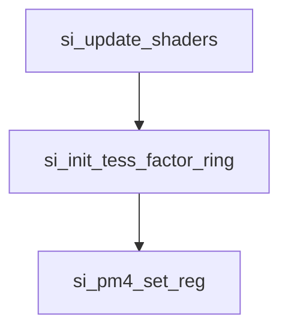

#### VGT_INDEX_TYPE

VGT_INDEX_TYPE是一个可写寄存器，占据32位，用于配置VGT（Vertex Graphics Table）的索引类型。

该寄存器的GPUF0MMReg地址为`0x895c`。

具体字段如下：

| 字段名称      | 位     | 默认值 | 描述                                                                                                      |
|---------------|----------|--------|-----------------------------------------------------------------------------------------------------------|
| INDEX_TYPE   | 1:0      | none   | 索引类型（仅适用于prim类型0-28）。如果Source Select字段设置为“Auto-increment Index”模式，则忽略此字段，索引类型为32位/索引。 |
|                      |                |        | 可能的值：                                                                                                 |
|                      |                |        | 00 - DI_INDEX_SIZE_16_BIT: 16位/索引。                                                                      |
|                      |                |        | 01 - DI_INDEX_SIZE_32_BIT: 32位/索引。                                                                      |

通过写入这些字段，可以配置VGT的索引类型，选择每个索引占用的位数，可以是16位或32位。该配置仅适用于特定的图元类型（prim类型0-28），如果Source Select字段设置为“Auto-increment Index”模式，则索引类型为32位。


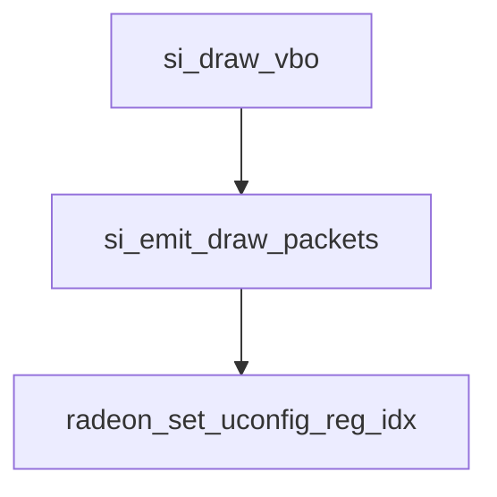

#### VGT_INDX_OFFSET 

VGT_INDX_OFFSET是一个可读写寄存器，占据32位，用于对指定为索引的组件进行偏移。该寄存器仅适用于Ring 0。

该寄存器的GPUF0MMReg地址为`0x28408`。

具体字段如下：

| 字段名称      | 位      | 默认值 | 描述                                                                                         |
|---------------|-----------|--------|------------------------------------------------------------------------------------------------|
| INDX_OFFSET  | 31:0      | none   | 索引偏移值（32位加法器），将其扩展为32位。                                               |

通过写入INDX_OFFSET字段，可以对被指定为索引的组件进行偏移。偏移操作发生在进行夹取和固定点转浮点转换之前。

该寄存器使用流程同VGT_ES_PER_GS

#### VGT_INSTANCE_STEP_RATE_0-1

VGT_INSTANCE_STEP_RATE_x是一个可读写寄存器，占据32位，用于定义第x个实例的步进率。


具体字段如下：

| 字段名称      | 位      | 默认值 | 描述                                    |
|---------------|-----------|--------|-------------------------------------------|
| STEP_RATE    | 31:0      | none   | 实例的步进率（Instance step rate）。| 

通过写入STEP_RATE字段，可以定义第x个实例的步进率。

该寄存器使用流程同VGT_ES_PER_GS

#### VGT_LS_HS_CONFIG

VGT_LS_HS_CONFIG是一个可读写寄存器，占据32位，用于指定LS/HS（Local Shader / Hull Shader）的控制值。

该寄存器的GpuF0MMReg地址为`0x28b58`。

具体字段如下：

| 字段名称            | 位      | 默认值 | 描述                                             |
|-----------------------|-----------|--------|-------------------------------------------------------|
| NUM_PATCHES        | 7:0       | none   | 指示一个线程组中的patch（图元片段）数量。         | 
| HS_NUM_INPUT_CP   | 13:8      | none   | HS输入patch（图元片段）中的控制点数量。         | 
| HS_NUM_OUTPUT_CP | 19:14   | none   | HS输出patch（图元片段）中的控制点数量。       | 

通过写入这些字段，可以指定LS/HS的控制值。

```mermaid

si_draw_vbo-->
si_emit_all_states --> si_emit_derived_tess_state-->
radeon_set_context_reg_idx

```


#### VGT_MAX_VTX_INDX

VGT:VGT_MAX_VTX_INDX是一个可读写寄存器，占据32位，用于索引值（indices）的最大值截断。该寄存器是针对特定的环（Ring）而设定的，但只存在于环0中。索引值在指定为索引的组件中时（请参阅VGT_GROUP_VECT_0_FMT_CNTL寄存器），会在偏移之后和fix->flt（固定点数到浮点数）转换之前进行截断。

该寄存器的GpuF0MMReg地址为`0x28400`。

具体字段如下：

| 字段名称       | 位     | 默认值 | 描述                                      |
|----------------|--------|--------|------------------------------------------|
| MAX_INDX       | 31:0 | none   | 索引值的最大截断值，扩展为32位。   |

该寄存器使用流程同VGT_ES_PER_GS

#### VGT_MIN_VTX_INDX

VGT:VGT_MIN_VTX_INDX是一个可读写寄存器，占据32位，用于索引值（indices）的最小值截断。该寄存器是针对特定的环（Ring）而设定的，但只存在于环0中。索引值在指定为索引的组件中时（请参阅VGT_GROUP_VECT_0_FMT_CNTL寄存器），会在偏移之后和fix->flt（固定点数到浮点数）转换之前进行截断。

该寄存器的GpuF0MMReg地址为`0x28404`。

具体字段如下：

| 字段名称       | 位     | 默认值 | 描述                                      |
|----------------|--------|--------|------------------------------------------|
| MIN_INDX       | 31:0 | none   | 索引值的最小截断值，扩展为32位。   |

通过写入这些字段，可以指定索引值的最大截断值和最小截断值。

该寄存器使用流程同VGT_ES_PER_GS

####  VGT_MULTI_PRIM_IB_RESET_EN

VGT:VGT_MULTI_PRIM_IB_RESET_EN是一个可读写寄存器，占据32位，用于启用基于重置索引（reset index）的图元重置。该寄存器允许根据重置索引来重置图元。

该寄存器的GpuF0MMReg地址为`0x28a94`。

具体字段如下：

| 字段名称       | 位     | 默认值 | 描述                                      |
|----------------|--------|--------|------------------------------------------|
| RESET_EN       | 0     | none   | 如果设置为1，则启用重置索引来重置图元。   |

通过写入该字段，可以启用或禁用基于重置索引的图元重置功能。如果设置为1，重置索引将用于重置图元。如果设置为0，将禁用图元重置功能。

该寄存器使用流程同IA_MULTI_VGT_PARAM

#### VGT_MULTI_PRIM_IB_RESET_INDX

VGT:VGT_MULTI_PRIM_IB_RESET_INDX是一个可读写寄存器，占据32位，用于指定用于重置图元顺序（strip/fan/polygon）的32位索引值。当IB（Index Buffer）中的索引值与该寄存器中的值匹配时，将开始一个新的图元集。

该寄存器的GpuF0MMReg地址为`0x2840c`。

具体字段如下：

| 字段名称    | 位     | 默认值 | 描述                          |
|-------------|--------|--------|----------------------------------|
| RESET_INDX  | 31:0 | none   | 用于重置图元顺序的32位索引值。 |

通过写入RESET_INDX字段，可以指定用于重置图元顺序的索引值。当IB中的索引值等于该寄存器中的值时，会触发开始一个新的图元集。

该寄存器使用流程同IA_MULTI_VGT_PARAM


####  **VGT_NUM_INDICES**

VGT:VGT_NUM_INDICES是一个可写寄存器，占据32位，用于指定要处理的索引数量。需要注意的是，这个计数不一定是图元的计数，也不是索引缓冲在内存中的大小。当使用计算着色器（compute shaders）时，驱动程序需要将这个寄存器写入x、y和z的乘积，这三个维度定义了计算着色器线程组的大小。

该寄存器的GpuF0MMReg地址为`0x8970`。

具体字段如下：

| 字段名称      | 位     | 默认值 | 描述                                     |
|---------------|--------|--------|---------------------------------------------|
| NUM_INDICES   | 31:0 | none   | 指定要处理的索引数量。 |

通过写入NUM_INDICES字段，可以指定要处理的索引数量。

#### **VGT_NUM_INSTANCES**

VGT:VGT_NUM_INSTANCES是一个可写寄存器，占据32位，用于指定绘制调用中的实例数量。如果设置为零，则会被解释为1个实例。最大允许的值是2^32-1。

该寄存器的GpuF0MMReg地址为`0x8974`。

具体字段如下：

| 字段名称         | 位     | 默认值 | 描述                                        |
|------------------|--------|--------|--------------------------------------------------|
| NUM_INSTANCES   | 31:0 | none   | 指定绘制调用中的实例数量。如果设置为零，则会被解释为1个实例。最大允许的值是2^32-1。 |

通过写入NUM_INSTANCES字段，可以指定绘制调用中的实例数量。


这个在radeonsi没有显式用到，而是用的PKT3_NUM_INSTANCES

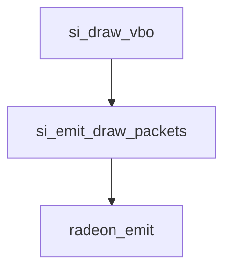

#### VGT_OUTPUT_PATH_CNTL

VGT:VGT_OUT_DEALLOC_CNTL是一个可读写寄存器，占据32位，用于控制在处理向量中上一个处理向量何时被释放（de-allocated）。

该寄存器的GpuF0MMReg地址为`0x28c5c`。

具体字段如下：

| 字段名称         | 位     | 默认值 | 描述                                       |
|------------------|--------|--------|-------------------------------------------------|
| DEALLOC_DIST   | 6:0   | none   | 控制在处理向量中上一个处理向量何时被释放（de-allocated）。从r7xx开始，该寄存器应该被设置为16。 |

通过设置DEALLOC_DIST字段，可以控制在处理向量中上一个处理向量的释放距离。在r7xx架构及之后，该寄存器应设置为16。

该寄存器使用流程同VGT_ES_PER_GS


#### VGT_PRIMITIVEID_EN

VGT:VGT_PRIMITIVEID_EN是一个可读写寄存器，占据32位，用于启用32位原始ID（PrimitiveID）的生成。

该寄存器的GpuF0MMReg地址为`0x28a84`。

具体字段如下：

| 字段名称                 | 位     | 默认值 | 描述                                                                                      |
|----------------------------|--------|--------|-----------------------------------------------------------------------------------------------|
| PRIMITIVEID_EN      | 0       | none   | 启用原始ID（PrimitiveID）的生成。                                                     |
| DISABLE_RESET_ON_EOI | 1       | none   | 决定原始ID（PrimitiveID）是否在每个实例的结束时重置。        |

通过设置PRIMITIVEID_EN字段，可以启用或禁止原始ID（PrimitiveID）的生成。可能的值如下：
- 00: 禁止原始ID（PrimitiveID）输出
- 01: 输出原始ID（PrimitiveID）

通过设置DISABLE_RESET_ON_EOI字段，可以决定原始ID（PrimitiveID）是否在每个实例的结束时重置。可能的值如下：
- 00: 原始ID（PrimitiveID）在每个实例和数据包结束时重置
- 01: 原始ID（PrimitiveID）仅在数据包结束时重置

该寄存器使用流程同VGT_GS_MODE

#### VGT_PRIMITIVEID_RESET

VGT:VGT_PRIMITIVEID_RESET是一个可读写寄存器，占据32位，用于指定用户指定的32位起始原始ID（PrimitiveID）值，该值在每个新的图元中递增。

该寄存器的GpuF0MMReg地址为`0x28a8c`。

具体字段如下：

| 字段名称 | 位      | 默认值 | 描述                   |
|----------|----------|--------|---------------------------|
| VALUE    | 31:0     | 0x0    | 原始ID（PrimitiveID）的重置值。 |

通过设置VALUE字段，用户可以指定原始ID（PrimitiveID）的起始值。在每个新的图元生成时，该值将递增。初始值可以用于生成唯一的原始ID，以便在图元处理过程中进行标识和追踪。

该寄存器使用流程同VGT_ES_PER_GS

#### VGT_PRIMITIVE_TYPE

VGT:VGT_PRIMITIVE_TYPE是一个可写寄存器，占据32位，用于指定VGT（Vertex Graphics Tesselator）的原始类型。

该寄存器的GpuF0MMReg地址为`0x8958`。

具体字段如下：

| 字段名称   | 位      | 默认值 | 描述                                 |
|-------------|----------|--------|----------------------------------------|
| PRIM_TYPE   | 5:0      | none   | 原始类型。仅在Major mode 0中使用。对于Major Mode 1，使用VGT_GRP_PRIM_TYPE寄存器中指定的原始类型。 |

通过设置PRIM_TYPE字段，可以指定要在VGT中使用的原始类型。不同的原始类型对应不同的图元类型，如点、线段、三角形等。这可以影响图元的绘制方式和渲染效果。注意，在Major Mode 1中，这个寄存器不会被使用，而是使用VGT_GRP_PRIM_TYPE寄存器中的原始类型。

该寄存器使用流程同IA_MULTI_VGT_PARAM


####  VGT_REUSE_OFF

VGT:VGT_REUSE_OFF是一个可读写寄存器，占据32位，用于控制VS（Vertex Shader）处理向量生成中的重用。

该寄存器的GpuF0MMReg地址为`0x28ab4`。

具体字段如下：

| 字段名称     | 位    | 默认值 | 描述                 |
|---------------|--------|--------|------------------------|
| REUSE_OFF     | 0        | none    | 是否关闭重用。设置为1表示重用关闭，设置为0表示重用打开。 |

通过设置REUSE_OFF字段，可以控制VS处理向量的生成是否进行重用。重用指的是在VS过程中，是否允许对之前处理过的数据进行再次使用，以减少冗余计算。将REUSE_OFF设置为1将关闭重用功能，而设置为0将打开重用功能。注意，该寄存器只会关闭VS处理向量的重用，对于ES（Exposure Shader）处理向量的重用不受影响。此外，重用也将在流输出和视口绘制过程中被关闭。


该寄存器使用流程同VGT_GS_MODE

#### VGT_SHADER_STAGES_EN

VGT:VGT_SHADER_STAGES_EN是一个可读写寄存器，占据32位，用于指定启用哪些着色器阶段。在更改某些组合时，可能需要进行VGT_FLUSH或PIPE FLUSH操作。

该寄存器的GpuF0MMReg地址为`0x28b54`。

具体字段如下：

| 字段名称     | 位    | 默认值 | 描述                 |
|---------------|--------|--------|------------------------|
| LS_EN         | 1:0    | none   | 控制LS（Local Shader）阶段的行为。 |
| HS_EN         | 2      | none   | 控制HS（Hull Shader）阶段的行为。 |
| ES_EN         | 4:3    | none   | 控制ES（Exposure Shader）阶段的行为。 |
| GS_EN         | 5      | none   | 控制GS（Geometry Shader）阶段的行为。 |
| VS_EN         | 7:6    | none   | 控制VS（Vertex Shader）阶段的行为。 |
| DYNAMIC_HS    | 8      | none   | 表示HS阶段的输出是否始终保留在芯片上（Evergreen模式）或者动态决定使用离散式存储器（off-chip memory），从而使用多个SIMD来执行后续DS波束。 |

各字段取值的含义如下：

- LS_EN：控制LS阶段的行为，可选值为LS_STAGE_OFF、LS_STAGE_ON、CS_STAGE_ON和RESERVED_LS。
- HS_EN：控制HS阶段的行为，可选值为HS_STAGE_OFF和HS_STAGE_ON。
- ES_EN：控制ES阶段的行为，可选值为ES_STAGE_OFF、ES_STAGE_DS、ES_STAGE_REAL和RESERVED_ES。
- GS_EN：控制GS阶段的行为，可选值为GS_STAGE_OFF和GS_STAGE_ON，但要求VGT_GS_MODE.bits.MODE必须设置为SCENARIO_G。
- VS_EN：控制VS阶段的行为，可选值为VS_STAGE_REAL、VS_STAGE_DS、VS_STAGE_COPY_SHADER和RESERVED_VS。
- DYNAMIC_HS：表示HS阶段的输出方式，可选值为hs_onchip和hs_dynamic_off_chip。

通过设置这些字段，可以启用或禁用不同的着色器阶段以满足特定的着色器需求。


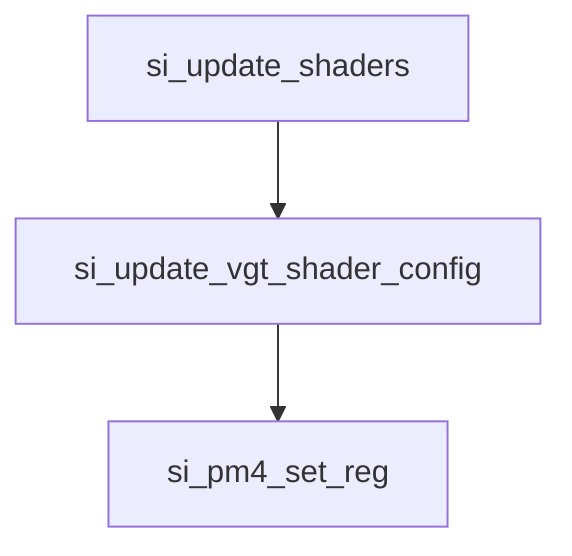


#### VGT_STRMOUT_BUFFER_CONFIG

VGT:VGT_STRMOUT_BUFFER_CONFIG是一个可读写寄存器，占据32位，用于启用流输出（Stream Out）功能。流输出允许GPU将处理过的图元数据流写入缓冲区，通常用于GPU计算和几何着色阶段的输出。

该寄存器的GpuF0MMReg地址为`0x28b98`。

具体字段如下：

| 字段名称            | 位     | 默认值 | 描述                      |
|---------------------|---------|--------|---------------------------|
| STREAM_0_BUFFER_EN   | 3:0     | 0x0    | 绑定流0的缓冲区。位0设置为1表示绑定缓冲区0，位1表示绑定缓冲区1，位2表示绑定缓冲区2，位3表示绑定缓冲区3。 |
| STREAM_1_BUFFER_EN   | 7:4     | 0x0    | 绑定流1的缓冲区。位0设置为1表示绑定缓冲区0，位1表示绑定缓冲区1，位2表示绑定缓冲区2，位3表示绑定缓冲区3。 |
| STREAM_2_BUFFER_EN   | 11:8    | 0x0    | 绑定流2的缓冲区。位0设置为1表示绑定缓冲区0，位1表示绑定缓冲区1，位2表示绑定缓冲区2，位3表示绑定缓冲区3。 |
| STREAM_3_BUFFER_EN   | 15:12   | 0x0    | 绑定流3的缓冲区。位0设置为1表示绑定缓冲区0，位1表示绑定缓冲区1，位2表示绑定缓冲区2，位3表示绑定缓冲区3。 |

通过设置这些字段，可以指定哪些流输出缓冲区将被启用，从而使得GPU可以将处理过的图元数据流写入相应的缓冲区。


该寄存器使用流程同VGT_ES_PER_GS
 
 

#### VGT_STRMOUT_BUFFER_SIZE_0-3

VGT:VGT_STRMOUT_BUFFER_SIZE_x是一个可读写寄存器，占据32位，用于设置流输出（Stream Out）缓冲区x的大小。


具体字段如下：

| 字段名称 | 位    | 默认值 | 描述                         |
|----------|-------|--------|------------------------------|
| SIZE     | 31:0 | none   | 流输出缓冲区0的大小（以DWORD为单位）。 |

通过设置SIZE字段，可以指定流输出缓冲区0的大小，以DWORD为单位。GPU将处理过的图元数据流写入该缓冲区，当达到指定大小后，GPU将停止写入并继续处理下一个图元。


这个寄存器在state_streamout.c文件中si_emit_streamout_begin中用到。

```mermaid
graph TD
si_init_streamout_functions -.初始化si_context atoms.s.streamout_begin.emit.->  si_init_streamout_functions
si_emit_streamout_begin
```

#### VGT_STRMOUT_CONFIG

VGT:VGT_STRMOUT_CONFIG是一个可读写寄存器，占据32位，用于启用流输出（Stream Out）功能。

该寄存器的GpuF0MMReg地址为`0x28b94`。

具体字段如下：

| 字段名称             | 位    | 默认值 | 描述                                                         |
|-----------------------|-------|--------|----------------------------------------------------------------|
| STREAMOUT_0_EN    | 0     | 0x0    | 如果设置为1，启用到流输出流0的流输出。              |
| STREAMOUT_1_EN    | 1     | 0x0    | 如果设置为1，启用到流输出流1的流输出。              |
| STREAMOUT_2_EN    | 2     | 0x0    | 如果设置为1，启用到流输出流2的流输出。              |
| STREAMOUT_3_EN    | 3     | 0x0    | 如果设置为1，启用到流输出流3的流输出。              |
| RAST_STREAM        | 6:4 | 0x0    | 启用光栅化的流，如果设置了bit[6]，则对于任何流都不启用光栅化。|
| RAST_STREAM_MASK | 11:8 | 0x0    | 表示哪个流已启用的掩码。仅在USE_RAST_STREAM_MASK为1时有效。 |
| USE_RAST_STREAM_MASK | 31   | 0x0    | 当设置为1时，将使用RAST_STREAM_MASK。设置为0时，使用RAST_STREAM。 |

通过设置这些字段，可以选择启用特定的流输出和光栅化功能。流输出允许将GPU处理过的图元数据流写入指定的缓冲区，以供后续处理和存储。光栅化则用于决定哪些图元将被传递到图形流水线的后续阶段进行处理。


```mermaid
graph TD
si_init_streamout_functions -.初始化atoms.s.streamout_enable.emit.-> si_emit_streamout_enable
si_emit_streamout_enable-->radeon_set_context_reg_seq

```

#### VGT_STRMOUT_DRAW_OPAQUE_OFFSET

VGT:VGT_STRMOUT_DRAW_OPAQUE_OFFSET是一个可读写寄存器，占据32位，用于设置绘制不透明物体时的偏移量。

该寄存器的GpuF0MMReg地址为`0x28b28`。

具体字段如下：

| 字段名称 | 位    | 默认值 | 描述                                                                                                                                                                                |
|-------------|-------|--------|------------------------------------------------------------------------------------------------------------------------------------------------------------------------------------|
| OFFSET      | 31:0 | none   | 从IASetVertexBuffers绑定的流输出缓冲区的pOffsets（偏移量），用作源数据。如果从中减去BufferFilledSize（检索到的BufferFilledSize）是正数，则会确定可以从中创建基元的数据量。|

该寄存器用于指定用作源数据的流输出缓冲区的偏移量。在绘制不透明物体时，CP会根据从IASetVertexBuffers绑定的流输出缓冲区检索到的BufferFilledSize和该寄存器的偏移量，确定可以从缓冲区中创建基元的数据量。这有助于确保绘制不透明物体时数据的正确处理。


该寄存器使用流程同VGT_ES_PER_GS

#### VGT_STRMOUT_DRAW_OPAQUE_VERTEX_STRIDE 

VGT:VGT_STRMOUT_DRAW_OPAQUE_VERTEX_STRIDE是一个可读写寄存器，占据32位，用于设置绘制不透明物体时的顶点跨距。

该寄存器的GpuF0MMReg地址为`0x28b30`。

具体字段如下：

| 字段名称         | 位     | 默认值 | 描述                                                                                           |
|-------------------|--------|--------|--------------------------------------------------------------------------------------------------|
| VERTEX_STRIDE | 8:0 | none   | 绘制不透明调用中使用的顶点跨距。|

该寄存器用于指定绘制不透明物体时的顶点跨距。顶点跨距是指相邻顶点之间在缓冲区中的字节偏移量。它决定了如何在缓冲区中读取顶点数据以绘制不透明物体。通过设置该寄存器，可以调整顶点数据在缓冲区中的布局和排列方式，以满足绘制需求。


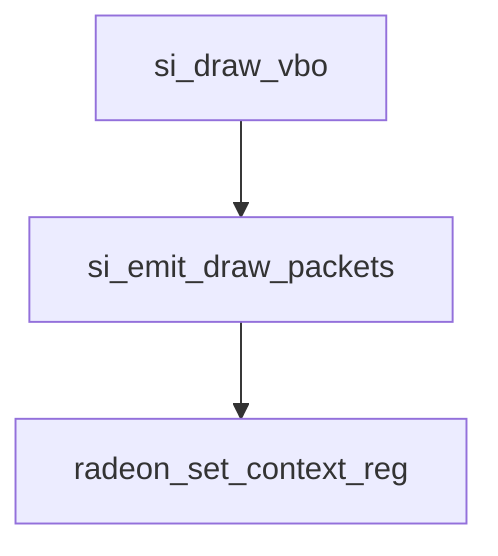

####  VGT_TF_MEMORY_BASE

VGT:VGT_TF_MEMORY_BASE是一个可写寄存器，占据32位，用于设置细分因子存储器的基地址。

该寄存器的GpuF0MMReg地址为`0x89b8`。

具体字段如下：

| 字段名称 | 位    | 默认值 | 描述                                    |
|----------|-------|--------|-------------------------------------------|
| BASE     | 31:0  | 0x0    | 细分因子存储器的基地址。地址需要256字节对齐，有效地址位为[39:8]。 |

细分因子存储器用于存储细分曲面细分因子的数据。细分因子存储器基地址可以由程序员设置，以指定存储细分因子数据的内存位置。通常，细分因子存储器位于显存中，并且需要按照256字节对齐的方式进行存放。

设置该寄存器的基地址，可以将细分因子数据存储到所需的内存位置，供硬件使用进行细分曲面绘制。


#### VGT_TF_PARAM

VGT:VGT_TF_PARAM是一个可读写寄存器，占据32位，用于指定细分引擎的控制参数。

该寄存器的GpuF0MMReg地址为`0x28b6c`。

具体字段如下：

| 字段名称           | 位      | 默认值 | 描述                                       |
|------------------|---------|--------|----------------------------------------------|
| TYPE             | 1:0     | 无     | 使用的细分类型（域）                         |
| PARTITIONING     | 4:2     | 无     | 使用的分割类型                               |
| TOPOLOGY         | 7:5     | 无     | 输出原语的拓扑                               |
| RESERVED_REDUC_AXIS | 8     | 无     | 不再使用，现在变为保留字段                       |
| NUM_DS_WAVES_PER_SIMD | 13:10 | 无    | 在将数据写入多个SIMD之前，将多少DS波（ES/VS）发送到同一个SIMD |
| DISABLE_DONUTS   | 14      | 无     | 决定细分器中使用的行走模式                     |

这些字段的详细说明如下：

- TYPE字段（1:0）：用于指定细分类型（域），它决定了细分引擎使用的细分域类型。可能的取值包括：
  - 00: TESS_ISOLINE - 线段细分
  - 01: TESS_TRIANGLE - 三角形细分
  - 02: TESS_QUAD - 四边形细分

- PARTITIONING字段（4:2）：用于指定分割类型，它决定了细分引擎如何对输入图元进行分割。可能的取值包括：
  - 00: PART_INTEGER - 整数分割
  - 01: PART_POW2 - 2的幂分割
  - 02: PART_FRAC_ODD - 奇数分数分割
  - 03: PART_FRAC_EVEN - 偶数分数分割

- TOPOLOGY字段（7:5）：用于指定输出原语的拓扑，即细分后形成的原始图元类型。可能的取值包括：
  - 00: OUTPUT_POINT - 输出点
  - 01: OUTPUT_LINE - 输出线段
  - 02: OUTPUT_TRIANGLE_CW - 输出顺时针三角形
  - 03: OUTPUT_TRIANGLE_CCW - 输出逆时针三角形

- RESERVED_REDUC_AXIS字段（8）：这个字段曾经用于规约轴，但是现在不再需要，已变为保留字段。

- NUM_DS_WAVES_PER_SIMD字段（13:10）：指定在将数据写入多个SIMD之前，将多少DS波（ES/VS）发送到同一个SIMD。这影响了数据在细分引擎内的处理方式。

- DISABLE_DONUTS字段（14）：确定在细分器中使用的行走模式。可能的取值包括：
  - 00: 使用donut行走模式以获得最佳复用
  - 01: 使用单环行走模式

通过设置这些控制参数，可以配置细分引擎的行为，以满足不同细分需求。细分引擎用于将低细节的几何图元转换为更高细节的曲面，通常用于细节丰富的图形渲染。

流程同VGT_ESGS_RING_ITEMSIZE

```mermaid
graph TD

si_shader_es -.设置atom.emit.-> si_emit_shader_es,gs
si_emit_shader_es--> radeon_opt_set_context_reg
si_emit_shader_gs--> radeon_opt_set_context_reg

```

####  VGT_TF_RING_SIZE

VGT:VGT_TF_RING_SIZE是一个可读写寄存器，占据32位，用于指定细分因子缓冲区的大小。

该寄存器的GpuF0MMReg地址为`0x8988`。

具体字段如下：

| 字段名称 | 位     | 默认值 | 描述                                                     |
|----------|--------|--------|--------------------------------------------------------|
| SIZE     | 15:0   | 0x2000 | 细分因子缓冲区的大小（以双字为单位），在具有双VGT的项目中，该环会在两个VGT之间内部划分。 |

这个字段的详细说明如下：

- SIZE字段（15:0）：用于指定细分因子缓冲区的大小，以双字为单位。细分因子是在细分过程中计算得出的值，用于控制细分程度。细分因子缓冲区是一个用于存储细分因子的内存区域。该字段可以设置为合适的值，以适应细分引擎的需求。

在具有双VGT的项目中，VGT（Vertex Generation Unit，顶点生成单元）有两个，而细分因子缓冲区在这两个VGT之间进行内部划分，因此SIZE字段的设置应该考虑到这种划分。

通过设置SIZE字段，可以调整细分因子缓冲区的大小，以满足不同细分引擎的需求和限制。


使用流程同VGT_HS_OFFCHIP_PARAM

####  VGT_VERTEX_REUSE_BLOCK_CNTL

VGT:VGT_VERTEX_REUSE_BLOCK_CNTL 是一个可读写寄存器，占据32位，用于控制VGT（Vertex Generation Unit，顶点生成单元）后端的顶点复用块（Vertex Reuse Block）的行为。该寄存器仅在VGT_OUTPUT_PATH_CNTL寄存器（或Major Mode 0中的prim type）指定顶点复用块作为VGT后端路径时才有效。

该寄存器的GpuF0MMReg地址为 0x28c58。

具体字段如下：

| 字段名称 | 位      | 默认值 | 描述                                                                                     |
|-----------|---------|---------|----------------------------------------------------------------------------------------|
| VTX_REUSE_DEPTH | 7:0   | none    | 从r7xx开始，复用深度（VTX_REUSE_DEPTH）应设置为14。也可以设置为15（如果prim type是线）和16（如果prim type是点）。  |

这个字段的详细说明如下：

- VTX_REUSE_DEPTH字段（7:0）：用于控制顶点复用块的复用深度。顶点复用是一种优化技术，它允许在图形渲染过程中复用已经计算过的顶点数据，从而减少顶点数据的计算和传输开销，提高性能。

在该字段中，可以设置复用深度的值。复用深度表示在处理新的绘制命令时，复用块会保留多少个前面处理过的顶点数据。例如，如果复用深度设置为14，则复用块会保留最近处理的14个顶点数据，以便在新的绘制命令中复用它们。

在r7xx以及之后的版本中，复用深度建议设置为14。如果绘制类型（prim type）是线，则可以设置为15；如果绘制类型是点，则可以设置为16。具体的设置取决于应用的需求和硬件支持的特性。

通过调整VTX_REUSE_DEPTH字段的值，可以优化顶点复用块的行为，从而获得更好的性能和效率。


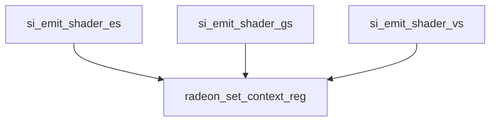


####  VGT_VTX_CNT_EN

VGT:VGT_VTX_CNT_EN 是一个可读写寄存器，占据32位，用于在复用模式下指定自动索引生成。第一个向量输出的y分量将具有自动索引值。自动索引值将通过向VGT发送的事件来重置为零。

该寄存器的GpuF0MMReg地址为 0x28ab8。

具体字段如下：

| 字段名称   | 位    | 默认值 | 描述                                                                                           |
|-------------|--------|---------|--------------------------------------------------------------------------------------------------|
| VTX_CNT_EN | 0      | none    | 如果启用自动索引生成，则将此字段设置为1。这是为了通过顶点着色器在y通道上导入的索引。这与DRAW_INDEX_AUTO不同。  |
 
这个字段的详细说明如下：

- VTX_CNT_EN字段（0）：用于启用或禁用自动索引生成。在复用模式下，当设置为1时，自动索引值将被生成，并存储在第一个向量输出的y分量中。自动索引值是一个在特定条件下自动生成的索引，它用于优化图形渲染过程中的顶点处理。

通过设置VTX_CNT_EN字段的值，可以控制是否启用自动索引生成。如果设置为1，自动索引将按照特定规则自动生成。如果设置为0，则禁用自动索引，此时应用程序需要通过其他方式提供顶点索引。

自动索引的使用可以提高绘制效率，尤其是在顶点复用的情况下。通过生成自动索引，可以减少对顶点索引的存储和传输，从而提高性能。


该寄存器使用流程同VGT_ES_PER_GS


### PA(Primitive Assembly ) Registers


#### PA_CL_CLIP_CNTL

PA:PA_CL_CLIP_CNTL 是一个可读写寄存器，占据32位，用于控制裁剪器的一些参数。

该寄存器的GpuF0MMReg地址为 0x28810。

具体字段如下：

| 字段名称                  | 位       | 默认值 | 描述                                                     |
|-----------------------------|-----------|---------|------------------------------------------------------------|
| UCP_ENA_0                  | 0         | none    | 启用用户裁剪平面0                                        |
| UCP_ENA_1                  | 1         | none    | 启用用户裁剪平面1                                        |
| UCP_ENA_2                  | 2         | none    | 启用用户裁剪平面2                                        |
| UCP_ENA_3                  | 3         | none    | 启用用户裁剪平面3                                        |
| UCP_ENA_4                  | 4         | none    | 启用用户裁剪平面4                                        |
| UCP_ENA_5                  | 5         | none    | 启用用户裁剪平面5                                        |
| PS_UCP_Y_SCALE_NEG   | 13       | none    | PS_UCP模式下y轴的缩放是否为负值              |
| PS_UCP_MODE              | 15:14 | none    | PS_UCP模式                                                 |
| CLIP_DISABLE             | 16       | none    | 禁用TCL中的裁剪代码生成和裁剪过程               |
| UCP_CULL_ONLY_ENA   | 17       | none    | 对UCP进行裁剪，但不进行裁剪                     |
| BOUNDARY_EDGE_FLAG_ENA | 18       | none    | 目前未使用：保留为占位符                          |
| DX_CLIP_SPACE_DEF     | 19       | none    | 剪辑空间的定义                                         |
| DIS_CLIP_ERR_DETECT | 20       | none    | 禁用对裁剪检测错误的原语进行裁剪      |
| VTX_KILL_OR                | 21       | none    | 如果从顶点着色器导出了顶点杀死标志，则指定顶点杀死标志的逻辑模式   |
| DX_RASTERIZATION_KILL | 22       | none    | DirectX光栅化杀死                                       |
| DX_LINEAR_ATTR_CLIP_ENA | 24     | none    | DirectX线性属性剪辑是否启用                 |
| VTE_VPORT_PROVOKE_DISABLE | 25 | none    | 是否禁用VTE口启发                                       |
| ZCLIP_NEAR_DISABLE   | 26       | none    | 是否禁用Z轴近裁剪                                     |
| ZCLIP_FAR_DISABLE     | 27       | none    | 是否禁用Z轴远裁剪                                     |

这些字段用于配置裁剪控制，以实现裁剪、剪裁和优化绘制效果。它们的具体作用取决于图形渲染管道的配置和特定的应用场景。通过对这些字段进行设置，可以调整渲染管线的行为和渲染效果。


```mermaid


si_init_state_functions -->  |设置si_context atoms.s.clip_regs.emit| si_emit_clip_regs

si_emit_clip_regs  --> radeon_set_context_reg


```

####  PA_CL_ENHANCE

PA:PA_CL_ENHANCE 是一个可读写寄存器，占据32位，用于进行控制位的追加。

该寄存器的GpuF0MMReg地址为 0x8a14。

具体字段如下：

| 字段名称                     | 位       | 默认值 | 描述                                                     |
|--------------------------------|----------|---------|------------------------------------------------------------|
| CLIP_VTX_REORDER_ENA | 0         | 0x1       | 启用顶点顺序无关的裁剪                            |
| NUM_CLIP_SEQ               | 2:1       | 0x3       | 激活的裁剪序列数（+1）。应设置为3（4个序列）以获得最佳性能 |
| CLIPPED_PRIM_SEQ_STALL | 3         | none    | 如果NUM_CLIP_SEQ设置为0，则强制使用更快的裁剪路径 |
| VE_NAN_PROC_DISABLE    | 4         | none    | 禁用处理顶点着色器中的NaN值                      |

这些字段用于进行后期控制位的添加，用于优化裁剪和剪裁的性能。CLIP_VTX_REORDER_ENA字段用于启用一种顶点顺序无关的裁剪模式，NUM_CLIP_SEQ字段用于指定激活的裁剪序列数，CLIPPED_PRIM_SEQ_STALL字段用于强制使用更快的裁剪路径，VE_NAN_PROC_DISABLE字段用于禁用处理顶点着色器中的NaN值。

这些控制位的设置可以根据具体的应用场景和渲染需求进行调整，以获得最佳的性能和渲染效果。

该寄存器使用流程同VGT_ES_PER_GS

#### PA_CL_GB_HORZ_CLIP_ADJ

PA:PA_CL_GB_VERT_CLIP_ADJ 是一个可读写寄存器，占据32位，用于垂直边界带裁剪的调整。

该寄存器的 GpuF0MMReg 地址为 0x28be8。

具体字段如下：

| 字段名称       | 位      | 默认值 | 描述                                                         |
|-----------------|---------|---------|------------------------------------------------------------|
| DATA_REGISTER | 31:0    | none    | 32位浮点值。应设置为1.0以禁用垂直边界带裁剪。  |

这个寄存器用于调整垂直边界带的裁剪范围。通常，1.0表示没有边界带裁剪，而其他值表示进行了裁剪调整。垂直边界带裁剪可以用于在渲染中定义屏幕上的裁剪区域，超出该区域的图元将被裁剪掉。

具体数值的设置可以根据具体的渲染需求和场景进行调整，以获得所需的裁剪效果和渲染质量。


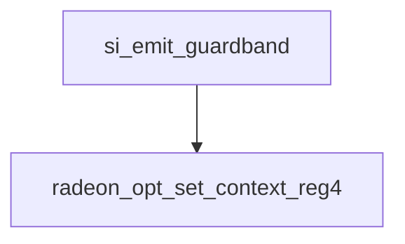

####  PA_CL_NANINF_CNTL

PA:PA_CL_NANINF_CNTL 是一个可读写寄存器，占据32位，用于处理NaN（Not a Number）和无穷大值的控制。

该寄存器的 GpuF0MMReg 地址为 0x28820。

具体字段如下：

| 字段名称                  | 位     | 默认值 | 描述                                                   |
|------------------------|--------|---------|------------------------------------------------------|
| VTE_XY_INF_DISCARD      | 0      | none    | 若为1，顶点着色器计算的XY分量为无穷大时将被丢弃                |
| VTE_Z_INF_DISCARD       | 1      | none    | 若为1，顶点着色器计算的Z分量为无穷大时将被丢弃                 |
| VTE_W_INF_DISCARD       | 2      | none    | 若为1，顶点着色器计算的W分量为无穷大时将被丢弃                 |
| VTE_0XNANINF_IS_0       | 3      | none    | 若为1，顶点着色器计算结果中的0、无穷大和NaN将被替换为0      |
| VTE_XY_NAN_RETAIN       | 4      | none    | 若为1，顶点着色器计算的XY分量为NaN时将被保留                 |
| VTE_Z_NAN_RETAIN        | 5      | none    | 若为1，顶点着色器计算的Z分量为NaN时将被保留                  |
| VTE_W_NAN_RETAIN        | 6      | none    | 若为1，顶点着色器计算的W分量为NaN时将被保留                  |
| VTE_W_RECIP_NAN_IS_0    | 7      | none    | 若为1，当顶点着色器计算W的倒数为NaN时将被替换为0           |
| VS_XY_NAN_TO_INF        | 8      | none    | 若为1，顶点着色器计算的XY分量为NaN时将被替换为无穷大      |
| VS_XY_INF_RETAIN        | 9      | none    | 若为1，顶点着色器计算的XY分量为无穷大时将被保留              |
| VS_Z_NAN_TO_INF         | 10     | none    | 若为1，顶点着色器计算的Z分量为NaN时将被替换为无穷大       |
| VS_Z_INF_RETAIN         | 11     | none    | 若为1，顶点着色器计算的Z分量为无穷大时将被保留              |
| VS_W_NAN_TO_INF         | 12     | none    | 若为1，顶点着色器计算的W分量为NaN时将被替换为无穷大       |
| VS_W_INF_RETAIN         | 13     | none    | 若为1，顶点着色器计算的W分量为无穷大时将被保留              |
| VS_CLIP_DIST_INF_DISCARD| 14     | none    | 若为1，当顶点着色器计算的裁剪距离为无穷大时将被丢弃    |
| VTE_NO_OUTPUT_NEG_0     | 20     | none    | 若为1，顶点着色器计算结果中的负数将被替换为0              |


这些字段用于控制在图形管线中遇到NaN和无穷大值时的处理方式，可以通过设置不同的标志位来指定具体的处理行为。这些处理行为可能包括裁剪、替换或保留等操作，以确保在图形渲染过程中不会出现异常或非法的数值。根据应用场景和需求，可以根据需要来设置这些标志位，以实现所需的数值处理策略。

流程同同VGT_ES_PER_GS


#### PA_CL_VTE_CNTL

PA:PA_CL_VS_OUT_CNTL 是一个可读写寄存器，占据32位，用于控制顶点着色器输出的设置。

该寄存器的 GpuF0MMReg 地址为 0x2881c。

具体字段如下：

| 字段名称                        | 位     | 默认值 | 描述                                                             |
|-------------------------------|--------|---------|----------------------------------------------------------------|
| CLIP_DIST_ENA_0               | 0      | none    | 启用ClipDistance#用于用户定义的裁剪。需要设置VS_OUT_CCDIST#_ENA     |
| CLIP_DIST_ENA_1               | 1      | none    | 启用ClipDistance#用于用户定义的裁剪。需要设置VS_OUT_CCDIST#_ENA     |
| CLIP_DIST_ENA_2               | 2      | none    | 启用ClipDistance#用于用户定义的裁剪。需要设置VS_OUT_CCDIST#_ENA     |
| CLIP_DIST_ENA_3               | 3      | none    | 启用ClipDistance#用于用户定义的裁剪。需要设置VS_OUT_CCDIST#_ENA     |
| CLIP_DIST_ENA_4               | 4      | none    | 启用ClipDistance#用于用户定义的裁剪。需要设置VS_OUT_CCDIST#_ENA     |
| CLIP_DIST_ENA_5               | 5      | none    | 启用ClipDistance#用于用户定义的裁剪。需要设置VS_OUT_CCDIST#_ENA     |
| CLIP_DIST_ENA_6               | 6      | none    | 启用ClipDistance#用于用户定义的裁剪。需要设置VS_OUT_CCDIST#_ENA     |
| CLIP_DIST_ENA_7               | 7      | none    | 启用ClipDistance#用于用户定义的裁剪。需要设置VS_OUT_CCDIST#_ENA     |
| CULL_DIST_ENA_0               | 8      | none    | 启用CullDistance#用于用户定义的裁剪丢弃。需要设置VS_OUT_CCDIST#_ENA |
| CULL_DIST_ENA_1               | 9      | none    | 启用CullDistance#用于用户定义的裁剪丢弃。需要设置VS_OUT_CCDIST#_ENA |
| CULL_DIST_ENA_2               | 10     | none    | 启用CullDistance#用于用户定义的裁剪丢弃。需要设置VS_OUT_CCDIST#_ENA |
| CULL_DIST_ENA_3               | 11     | none    | 启用CullDistance#用于用户定义的裁剪丢弃。需要设置VS_OUT_CCDIST#_ENA |
| CULL_DIST_ENA_4               | 12     | none    | 启用CullDistance#用于用户定义的裁剪丢弃。需要设置VS_OUT_CCDIST#_ENA |
| CULL_DIST_ENA_5               | 13     | none    | 启用CullDistance#用于用户定义的裁剪丢弃。需要设置VS_OUT_CCDIST#_ENA |
| CULL_DIST_ENA_6               | 14     | none    | 启用CullDistance#用于用户定义的裁剪丢弃。需要设置VS_OUT_CCDIST#_ENA |
| CULL_DIST_ENA_7               | 15     | none    | 启用CullDistance#用于用户定义的裁剪丢弃。需要设置VS_OUT_CCDIST#_ENA |
| USE_VTX_POINT_SIZE            | 16     | none    | 使用来自VS的PointSize输出（在VS_OUT_MISC_VEC的x通道）                |
| USE_VTX_EDGE_FLAG             | 17     | none    | 使用来自VS的EdgeFlag输出（在VS_OUT_MISC_VEC的y通道）                |
| USE_VTX_RENDER_TARGET_INDX    | 18     | none    | 使用来自VS的RenderTargetArrayIndx输出（在VS_OUT_MISC_VEC的z通道）  |
| USE_VTX_VIEWPORT_INDX         | 19     | none    | 使用来自VS的ViewportArrayIndx输出（在VS_OUT_MISC_VEC的w通道）       |
| USE_VTX_KILL_FLAG             | 20     | none    | 使用来自VS的KillFlag输出（在VS_OUT_MISC_VEC的z通道）                |
| VS_OUT_MISC_VEC_ENA           | 21     | none    | 输出VS的杂项向量（从VS（SX）到PA（原

语组装器））。如果要使用任何字段，应设置 |
| VS_OUT_CCDIST0_VEC_ENA        | 22     | none    | 输出VS的ccdist0向量（从VS（SX）到PA（原语组装器））。如果要使用任何字段，应设置 |
| VS_OUT_CCDIST1_VEC_ENA        | 23     | none    | 输出VS的ccdist1向量（从VS（SX）到PA（原语组装器））。如果要使用任何字段，应设置 |
| VS_OUT_MISC_SIDE_BUS_ENA      | 24     | none    |                                                                     |
| USE_VTX_GS_CUT_FLAG           | 25     | none    |                                                                     |

这些字段用于控制顶点着色器的输出设置，可以启用/禁用剪裁和舍弃、设置顶点大小、边缘标志等功能，以及将顶点着色器输出传递到图元组装阶段。可以根据图形渲染需求来设置这些标志位，以实现所需的顶点着色器输出设置。


流程同PA_CL_CLIP_CNTL

####  PA_SC_AA_MASK_X0Y0_X1Y0

PA_SC_AA_MASK_X0Y0_X1Y0是一个可读写的寄存器，它占据32位，用于多样本反锯齿掩码。

该寄存器的GpuF0MMReg地址为0x28c38。

具体字段如下：

| 字段名称         | 位     | 默认值 | 描述                                                                                      |
|----------------|--------|--------|-----------------------------------------------------------------------------------------|
| AA_MASK_X0Y0   | 15:0   | none   | 16位掩码应用于像素X0、Y0(左上角)。LSB是Sample0，MSB是Sample15。                         |
| AA_MASK_X1Y0   | 31:16  | none   | 16位掩码应用于像素X1、Y0(右上角)。LSB是Sample0，MSB是Sample15。                         |

这些字段用于设置多样本反锯齿掩码，对像素X0、Y0（左上角）和X1、Y0（右上角）的样本进行掩码，每个样本对应一个比特位。掩码决定了像素的多样本覆盖情况，如果全部为1，则开启全覆盖的优化。根据所需的样本覆盖情况，可以设置这些掩码来实现反锯齿效果。

#### PA_SC_AA_SAMPLE_LOCS_PIXEL_X0Y0_0

PA_SC_AA_SAMPLE_LOCS_PIXEL_X0Y0_0是一个可读写的寄存器，用于设置多样本像素X0、Y0（左上角）的程序化采样位置。

该寄存器的GpuF0MMReg地址为0x28bf8。

具体字段如下：

| 字段名称   | 位      | 默认值 | 描述                                        |
|------------|---------|--------|-----------------------------------------------|
| S0_X       | 3:0     | none   | 从像素中心的偏移，4位有符号数。范围-8/16至7/16。 |
| S0_Y       | 7:4     | none   | 从像素中心的偏移，4位有符号数。范围-8/16至7/16。 |
| S1_X       | 11:8    | none   | 从像素中心的偏移，4位有符号数。范围-8/16至7/16。 |
| S1_Y       | 15:12   | none   | 从像素中心的偏移，4位有符号数。范围-8/16至7/16。 |
| S2_X       | 19:16   | none   | 从像素中心的偏移，4位有符号数。范围-8/16至7/16。 |
| S2_Y       | 23:20   | none   | 从像素中心的偏移，4位有符号数。范围-8/16至7/16。 |
| S3_X       | 27:24   | none   | 从像素中心的偏移，4位有符号数。范围-8/16至7/16。 |
| S3_Y       | 31:28   | none   | 从像素中心的偏移，4位有符号数。范围-8/16至7/16。 |

这些字段用于设置多样本像素X0、Y0（左上角）的采样位置。每个样本对应一个4位的有符号偏移，表示相对于像素中心的偏移量。范围是-8/16至7/16。通过设置这些偏移量，可以调整多样本像素采样的位置，从而实现更精确的抗锯齿效果。


#### PA_SC_AA_SAMPLE_LOCS_PIXEL_X0Y1_0

#### PA_SC_AA_SAMPLE_LOCS_PIXEL_X1Y0_0


### General Shader Registers 


### Shader Buffer Resource Descriptor

#### SQ_BUF_RSRC_WORD0

SQ_BUF_RSRC_WORD0是一个可读写的寄存器，用于设置缓冲区资源的一些参数。该寄存器的GpuF0MMReg地址为0x8f00。

具体字段如下：

| 字段名称        | 位     | 默认值 | 描述                                 |
|----------------|--------|--------|----------------------------------------|
| BASE_ADDRESS   | 31:0   | 0x0    | 缓冲区的基地址，位31-0表示以字节为单位的基地址。 |

这个字段用于设置缓冲区的基地址，它表示缓冲区在内存中的起始位置。在32位的字段中，可以指定2^32个不同的内存位置作为缓冲区的基地址。这个寄存器是一个非常重要的设置，因为它决定了缓冲区在内存中的位置，从而影响了程序的正确执行。要正确使用缓冲区，必须将合适的基地址加载到该寄存器中。


### SQ_BUF_RSRC_WORD1

SQ_BUF_RSRC_WORD1是一个可读写的寄存器，用于设置缓冲区资源的一些参数。该寄存器的GpuF0MMReg地址为0x8f04。

具体字段如下：

| 字段名称          | 位      | 默认值 | 描述                                                        |
|------------------|---------|--------|---------------------------------------------------------------|
| BASE_ADDRESS_HI  | 15:0    | 0x0    | 缓冲区的基地址的高16位，位47-32表示以字节为单位的高位基地址。 |
| STRIDE           | 29:16   | 0x0    | 缓冲区中相邻元素之间的跨度，以字节为单位，取值范围为[0..2048]。  |
| CACHE_SWIZZLE    | 30      | 0x0    | 缓存重排标志。可以选择对TC L1缓存进行bank级别的重排。              |
| SWIZZLE_ENABLE   | 31      | 0x0    | 缓存重排使能标志。根据跨度（stride）、索引跨度（index_stride）和元素大小（element_size），对缓存进行阵列结构的重排，否则为线性。   |

这些字段用于配置缓冲区资源的各个参数，包括高16位的基地址、跨度（Stride）、缓存重排（Cache Swizzle）和缓存重排使能（Swizzle Enable）。这些参数的正确设置对于缓冲区的访问和数据处理非常重要。例如，跨度决定了在缓冲区中相邻元素之间的字节偏移量，而缓存重排可以优化缓存的访问性能。


###  SQ_BUF_RSRC_WORD2


SQ_BUF_RSRC_WORD2是一个可读写的寄存器，用于设置缓冲区资源的一些参数。该寄存器的GpuF0MMReg地址为0x8f08。

具体字段如下：

| 字段名称       | 位     | 默认值 | 描述                                  |
|---------------|--------|--------|---------------------------------------|
| NUM_RECORDS   | 31:0   | 0x0    | 缓冲区中的记录数量。每个记录的大小为STRIDE字节。 |

这个寄存器用于设置缓冲区中的记录数量。每个记录的大小由STRIDE字段指定，因此通过设置NUM_RECORDS和STRIDE字段，可以确定缓冲区的总大小。

请注意，记录的大小和数量是关键参数，它们决定了缓冲区可以存储的数据量。确保将这些参数设置为正确的值，以满足应用程序的需求。


### SQ_BUF_RSRC_WORD3


## Shader Image Resource Descriptor 

TODO

## Shader Image Resource Sampler Descriptor
TODO

|
## Shader Program Registers


在GCN 硬件阶段可分为LS,HS, ES,GS,VS,PS
如下图

下面寄存器名中**HI**代表高位[63:32], **LO**代表低位[31:0]，所有下面的寄存器都是32 位。

### Shader Program 基址相关

在 AMD 的显卡中，着色器程序被分为两个部分：`SPI_SHADER_PGM_LO` 和 `SPI_SHADER_PGM_HI`。

具体来说：

- `SPI_SHADER_PGM_LO_VS` 是用于顶点着色器程序的低位地址部分。
- `SPI_SHADER_PGM_HI_VS` 是用于顶点着色器程序的高位地址部分。

这两个寄存器结合在一起，形成了顶点着色器程序的完整地址，指向存储在显存中的顶点着色器代码。

在显卡的驱动程序或硬件中，通过将顶点着色器程序加载到这些寄存器中，显卡就可以在渲染过程中使用顶点着色器来处理传入的顶点数据，并执行必要的变换、光照等计算，以生成最终的图形显示。

这些寄存器通常是由驱动程序在渲染任务开始之前设置好的，以确保着色器程序正确加载并准备执行。它们是图形渲染流水线中非常重要的部分，有助于实现图形渲染的高性能和效率。

* SPI_SHADER_PGM_HI_ES
* SPI_SHADER_PGM_HI_GS
* SPI_SHADER_PGM_HI_HS
* SPI_SHADER_PGM_HI_LS
* SPI_SHADER_PGM_HI_PS
* SPI_SHADER_PGM_HI_VS
* SPI_SHADER_PGM_LO_ES
* SPI_SHADER_PGM_LO_GS
* SPI_SHADER_PGM_LO_HS
* SPI_SHADER_PGM_LO_LS
* SPI_SHADER_PGM_LO_PS
* SPI_SHADER_PGM_LO_VS


### Shader Program设置 相关


下面这些寄存器主要是shader program的配置。

* SPI_SHADER_PGM_RSRC1_ES
* SPI_SHADER_PGM_RSRC1_GS
* SPI_SHADER_PGM_RSRC1_HS
* SPI_SHADER_PGM_RSRC1_LS
* SPI_SHADER_PGM_RSRC1_PS
* SPI_SHADER_PGM_RSRC1_VS
* 
* SPI_SHADER_PGM_RSRC2_ES
* SPI_SHADER_PGM_RSRC2_GS
* SPI_SHADER_PGM_RSRC2_HS
* SPI_SHADER_PGM_RSRC2_LS
* SPI_SHADER_PGM_RSRC2_PS
* SPI_SHADER_PGM_RSRC2_VS


以 SPI_SHADER_PGM_RSRC1_VS (0xb128) 为例， 下表给出了各个字段的含义 :

这些字段描述了SPI_SHADER_PGM_RSRC1_VS寄存器中的不同位段的作用和含义。这个寄存器用于配置Vertex Shader（VS）程序的设置，比如VGPRs数量、SGPRs数量、浮点模式、优先级等。这些配置设置将影响VS程序的运行行为和性能。

| 字段名称       | 位数   | 默认值 | 描述                                               |
| -------------- | ------ | ------ | -------------------------------------------------- |
| VGPRS          | 5:0    | 0x0    | VGPRs的数量，以4为粒度，范围为0-63，分配方式为4,8,12 ... 256 |
| SGPRS          | 9:6    | 0x0    | SGPRs的数量，以8为粒度，范围为0-15，分配方式为8,16,24 ... 128 |
| PRIORITY       | 11:10  | 0x0    | 驱动spi_sq newWave指令中的spi_priority |
| FLOAT_MODE     | 19:12  | 0x0    | 驱动spi_sq newWave指令中的float_mode |
| PRIV           | 20     | 0x0    | 驱动spi_sq newWave指令中的priv |
| DX10_CLAMP     | 21     | 0x0    | 驱动spi_sq newWave指令中的dx10_clamp |
| DEBUG_MODE     | 22     | 0x0    | 驱动spi_sq newWave指令中的debug |
| IEEE_MODE      | 23     | 0x0    | 驱动spi_sq newWave指令中的ieee |
| VGPR_COMP_CNT  | 25:24  | 0x0    | 告诉SPI要加载多少VGPR组件 |
| CU_GROUP_ENABLE| 26     | 0x0    | 当设置为1时，VS优先发送一个wave给CU中的每个SIMD；当设置为0时，VS只发送一个wave给一个CU中的一个SIMD |


* SPI_SHADER_PGM_RSRC2_VS 


| **字段名称**  | **位数** | **默认值** | **描述**                                              |
|-------------|--------|---------|---------------------------------------------------|
| SCRATCH_EN  | 0      | 0x0     | 该波（Wave）是否使用寄存器临时空间进行寄存器溢出。       |
| USER_SGPR   | 5-1    | 0x0     | SPI 应初始化的 USER_DATA 寄存器数量。范围：0-16。      |
| TRAP_PRESENT| 6      | 0x0     | 是否启用陷阱处理。设置该位会使 SPI 分配额外的 16 个 SGPR，并将 TBA/TMA 值写入 SGPR 中。|
| OC_LDS_EN   | 7      | 0x0     | 是否启用将与 offchip 相关的信息加载到 SGPR 中。        |
| SO_BASE0_EN | 8      | 0x0     | 是否启用将 Stream Out Base 0 加载到 SGPR 中。           |
| SO_BASE1_EN | 9      | 0x0     | 是否启用将 Stream Out Base 1 加载到 SGPR 中。           |
| SO_BASE2_EN | 10     | 0x0     | 是否启用将 Stream Out Base 2 加载到 SGPR 中。           |
| SO_BASE3_EN | 11     | 0x0     | 是否启用将 Stream Out Base 3 加载到 SGPR 中。           |
| SO_EN       | 12     | 0x0     | 是否启用将 Stream Out 缓冲区配置加载到 SGPR 中。        |
| EXCP_EN     | 19-13  | 0x0     | 在 spi_sq newWave 命令中设置 excp 位的驱动。                |

### TBA 相关

**陷阱处理程序基地址TBA (Trap Base Address)**
TBA 是一个 64 位的寄存器，它用于保存指向当前陷阱（trap）处理程序的指针。在计算机图形学中，陷阱是一种异常或中断，用于处理特定的条件或情况。着色器程序可以使用 TBA 寄存器来存储当前陷阱处理程序的地址，以便在需要时跳转到相应的处理程序。


* SPI_SHADER_TBA_HI_ES
* SPI_SHADER_TBA_HI_GS
* SPI_SHADER_TBA_HI_HS
* SPI_SHADER_TBA_HI_LS
* SPI_SHADER_TBA_HI_PS
* SPI_SHADER_TBA_HI_VS

* SPI_SHADER_TBA_LO_ES
* SPI_SHADER_TBA_LO_GS
* SPI_SHADER_TBA_LO_HS
* SPI_SHADER_TBA_LO_LS
* SPI_SHADER_TBA_LO_PS
* SPI_SHADER_TBA_LO_VS


### TMA 相关

**指向陷阱处理程序在内存中使用的数据的指针TMA (Trap Memory Address)**:
TMA 是另一个 64 位的寄存器，它用于在着色器操作中作为临时寄存器。着色器是在图形渲染管线中运行的小型程序，用于控制图形元素的渲染过程。TMA 寄存器用于暂存某些中间结果或计算过程中的数据，以便在需要时进行临时存储和处理。

* SPI_SHADER_TMA_HI_ES
* SPI_SHADER_TMA_HI_GS
* SPI_SHADER_TMA_HI_HS
* SPI_SHADER_TMA_HI_LS
* SPI_SHADER_TMA_HI_PS
* SPI_SHADER_TMA_HI_VS

* SPI_SHADER_TMA_LO_ES
* SPI_SHADER_TMA_LO_GS
* SPI_SHADER_TMA_LO_HS
* SPI_SHADER_TMA_LO_LS
* SPI_SHADER_TMA_LO_PS
* SPI_SHADER_TMA_LO_VS

### USER_DATA

USER_DATA相关寄存器是SGPR Initialization用到的寄存器。

SGPR（Scalar General Purpose Register）初始化是指在图形着色器中加载不会在每个线程中变化的着色器输入。这个过程也会根据着色器类型而有所不同。

在着色器中，SGPR可以用来存储通用目的的数据。在初始化过程中，SGPR主要用来加载一些与着色器相关的常量或数据，这些数据在整个着色器执行过程中保持不变。

在AMD的图形处理架构中，有一种称为 "USER_DATA" 的机制，用于将数据加载到SGPR中。通过使用 "SPI_SHADER_USER_DATA_xx_0-15" 硬件寄存器，驱动程序可以通过PM4 SET命令写入数据到这些SGPR中。用户数据用于向着色器传递一些关键信息，其中最重要的是视频内存中资源常量的内存地址。


* SPI_SHADER_USER_DATA_ES_[0-15]
* SPI_SHADER_USER_DATA_GS_[0-15]
* SPI_SHADER_USER_DATA_HS_[0-15]
* SPI_SHADER_USER_DATA_LS_[0-15]
* SPI_SHADER_USER_DATA_PS_[0-15]
* SPI_SHADER_USER_DATA_VS_[0-15]


TMA和TBA都用在Scalar ALU Operations 中。


##  SPI Registers


## 分析case中的寄存器配置

从IB 列表可以看出 ## 首先编译完成shader之后关于shader的状态如下图,今天主要分析了产生过程。

```
*** SHADER STATS ***
SGPRS: 16
VGPRS: 8
Spilled SGPRs: 0
Spilled VGPRs: 0
Private memory VGPRs: 0
Code Size: 68 bytes
LDS: 0 blocks
Scratch: 0 bytes per wave
Max Waves: 8
********************

```
## 流程

```mermaid
graph TD
si_compiler_shader --> si_init_shader_ctx --> si_llvm_context_set_tgsi 
--> si_compiler_tgsi_main --> si_compile_llvm 
si_compile_llvm --> si_shader_binary_read_config

```
## 主要函数

```c
void ac_shader_binary_read_config(struct ac_shader_binary *binary,
                                  struct ac_shader_config *conf,
                                  unsigned symbol_offset,
                                  bool supports_spill)
{
    unsigned i;
    const unsigned char *config =
        ac_shader_binary_config_start(binary, symbol_offset);
    bool really_needs_scratch = false;
    uint32_t wavesize = 0;

    // 检查是否真的需要scratch缓冲区，根据是否支持spill来判断
    if (supports_spill) {
        really_needs_scratch = true;
    } else {
        // 如果不支持spill，则检查是否有关于scratch资源的符号重定位信息
        for (i = 0; i < binary->reloc_count; i++) {
            const struct ac_shader_reloc *reloc = &binary->relocs[i];

            // 通过比较符号的名字来确定是否需要scratch缓冲区
            if (!strcmp(scratch_rsrc_dword0_symbol, reloc->name) ||
                !strcmp(scratch_rsrc_dword1_symbol, reloc->name)) {
                really_needs_scratch = true;
                break;
            }
        }
    }

    // 从二进制的配置数据中读取寄存器值并填充到ac_shader_config结构体中
    for (i = 0; i < binary->config_size_per_symbol; i += 8) {
        unsigned reg = util_le32_to_cpu(*(uint32_t*)(config + i));
        unsigned value = util_le32_to_cpu(*(uint32_t*)(config + i + 4));
        switch (reg) {
        case R_00B028_SPI_SHADER_PGM_RSRC1_PS:
        case R_00B128_SPI_SHADER_PGM_RSRC1_VS:
        case R_00B228_SPI_SHADER_PGM_RSRC1_GS:
        case R_00B848_COMPUTE_PGM_RSRC1:
        case R_00B428_SPI_SHADER_PGM_RSRC1_HS:
            // 读取SGPRs和VGPRs数量，并存储到ac_shader_config结构体中
            conf->num_sgprs = MAX2(conf->num_sgprs, (G_00B028_SGPRS(value) + 1) * 8);
            conf->num_vgprs = MAX2(conf->num_vgprs, (G_00B028_VGPRS(value) + 1) * 4);
            conf->float_mode =  G_00B028_FLOAT_MODE(value);
            break;
        case R_00B02C_SPI_SHADER_PGM_RSRC2_PS:
            // 读取LDS（Local Data Share）大小，并存储到ac_shader_config结构体中
            conf->lds_size = MAX2(conf->lds_size, G_00B02C_EXTRA_LDS_SIZE(value));
            break;
        case R_00B84C_COMPUTE_PGM_RSRC2:
            // 读取LDS大小（Compute模式），并存储到ac_shader_config结构体中
            conf->lds_size = MAX2(conf->lds_size, G_00B84C_LDS_SIZE(value));
            break;
        case R_0286CC_SPI_PS_INPUT_ENA:
            // 读取SPI_PS_INPUT_ENA寄存器值，并存储到ac_shader_config结构体中
            conf->spi_ps_input_ena = value;
            break;
        case R_0286D0_SPI_PS_INPUT_ADDR:
            // 读取SPI_PS_INPUT_ADDR寄存器值，并存储到ac_shader_config结构体中
            conf->spi_ps_input_addr = value;
            break;
        case R_0286E8_SPI_TMPRING_SIZE:
        case R_00B860_COMPUTE_TMPRING_SIZE:
            // 读取WAVESIZE，并存储到ac_shader_config结构体中
            // WAVESIZE是以256个DWORD为单位的
            wavesize = value;
            break;
        case SPILLED_SGPRS:
            // 读取被spill的SGPRs数量，并存储到ac_shader_config结构体中
            conf->spilled_sgprs = value;
            break;
        case SPILLED_VGPRS:
            // 读取被spill的VGPRs数量，并存储到ac_shader_config结构体中
            conf->spilled_vgprs = value;
            break;
        default:
            // 处理未知的配置寄存器，输出警告信息
            {
                static bool printed;

                if (!printed) {
                    fprintf(stderr, "Warning: LLVM emitted unknown "
                        "config register: 0x%x\n", reg);
                    printed = true;
                }
            }
            break;
        }

        // 设置SPI_PS_INPUT_ADDR为SPI_PS_INPUT_ENA（如果未设置）
        if (!conf->spi_ps_input_addr)
            conf->spi_ps_input_addr = conf->spi_ps_input_ena;
    }

    // 如果真的需要scratch缓冲区，则计算每个wave所需的scratch缓冲区大小，并存储到ac_shader_config结构体中
    if (really_needs_scratch) {
        // WAVESIZE以256个DWORD为单位，计算scratch_bytes_per_wave
        conf->scratch_bytes_per_wave = G_00B860_WAVESIZE(wavesize) * 256 * 4;
    }
}


```

## RadeonSI中未使用的寄存器

### VGT

* VGT_HOS_REUSE_DEPTH
* VGT_IMMED_DATA
* VGT_OUTPUT_PATH_CNTL
* VGT_STRMOUT_BUFFER_FILLED_SIZE_0
* VGT_STRMOUT_BUFFER_FILLED_SIZE_1
* VGT_STRMOUT_BUFFER_FILLED_SIZE_2
* VGT_STRMOUT_BUFFER_FILLED_SIZE_3

* VGT_STRMOUT_BUFFER_OFFSET_0
* VGT_STRMOUT_BUFFER_OFFSET_1
* VGT_STRMOUT_BUFFER_OFFSET_2
* VGT_STRMOUT_BUFFER_OFFSET_3

* VGT_STRMOUT_VTX_STRIDE_0
* VGT_STRMOUT_VTX_STRIDE_1
* VGT_STRMOUT_VTX_STRIDE_2
* VGT_STRMOUT_VTX_STRIDE_2

* VGT_VTX_VECT_EJECT_REG

### PA 

* PA_CL_GB_HORZ_CLIP_ADJ
* PA_CL_GB_VERT_DISC_ADJ

* PA_CL_POINT_CULL_RAD
* PA_CL_POINT_SIZE
* PA_CL_POINT_X_RAD
* PA_CL_POINT_Y_RAD
* PA_CL_UCP_[0-5]_W
* PA_CL_UCP_[0-5]_X 
* PA_CL_UCP_[0-5]_Y
* PA_CL_UCP_[0-5]_Z

* PA_CL_VPORT_XOFFSET_[0-15]
* PA_CL_VPORT_XSCALE_[0-15]
* PA_CL_VPORT_YOFFSET_[0-15] 
* PA_CL_VPORT_YSCALE_[0-15]
* PA_CL_VPORT_ZOFFSET_[0-15]
* PA_CL_VPORT_ZSCALE_[0-15]

* PA_SC_AA_CONFIG
* PA_SC_AA_MASK_X0Y1_X1Y1

* PA_SC_AA_SAMPLE_LOCS_PIXEL_X0Y0_1
* PA_SC_AA_SAMPLE_LOCS_PIXEL_X0Y0_2
* PA_SC_AA_SAMPLE_LOCS_PIXEL_X0Y0_3

* PA_SC_AA_SAMPLE_LOCS_PIXEL_X0Y1_1
* PA_SC_AA_SAMPLE_LOCS_PIXEL_X0Y1_2
* PA_SC_AA_SAMPLE_LOCS_PIXEL_X0Y1_3


## Reference 

* [southern-islands-instruction-set-architecture.pdf](https://www.amd.com/system/files/TechDocs/southern-islands-instruction-set-architecture.pdf)

* [R6xx_R7xx_3D.pdf](https://www.x.org/docs/AMD/old/R6xx_R7xx_3D.pdf)

* [si_programming_guide_v2.pdf](https://www.x.org/docs/AMD/old/si_programming_guide_v2.pdf)

* [SI_3D_registers.pdf](https://www.x.org/docs/AMD/old/SI_3D_registers.pdf)

