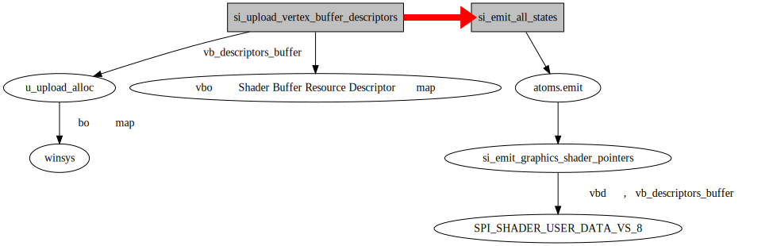

## VBO创建流程

```
glGenBuffers  
	create_buffers_err  
		create_buffers  
```

在mesa中create_buffers内部没有实际调用驱动函数进行对象的产生，而是直接将bufferid绑定到了一个全局变量DummyBufferObject

从注释来看，这段代码定义了一个名为`DummyBufferObject`的静态结构体变量，用作在调用`glGenBuffers()`和`glBindBuffer()`之间的占位符缓冲对象。这种方法允许`glIsBuffer()`函数正常工作，即使在生成和绑定实际缓冲对象之前。这样的设计可能有助于代码的逻辑和可读性，同时确保OpenGL函数的正确使用。

```
glBindBuffer
	_mesa_BindBuffer  
		get_buffer_target  
		bind_buffer_object  
			_mesa_lookup_bufferobj
			_mesa_reference_buffer_object_

```
整个流程基本就是如果绑定目标为GL_ARRAY_BUFFER,bind_buffer_object中首先会通过_mesa_lookup_bufferobj 找出之前glGenBuffers产生的gl_buffer_object .
然后将之绑定到gl_context的Array中的ArrayBufferObj中。

```
glBufferData
	get_buffer
		get_buffer_target
	_mesa_buffer_data
		buffer_data_error
			buffer_data
				_mesa_buffer_unmap_all_mappings
				st_bufferobj_data
					bufferobj_data
						si_buffer_create
						pipe_buffer_write
							si_buffer_subdata
								si_buffer_transfer_map
									si_buffer_map_sync_with_rings
	
```

当 MESA_VERBOSE 设置了state时 ，可以看到flush vertices.
### bo的创建 
```c
static ALWAYS_INLINE GLboolean
bufferobj_data(struct gl_context *ctx,
               GLenum target,
               GLsizeiptrARB size,
               const void *data,
               struct gl_memory_object *memObj,
               GLuint64 offset,
               GLenum usage,
               GLbitfield storageFlags,
               struct gl_buffer_object *obj)
{
	
	...

   if (ST_DEBUG & DEBUG_BUFFER) {
      debug_printf("Create buffer size %" PRId64 " bind 0x%x\n",
                   (int64_t) size, bindings);
   }

  ...

      else {
         st_obj->buffer = screen->resource_create(screen, &buffer);

         if (st_obj->buffer && data)
            pipe_buffer_write(pipe, st_obj->buffer, 0, size, data);
      }
	  
	  ...
}

```
在bufferobj_data中， `export ST_DEBUG=buffer`可以看到 `create buffer....`输出。

bufferobj_data 会调用驱动层接口si_buffer_create进行实际bo的创建

### 顶点数据的拷贝

在si_buffer_subdata中， 首先通过si_buffer_transfer_map amdgpu_bo_cpu_map得到map 地址后，通过memcpy拷贝顶点数组的数据到这个地址中。

```
static void si_buffer_subdata(struct pipe_context *ctx,
			      struct pipe_resource *buffer,
			      unsigned usage, unsigned offset,
			      unsigned size, const void *data)
{
	struct pipe_transfer *transfer = NULL;
	struct pipe_box box;
	uint8_t *map = NULL;

	u_box_1d(offset, size, &box);
	map = si_buffer_transfer_map(ctx, buffer, 0,
				       PIPE_TRANSFER_WRITE |
				       PIPE_TRANSFER_DISCARD_RANGE |
				       usage,
				       &box, &transfer);
	if (!map)
		return;

	memcpy(map, data, size);
	si_buffer_transfer_unmap(ctx, transfer);
}

```

### 顶点数据的下发

下方的流程首先通过si_upload_si_upload_vertex_buffer_descriptors 将vbo地址写入描述符 然后解析实现。

radeonsi将顶点相关信息放到si_context中的vertex_element数组。然后下方的流程首先通过si_upload_si_upload_vertex_buffer_descriptors根据这个信息顶点描述符相关寄存器写值。

```c

struct si_vertex_elements
{
	// 指向一个 r600_resource 结构体，该资源用于存储实例分频因子的缓冲区。
	struct r600_resource *instance_divisor_factor_buffer;

	// 一个包含 SI_MAX_ATTRIBS 个元素的数组，用于存储每个顶点属性的 rsrc_word3 值。
	uint32_t rsrc_word3[SI_MAX_ATTRIBS];

	// 一个包含 SI_MAX_ATTRIBS 个元素的数组，用于存储每个顶点属性在数据中的偏移量。
	uint16_t src_offset[SI_MAX_ATTRIBS];

	// 一个包含 SI_MAX_ATTRIBS 个元素的数组，用于存储每个顶点属性是否需要修复获取（fix fetch）。
	uint8_t fix_fetch[SI_MAX_ATTRIBS];

	// 一个包含 SI_MAX_ATTRIBS 个元素的数组，用于存储每个顶点属性的格式大小。
	uint8_t format_size[SI_MAX_ATTRIBS];

	// 一个包含 SI_MAX_ATTRIBS 个元素的数组，用于存储每个顶点属性所属的顶点缓冲区索引。
	uint8_t vertex_buffer_index[SI_MAX_ATTRIBS];

	// 用于存储顶点属性的数量。
	uint8_t count;

	// 一个布尔值，指示是否使用了实例分频因子。
	bool uses_instance_divisors;

	// 一个用于存储使用第一个顶点缓冲区的位掩码。
	uint16_t first_vb_use_mask;

	// 用于存储顶点缓冲区描述符列表的字节大小，以便进行最优预取（prefetch）。
	uint16_t desc_list_byte_size;

	// 一个位掩码，用于指示哪些输入的实例分频因子为1。
	uint16_t instance_divisor_is_one;

	// 一个位掩码，用于指示哪些输入的实例分频因子是通过获取获得的。
	uint16_t instance_divisor_is_fetched;
};

```

si_context的这个vertex_element副值 是在实际draw之前在prepare_draw操作中完成的。
```
_mesa_exec_DrawArrays
	_mesa_draw_arrays 
		st_draw_vbo
			prepare_draw
				st_validate_draw
					st_update_array
						set_vertex_attribs
							cso_set_vertex_elements
								v_vbuf_set_vertex_elements
									u_vbuf_set_vertex_elements_internal
										si_create_vertex_elements
										si_bind_vertex_elements

			cso_draw_vbo	
				u_vbuf_draw_vbo
					u_vbuf_set_driver_vertex_buffers
						u_vbuf_set_vertex_buffers
							si_set_vertex_buffers
								si_context_and_resource_size

					si_draw_vbo
						u_vbuf_draw_vbo
					---------------------------

						dd_contex_draw_vbo
						dd_after_draw            dd_context存在
							flush------	
					----------------------------

````


### 描述符配置初始化

描述符配置初始化是在驱动上下文创建的时候进行初始化的。

描述符的初始化是在` si_init_all_descriptors`函数里面进行初始化，  它在si_create_context时候调用。 它主要初始化了si_context中的 si_descriptor，rw_buffers, const_and_shader_buffers变量。

```c
/* Indices into sctx->descriptors, laid out so that gfx and compute pipelines
 * are contiguous: * *  0 - rw buffers *  1 - vertex const and shader buffers *  2 - vertex samplers and images
 *  3 - fragment const and shader buffer
 *   ...
 *  11 - compute const and shader buffers
 *  12 - compute samplers and images
 */
enum {
	SI_SHADER_DESCS_CONST_AND_SHADER_BUFFERS,
	SI_SHADER_DESCS_SAMPLERS_AND_IMAGES,
	SI_NUM_SHADER_DESCS,
};

#define SI_DESCS_RW_BUFFERS            0
#define SI_DESCS_FIRST_SHADER          1
#define SI_DESCS_FIRST_COMPUTE         (SI_DESCS_FIRST_SHADER + \
                                        PIPE_SHADER_COMPUTE * SI_NUM_SHADER_DESCS)
#define SI_NUM_DESCS                   (SI_DESCS_FIRST_SHADER + \
                                        SI_NUM_SHADERS * SI_NUM_SHADER_DESCS)

#define SI_DESCS_SHADER_MASK(name) \
	u_bit_consecutive(SI_DESCS_FIRST_SHADER + \
			  PIPE_SHADER_##name * SI_NUM_SHADER_DESCS, \
			  SI_NUM_SHADER_DESCS)

struct si_context {

	...
	...
/*着色其描述符 */
struct si_descriptors descriptors[SI_NUM_DESC];
struct si_buffer_resources rw_buffers;
struct si_buffer_resources const_and_shader_buffers[SI_NUM_SHADERS];
	...
	...

struct si_shader_data		shader_pointers;

	...
	...

}

```
descriptors[SI_DESCS_RW_BUFFERS] 存放的是rw_buffers
descriptors从SI_DESCS_FIRST_SHADER索引开始为每个shader存放const_shaderbuffer和samplers_imagesbuffer,每个各占两个。

 每个描述符所分配的buffer数量为SI_NUM_BUFFERS（16) + SI_NUM_CONST_BUFFERS(16) = 32个。
 还会设置每个shader所用用户数据常量的寄存器基地址，把他放进shader_pointers里面.
 默认设置是：

 | shader              |  寄存器  |
 |---|---|
 | PIPE_SHADER_VERTEX  | R_00B130_SPI_SHADER_USER_DATA_VS_0|
 | PIPE_SHADER_TESS_CTRL | R_00B430_SPI_SHADER_USER_DATA_HS_0 (<GFX9)| 
 | PIPE_SHADER_GEOMETRY | R_00B230_SPI_SHADER_USER_DATA_GS_0(<GFX9)| 
 | PIPE_SHADER_FRAGMENT | R_00B030_SPI_SHADER_USER_DATA_PS_0| 

它的功能总结如下:

1. 针对每种类型的着色器（vertex、tessellation control、geometry、fragment），它初始化了这些着色器的缓冲区资源描述符以及采样器和图像描述符。

2. 初始化读写缓冲区资源描述符。

3. 初始化可绑定的（bindless）纹理和图像描述符。

4. 初始化一些相关的管线状态和设置。

下面对每个主要部分进行详细解释：

1. 对每种类型的着色器（vertex、tessellation control、geometry、fragment），它：
   - 计算描述符的相关参数，如偏移量和槽数量。
   - 使用这些参数调用 `si_init_buffer_resources` 初始化缓冲区资源。
   - 初始化采样器和图像描述符。
   - 设置默认和不可变的用户数据映射。

2. 对于读写缓冲区资源描述符，它：
   - 使用 `si_init_buffer_resources` 初始化读写缓冲区资源。
   - 设置相关的使用和优先级。

3. 对于可绑定的（bindless）纹理和图像描述符，它：
   - 调用 `si_init_bindless_descriptors` 初始化描述符。
   - 设置描述符的相关参数，如偏移量和槽数量。

4. 初始化管线状态和设置，它：
   - 设置一些管线函数，如绑定采样器状态、设置着色器图像、设置常量缓冲区等。
   - 设置一些相关的管线状态，如 shader user data 的处理方式。


## 顶点描述符上传

具体对USER_DATA_VS*相关寄存器副值按照下列流程

```
si_draw_vbo
	si_upload_vertex_buffer_descriptors
	si_upload_graphics_shader_descriptors
		si_upload_descriptors	
		si_upload_bindless_descriptors
	si_emit_all_states
		si_emit_graphics_shader_pointers
			si_emit_shader_pointer
			si_emit_consecutive_shader_pointers
		si_emit_vs_state
	si_emit_draw_packets

```


关于USER_DATA寄存器地址的定义，从定义上看数量并不是手册上说的15个。

```
#define R_00B130_SPI_SHADER_USER_DATA_VS_0                              0x00B130
#define R_00B134_SPI_SHADER_USER_DATA_VS_1                              0x00B134
#define R_00B138_SPI_SHADER_USER_DATA_VS_2                              0x00B138
#define R_00B13C_SPI_SHADER_USER_DATA_VS_3                              0x00B13C
#define R_00B140_SPI_SHADER_USER_DATA_VS_4                              0x00B140
#define R_00B144_SPI_SHADER_USER_DATA_VS_5                              0x00B144
#define R_00B148_SPI_SHADER_USER_DATA_VS_6                              0x00B148
#define R_00B14C_SPI_SHADER_USER_DATA_VS_7                              0x00B14C
#define R_00B150_SPI_SHADER_USER_DATA_VS_8                              0x00B150
#define R_00B154_SPI_SHADER_USER_DATA_VS_9                              0x00B154
#define R_00B158_SPI_SHADER_USER_DATA_VS_10                             0x00B158
#define R_00B15C_SPI_SHADER_USER_DATA_VS_11                             0x00B15C
#define R_00B160_SPI_SHADER_USER_DATA_VS_12                             0x00B160
#define R_00B164_SPI_SHADER_USER_DATA_VS_13                             0x00B164
#define R_00B168_SPI_SHADER_USER_DATA_VS_14                             0x00B168
#define R_00B16C_SPI_SHADER_USER_DATA_VS_15                             0x00B16C
#define R_00B170_SPI_SHADER_USER_DATA_VS_16                             0x00B170
#define R_00B174_SPI_SHADER_USER_DATA_VS_17                             0x00B174
#define R_00B178_SPI_SHADER_USER_DATA_VS_18                             0x00B178
#define R_00B17C_SPI_SHADER_USER_DATA_VS_19                             0x00B17C
#define R_00B180_SPI_SHADER_USER_DATA_VS_20                             0x00B180
#define R_00B184_SPI_SHADER_USER_DATA_VS_21                             0x00B184
#define R_00B188_SPI_SHADER_USER_DATA_VS_22                             0x00B188
#define R_00B18C_SPI_SHADER_USER_DATA_VS_23                             0x00B18C
#define R_00B190_SPI_SHADER_USER_DATA_VS_24                             0x00B190
#define R_00B194_SPI_SHADER_USER_DATA_VS_25                             0x00B194
#define R_00B198_SPI_SHADER_USER_DATA_VS_26                             0x00B198
#define R_00B19C_SPI_SHADER_USER_DATA_VS_27                             0x00B19C
#define R_00B1A0_SPI_SHADER_USER_DATA_VS_28                             0x00B1A0
#define R_00B1A4_SPI_SHADER_USER_DATA_VS_29                             0x00B1A4
#define R_00B1A8_SPI_SHADER_USER_DATA_VS_30                             0x00B1A8
#define R_00B1AC_SPI_SHADER_USER_DATA_VS_31                             0x00B1AC
#define R_00B1F0_SPI_SHADER_PGM_RSRC2_GS_VS                             0x00B1F0

```
在si_upload_vertex_buffer_descriptors中:
1. 首先使用u_upload_alloc向winsys申请bo, 得到resource地址以及map地址ptr后，将bo地址存入si_context的vb_descriptors_buffer,将ptr存入si_context的vb_descriptors_gpu_list.
2. 然后把bo 设定RADEON_PRIO_DESCRIPTORS priority 加入到此次ib 提交引用的buffer列表中.
3. 根据属性计数开始对这个ptr地址开始写入4个32位数， 对应的si寄存器手册上的Shader Buffer Resource Descriptor。写入的值分别是: vbo的虚拟地址gpu_address加上该顶点属性在在vbo的偏移量word0 ,word1 ,word2 ,word3.

在si_emit_all_states中
首先会根据si_context中的dirty_atoms确定哪些原子状态需要发射，这里会调用之前描述符初始化的emit注册函数如scissor, si_emit_graphics_shader_pointers

在 si_emit_graphics_shader_pointers 中:
1. si_emit_global_shader_pointers 会设置R_00B130_SPI_SHADER_USER_DATA_VS_0的值为描述符的gpu_address
2. si_emit_consecutive_shader_pointers 会对R_00B13C_SPI_SHADER_USER_DATA_VS_3地址开始写入两个寄存器地址信息， 信息都为描述符的gpu_address, 
3. 如果当sctx->vertex_buffer_pointer_dirty为真时，也就是vbo地址未曾下法时， 开始下发vbo描述符的地址， 这个地址 通过sctx->vb_descriptors_buffer->gpu_address + sctx->vb_descriptors_offset 得到在si_upload_vertex_buffer_descriptors 中通过u_upload_alloc 获取了这个sctx->vb_descriptors_buffer 和当前的sctx->vb_descriptors_offset。这里使用寄存器为VS_8，VS_8通过SI_VS_NUM_USER_SGPR决定， 这里是8

如下图




* 从描述符初始化部分已经知道 sctx->shader_pointers.sh_base[PIPE_SHADER_VERTEX] 寄存器为R_00B130_SPI_SHADER_USER_DATA_VS_0, 而在HAVE_32BIT_POINTERS前提下 SI_SGPR_VS_STATE_BITS的枚举值为 4, 所以设置的实际寄存器其实地址为R_00B130_SPI_SHADER_USER_DATA_VS_4.


返回si_draw_vbo后接着开始发送vs_state ，在si_emit_vs_state 中将si_context中的current_vs_state 写入vs_4 0x140 

关于vs状态可参考
```
/* Fields of driver-defined VS state SGPR. */
/* Clamp vertex color output (only used in VS as VS). */
#define S_VS_STATE_CLAMP_VERTEX_COLOR(x)	(((unsigned)(x) & 0x1) << 0)
#define C_VS_STATE_CLAMP_VERTEX_COLOR		0xFFFFFFFE
#define S_VS_STATE_INDEXED(x)			(((unsigned)(x) & 0x1) << 1)
#define C_VS_STATE_INDEXED			0xFFFFFFFD
#define S_VS_STATE_LS_OUT_PATCH_SIZE(x)		(((unsigned)(x) & 0x1FFF) << 8)
#define C_VS_STATE_LS_OUT_PATCH_SIZE		0xFFE000FF
#define S_VS_STATE_LS_OUT_VERTEX_SIZE(x)	(((unsigned)(x) & 0xFF) << 24)
#define C_VS_STATE_LS_OUT_VERTEX_SIZE		0x00FFFFFF

```
之后在si_draw_vbo内部, si_emit_draw_packets开始写入地址为vs_5,6,7 0xb144 0xb148 0xb14c,写入的值为分别base_index,  draw的start_instance, 以及drawid

base_vertex_-> draw_info.start 

最后flush时，调用amdgpu_cs_submit_ib提交此次命令。传入各种buffer数据

## 调试日志

首先在bufferobj_data创建bffer打印地址可以看到


创建的虚拟地址为0x100000c00，创由于采用了slab分配,创建大小32字节小于128KB，同时累积并未超出上次分配的bo大小  ， 所以分配的bo地址并不是直接用drm进行申请的，而是上次分配的bo中的一块，地址为0x100000000。 
vertex_elements相关信息可以从日志看到以及绑定的vbo地址

在amdgpu_winsys_bo->u.slab.real可以看到实际va地址为0x100000000,这一点可以从Buffer list输出可
以看到。这个地址分配了 Ib, shader_binary， vertex_buffer相关bo数据.


